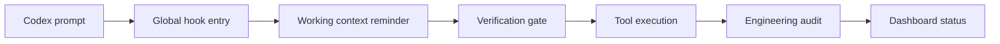

# Codex OS Brain

Codex OS Brain is a public, privacy-first cognitive harness for Codex. It installs a small local runtime into a user's Codex environment so every Codex prompt can pass through the same observable entry gate:

- global prompt context injection
- bounded working context reminders
- verification-before-completion guardrails
- post-tool engineering audit
- local status dashboard
- privacy-first local data boundaries

It is not a personal memory dump, persona pack, or private agent clone. This repository intentionally excludes personal `Memory`, `User`, `Agent`, `STATE`, `IDENTITY`, `SOUL`, private logs, API keys, and local runtime artifacts.

## Install

After the package is published to npm:

```bash
npx codex-os-brain install
```

Until npm publication, install from GitHub:

```bash
npx github:liuanye9-lab/codex-os-brain install
```

The installer:

1. copies the public runtime to `~/.codex-os-brain`
2. backs up `~/.codex/hooks.json`
3. adds global Codex hooks with empty matchers
4. writes only sanitized local status files under `~/.codex-os-brain/data`

## Commands

```bash
codex-os-brain install
codex-os-brain status
codex-os-brain dashboard
codex-os-brain check
codex-os-brain uninstall
```

Dashboard URL:

```text
http://127.0.0.1:8791/
```

## What Gets Installed

Codex OS Brain adds these hook stages:

| Codex event | Runtime script | Purpose |
|---|---|---|
| `UserPromptSubmit` | `inject-context.cjs` | Adds the public cognitive harness context |
| `PostToolUse` | `engineering-harness.cjs` | Records sanitized risk categories after tool use |
| `Stop` | `capture-session.cjs` | Updates sanitized heartbeat/status only |

## What Is Explicitly Not Included

- no private long-term memory
- no user profile
- no persona or identity file
- no API key
- no token
- no private local paths
- no automatic memory promotion
- no automatic self-evolution adoption
- no hidden chain-of-thought dashboard

## Core Design



The dashboard shows observable runtime state only. It does not expose hidden reasoning chains or private user data.

## Safety Model

Codex OS Brain treats memory and self-evolution as candidate-only by default:

- learning requires external evidence
- confidence controls action speed
- high-risk changes require human approval
- dashboard state is evidence, not proof of intelligence
- private data stays local and is not packaged

## Development

```bash
npm run check
npm run privacy:scan
npm run pack:dry
```

See [docs/SECURITY.md](docs/SECURITY.md) before publishing or modifying install behavior.
