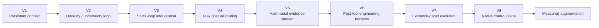
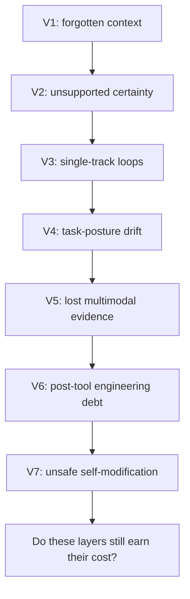
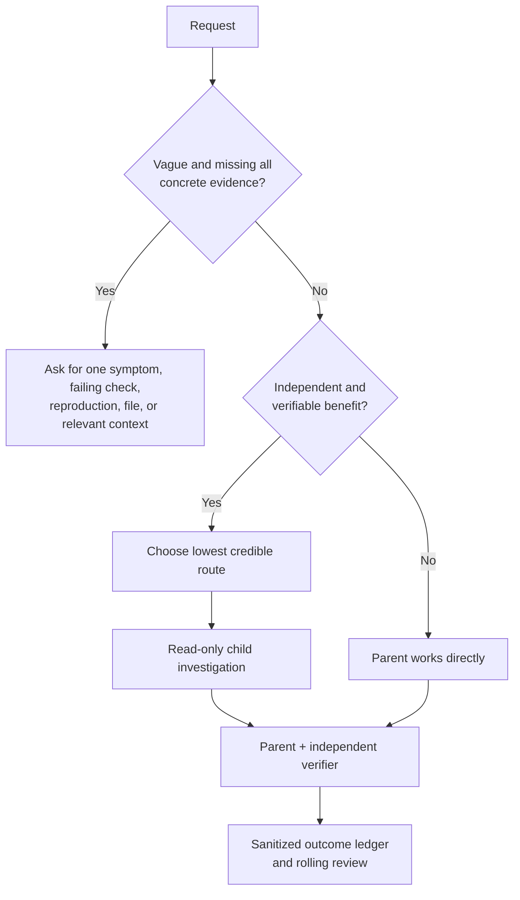
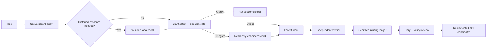

# Agentic Coding Harness — Research Archive

> A privacy-safe record of an agentic-coding harness evolving from V1 through V7, then toward a measured native-first runtime.

This is a research archive, not a one-click agent product and not a claim that every task needs more orchestration. It preserves a real engineering sequence: each version addressed a failure mode seen in longer AI-assisted work; later versions also revealed the cost and limits of earlier control layers.

The current conclusion is deliberately narrow: **keep controls that create independent evidence; make every other layer earn its cost for the task at hand.**

## How to read this archive

The v1–v7 directories preserve concise, de-identified records in the version layout used during the work. Account names, machine-specific paths, runtime state, prompts, and other private material have been removed or generalized. The technical sequence, original constraints, and unresolved limitations are retained; later conclusions do not rewrite earlier decisions as if they were obvious from the start.



## V1–V7: the actual exploration path

| Version | Starting problem | Mechanism introduced | What improved | Evidence and boundary | Why the next version was needed |
|---|---|---|---|---|---|
| [V1](v1/README.md) | Long tasks lost project context and repeated corrections disappeared after a session. | Small Markdown state, lessons, a lightweight index, and conditional context injection. | Context and corrections gained a durable, inspectable home rather than remaining only in chat history. | Operational baseline, not a controlled quality or token benchmark. Always-on injection could become noisy. | Storing context did not tell the agent when its confidence was unsupported. |
| [V2](v2/README.md) | The agent could sound certain or declare completion without calibrated evidence. | Honest-loop protocol: multiple confidence signals, adversarial probing, and sleep-time re-evaluation. | Uncertainty became an explicit choice: answer, hedge, or ask for verification. | The archived protocol and scaffolding were real; several signal implementations remained roadmap work. | A more honest agent could still keep pursuing one bad local path. |
| [V3](v3/DESIGN.md) | When blocked, the agent tended to keep varying the same approach. | Pre-action alternatives, a stuck-signal trigger, and a breakthrough checklist. | It added a concrete interruption point for single-track loops rather than generic reflection. | The archived implementation record reports five offline synthetic cases passing; it also records harmless meta-discussion false positives. | The appropriate posture still depended on task type and could drift under pressure. |
| [V4](v4/DESIGN.md) | The agent could know the right engineering principle but revert to a narrow worker mode. | A small deterministic router for owner, operator, reviewer, and coach contexts. | Context injection became selective and short rather than a permanent monolithic instruction block. | It was designed to guide posture, not create facts or mutate memory; no accuracy ranking is claimed. | Text-only context still lost screenshots and PDFs as future evidence. |
| [V5](v5/DESIGN.md) | Images and PDFs affected a task in the moment, then vanished from recall. | Multimodal sidecar index with metadata, user context, and extractable text. | Evidence could be referenced later without claiming unseen pixels or unextracted text had been understood. | Metadata is not OCR; no full-document prompt dump or secret indexing. | Better evidence intake did not catch structural debt created after tool use. |
| [V6](v6/DESIGN.md) | A locally convenient edit could create routing, verification, dependency, or maintenance debt. | Post-tool engineering harness with pure detectors, red-light records, throttling, and focused verification prompts. | It made several failure patterns visible close to the causal edit instead of waiting for later breakage. | Historical regression cases included false-positive controls. The hook runtime is preserved as legacy design, not restored as a default. | The framework still needed safe criteria for adopting changes to itself. |
| [V7](v7/DESIGN.md) | Research-inspired self-improvement could otherwise rewrite memory, persona, or runtime without proof. | Candidate-based evolution gate: sandboxing, verification, human approval, long-horizon metrics, and challenge/verification roles. | Sensitive changes became reviewable candidate records instead of automatic mutation. | The included self-test demonstrates an unsafe memory rewrite being held and an evidence-backed candidate being accepted. It is a gate, not proof that self-evolution improves every task. | Stronger coding models made persistent injection, default fan-out, and continuous hook stacks increasingly expensive relative to their benefit. |

### What the version chain shows

The point of V1–V7 was never “add mechanisms because mechanisms look intelligent.” Each version protected against a specific failure mode:



That sequence also explains the later subtraction. V1–V7 established enduring requirements—observable work, independent verification, privacy boundaries, human correction, and evidence-backed learning. They did **not** prove that hooks, full context packs, or multi-agent fan-out should run on every turn.

## Why the strategy changed after V7

More capable coding models can plan, inspect repositories, call tools, and retain local task state without external orchestration on many ordinary tasks. Applying every historical layer by default began to introduce new failure modes:

- permanent context injection consumed task budget before work began;
- always-on hooks competed with local model judgment and increased maintenance surface;
- automatic multi-agent fan-out multiplied coordination and token cost;
- broad self-review and automatic learning could turn weak signals into noisy policy.

The current runtime therefore uses **native-first, measured augmentation**:

| Decision area | V1–V7 tendency | Current default | What remains non-negotiable |
|---|---|---|---|
| Ordinary implementation | External workflow layers were readily available. | Parent agent works directly. | Independent verification before acceptance. |
| Context | Proactive injection and persistent state. | Bounded recall only when prior evidence is relevant. | Do not invent historical facts. |
| Subagents | Extra perspective could be dispatched easily. | Delegate only independent, verifiable work with a credible advantage. | Parent retains writes and final verification. |
| Ambiguous request | More reasoning layers might attempt to recover intent. | Ask for one concrete signal before delegating. | Do not guess undisclosed business rules. |
| Reuse and learning | Broad replay/evolution machinery was explored. | Promote only repeated, successful, replayable, permission-safe patterns. | Human and privacy gates for consequential change. |
| Hooks | Used as experimental control points. | No always-on hook stack. | A future hook must be bounded, measurable, removable, and justified. |

## V8: Native Harness Control Plane

V8 turns the native parent-agent path into the baseline. A task contract asks for clarification when a vague request lacks observable evidence; bounded context packets cap injected recall at 900 estimated tokens; privacy-safe traces record outcomes without raw prompts or hidden reasoning. Delegation, policies, and Skill promotion remain evidence-gated rather than default behavior.

V8 also measures its own overhead. A policy requires at least three distinct paired samples with no quality regression and a measurable token, latency, or verification benefit before it can become stable. Five no-gain samples with material overhead become a disable candidate. Hooks are disabled by default.

See [V8 design](v8/DESIGN.md), the [synthetic evaluation manifest](evals/v8-control-plane-2026-07-12/cases.json), and the [V8 scripts](scripts/).

## What the controlled evaluations changed

The present policy uses external deterministic graders, not model self-reports. Both pilot comparisons held the parent route constant and compared direct work against a routed condition with two read-only child investigators.

| Evaluation | Parent-only | Routed children | Resulting rule |
|---|---:|---:|---|
| Clear, verifier-gated coding tasks | 3/3 verified; median 80,474 tokens; 43.714 s | 3/3 verified; median 224,312 tokens; 78.929 s | Do not dispatch by default when the parent already crosses the quality line. |
| Vague request with no observable signal | 0/3 verified; median 93,411 tokens; 43.520 s | 0/3 verified; median 251,834 tokens; 94.000 s | Extra agents cannot infer undisclosed rules; request one concrete signal first. |

These are exploratory paired samples, not a universal model ranking. Their valid conclusion is local and practical: **more agents are an organizational choice, not a default quality multiplier.** Full method and limitations: [harness-evolution report](docs/research/2026-07-12-harness-evolution.md), [clear-task pilot](docs/research/2026-07-12-subagent-ab-pilot.md), and [vague-request pilot](docs/research/2026-07-12-vague-prompt-subagent-ab-pilot.md).



## Current research architecture



## Repository map

```text
v1/ ... v7/  de-identified historical design records
config/        deterministic routing, model, and budget policy
scripts/       router, delegate, ledger, review, and A/B runner
skills/        bounded routing guidance
schemas/       structured child-output contract
evals/         synthetic fixtures and deterministic checkers
tests/         regression and privacy-safe tests
docs/history/  historical synthesis
docs/research/ model-routing and paired-evaluation evidence
```

## Reproduce the public core

Requires Node.js 20 or newer. Live delegation also requires a Codex executable available as codex or through CODEX_PATH.

```bash
npm run check
node scripts/brain-lite-router.js --features-file examples/features.json
node scripts/brain-lite-subagent-ab.js --preflight --output reports/example
```

The router is deterministic and never launches a model by itself. A delegated worker is read-only; the parent owns writes and the final verifier.

## Archive and privacy boundary

This public archive contains only generic source, de-identified historical design records, synthetic fixtures, aggregate evidence, and documentation. It excludes personal profiles, memories, account identifiers, credentials, local paths, raw prompts, raw model outputs, vector indexes, generated ledgers, and deployment-specific automation.

MIT licensed.
