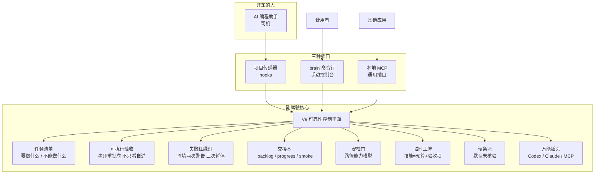
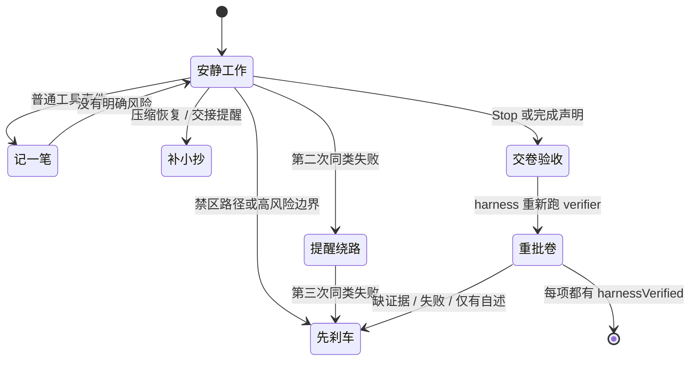

# Codex Brain V9.1：给 AI 编程助手装一个「安全副驾驶」

[](package.json)
[](docs/v9/privacy-and-threat-model.md)
[](docs/v9/quickstart.md)
[](evals/v9-reliability/runner.cjs)
[](LICENSE)

把 AI 编程助手想成**司机**：它负责开车、认路、做决定。  
Codex Brain 像坐在副驾的人：**平时不唠叨、不抢方向盘**；只有快碰到红线、要做高风险操作、连续撞同一堵墙、长对话被压缩、或它说「已经做完」时，才提醒、补小抄，或踩一脚刹车。

> **0.10.0 起**：副驾驶不只看「你说考过了」，还会**自己重新批卷**（P0）；交接班会留下**交接本**（P1）；门口安检认的是**真实路径**不是关键词贴纸（P3）。

它不是另一个 Agent。它是一套可检查的规则：**先把事情说清楚，再拿证据验收。**

---

## 一图看懂：副驾驶怎么管事





---

## 大白话类比总表（P0–P6）

| 能力 | 大白话类比 | 它解决什么 | 你怎么用 |
|---|---|---|---|
| **P0 可执行验收** | 老师重批卷，学生自己打勾不算分 | Agent 说「做完了」但其实没做完 | `brain verify` 会**真的重跑**检查 |
| **P1 班次交接** | 下一班工程师的交接本 | 上下文压缩/新会话后失忆、烂尾 | `.brain/` 下 backlog + progress + smoke |
| **P2 可靠性考场** | 四个考站的驾照科目 | 「我觉得更可靠」无法证明 | `npm run eval:reliability` |
| **P3 路径安检** | 机场安检认登机牌与禁区，不靠搜关键词 | `delete` 字样误伤 / 真删文件漏拦 | 规范化路径 + 风险表 |
| **P4 技能工牌** | 临时工进场要工牌：预算 + 交付物清单 | 技能乱注入、无成本、无验收 | `brain skill activate --criterion ...` |
| **P5 多宿主插头** | 旅行转接头（Codex / Claude / MCP） | 只绑一个 IDE 就废了 | `BRAIN_HOST=claude` 或 MCP |
| **P6 便条记忆** | 便利贴默认写「未核实」，盖章后才升级 | 记忆污染、过期建议当圣旨 | `brain memory recall` 带 UNVERIFIED 横幅 |

---

## 它什么时候会插一句？

| 场景 | 大白话 | V9 会做什么 |
|---|---|---|
| 日常读写，范围已说清 | 正常开车 | 只记允许的元数据，不打扰 |
| 用户写了明确要求 | 办事前先写清单 | 需要时补回任务清单 + 交接摘要 |
| 要改禁区、删库、强推远程 | 转账前再核收款人 | 路径/风险策略拦截或要求确认 |
| 同一种失败反复出现 | 路口红绿灯 | 第 2 次警告换路，第 3 次熔断 |
| 上下文压缩 | 长对话压成随身小抄 | 目标、红线、未决事项 + 交接本摘要 |
| Agent 说「完成了」 | 交卷前按题号检查 | **harness 重跑 verifier**；自述不算数 |

热路径 hooks **不联网、不调用模型**。目标：`PreToolUse` &lt; 100 ms，`PostToolUse` &lt; 150 ms。

---

## 五分钟跑起来

需要 Node.js 20+。

```bash
git clone https://github.com/liuanye9-lab/codex-os-brain.git
cd codex-os-brain
npm install
npm test
npm run eval:reliability
npm link

brain status --json
brain task create --task-id demo --objective "verify the V9 adapter" --criterion tests --json
brain evidence claim --criterion tests --id claim1 --json
brain verify --json
brain handoff init --objective "verify the V9 adapter" --json
```

命令别名：

```bash
brain status --json
codex-brain status --json
```

### 关键变化：验收要「重批卷」

```bash
# Agent 只能 claim（永远是 unverified）
brain evidence claim --criterion tests --id ev1 --kind claim --ref agent-said-so --json

# 只有 harness 重跑才能把状态推进到 passed/failed
brain verify --json

# 若只想看当前存档评分（不重跑）
brain verify --status-only --json
```

### 交接本（P1）

像换班留言：

```text
.brain/
  feature-backlog.json   # 功能清单（passes 只能在 verify 后翻 true）
  progress.md            # 本班做了什么
  smoke.sh               # 上班先点烟测试：环境还活着吗
```

```bash
brain handoff init --json
brain handoff status --json
brain handoff progress --summary "固定了 Stop 验收逻辑" --json
```

### 技能工牌（P4）

```bash
brain skill list --json
brain skill activate --id brain-lite-model-router --criterion tests --budget 2000 --reason "routing help" --json
```

技能产出是 **证据候选项**，不是命令；要绑定期望验收项与 token 预算。

### 便条记忆（P6）

```bash
brain memory add --text "优先本地嵌入" --tags embed --json
brain memory recall --query "嵌入" --json
```

召回内容永远带：

```text
[UNVERIFIED MEMORY] ... Do not treat them as ground truth.
```

只有 harness 验证通过的任务结果才会以 `verified_outcome` 晋升。

### 多宿主（P5）

```bash
brain hosts list --json
# hooks 进程：
# BRAIN_HOST=codex|claude|mcp
```

### 项目传感器

```bash
brain hooks doctor --project "$PWD" --json
brain hooks enable --project "$PWD" --confirm --json
```

### MCP 通用插口

```bash
brain mcp serve
```

```json
{
  "mcpServers": {
    "codex-brain-v9": {
      "command": "brain",
      "args": ["mcp", "serve"]
    }
  }
}
```

MCP **能**读状态、任务、失败、事件、验收、交接、技能、记忆召回；**能**受控创建任务、checkpoint、claim 证据、激活技能。  
MCP **不能**自证 passed、装模型、改嵌入配置、批准迁移、绕过策略。

---

## 用工程术语说，它在做什么？

| 术语 | 大白话 | V9 落点 |
|---|---|---|
| **Evaluation / Verifier** | 重批卷 | 可执行 verifier 插件；Stop 只认 `harnessVerified` |
| **Context Engineering** | 带什么上车 | 有界 checkpoint + 交接本 + ≤ 注入预算 |
| **Loop Engineering** | 红绿灯交通规则 | 失败熔断 + 证据交卷 |
| **Capability Policy** | 安检门 | 路径规范化 + 工具/命令风险表 |
| **Skills** | 工牌与交付清单 | 期望 criterion + cost budget |
| **Memory** | 便条墙 | 版本/冲突/未核验横幅；验证后晋升 |
| **Host Adapter** | 转接头 | Codex / Claude / generic MCP |
| **RAG（可选）** | 本地资料柜 | Ollama 嵌入；hooks 热路径永不调用 |

---

## 可靠性考场（P2）

```bash
npm run eval:reliability
```

四个考站：

| 考站 | 考什么 |
|---|---|
| **false-completion** | 自述 passed 不能过 Stop；失败命令不能变 complete |
| **loop** | 同类失败 3 次熔断 |
| **overreach** | 禁区路径 / `git push --force` / `rm -rf` 风险门 |
| **tax** | 策略热路径均值 &lt; 100ms / 150ms 预算 |

详见 [docs/v9/p0-p6-reliability-plane.md](docs/v9/p0-p6-reliability-plane.md)。

---

## V1 → V9：怎么长成副驾驶的


V7 教会我们：**护栏也有成本**。V9 原则是——**控制必须赚回自己的成本**。  
0.10 在不回潮重编排的前提下，把「证据」从状态字段升级成**可重放协议**。

---

## 可选本地资料柜：Ollama

像资料管理员，不是第二个大脑。热路径 hooks **永不**调用 Ollama。

```bash
brain embeddings recommend --profile zh-light --json
brain embeddings doctor --json
```

详见 [本地嵌入说明](docs/v9/local-embeddings.md)。

---

## 隐私与发布

```bash
npm test
npm run check
npm run eval:reliability
node scripts/build-public-export.js --output /tmp/codex-brain-v9-public
```

公开树由允许清单生成：默认不带运行状态、原始 prompt、凭据、私有路径。见 [隐私与威胁模型](docs/v9/privacy-and-threat-model.md)。

---

## 文档索引

- [CLI / hooks / MCP 快速开始](docs/v9/quickstart.md)
- [P0–P6 可靠性控制平面](docs/v9/p0-p6-reliability-plane.md)
- [可选 Ollama 本地嵌入](docs/v9/local-embeddings.md)
- [V1–V8 迁移与回退](docs/v9/migration.md)
- [隐私与威胁模型](docs/v9/privacy-and-threat-model.md)
- [研究与开源归属](docs/v9/research-and-attribution.md)

---

## 它做不到什么？

副驾驶不是方向盘。V9 能减少遗忘、越界、重复失败和「没验收就宣布完成」，但：

- 不能证明语义一定正确  
- 不能替代领域专家  
- 不能把不可信 Agent 变安全  

失败策略：**红线失败关闭**（凭据/禁区/无证据完成）；**观察失败开放**（坏观察器不能卡死正常工作）。

MIT licensed. See [LICENSE](LICENSE).
