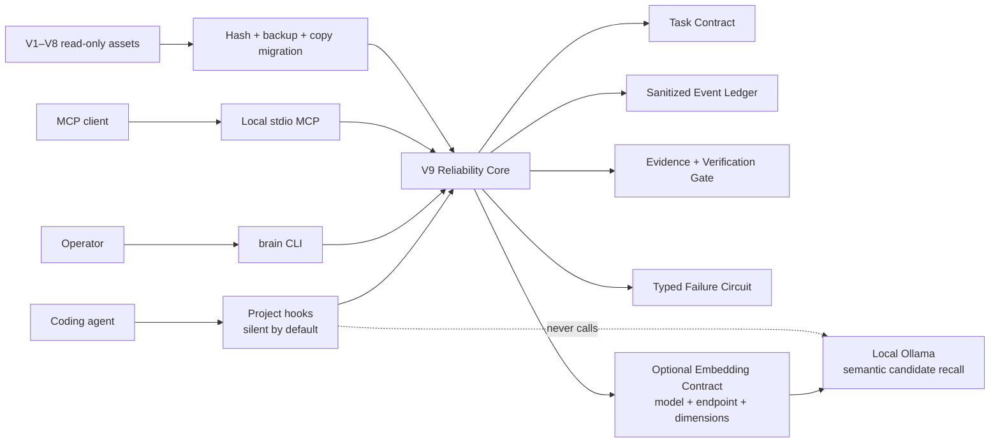
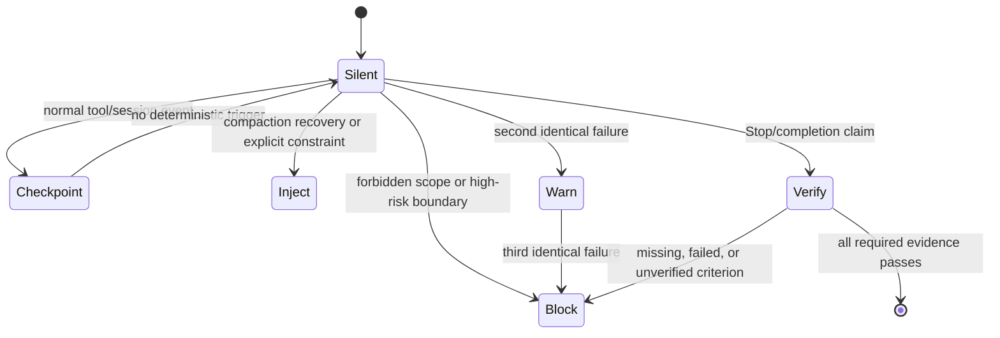
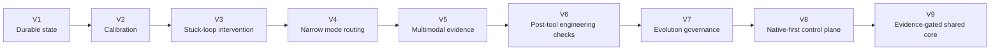

# Codex Brain — Adaptive Reliability Harness, Version 9

[](package.json)
[](docs/v9/privacy-and-threat-model.md)
[](docs/v9/quickstart.md)
[](LICENSE)

Codex Brain V9 is a local reliability control plane for coding agents. It is silent during ordinary work and intervenes only when deterministic evidence indicates an explicit constraint, a high-risk write, repeated failure, context-compaction recovery, or an unsupported completion claim.

It does not replace the agent. It gives hooks, the `brain` CLI, and a stdio MCP server one shared, evidence-gated contract.

## Architecture





## V1 → V9: design journey

This repository keeps the version history as an engineering record, not a claim that each newer layer is automatically better. Each version addressed a concrete agent failure, then exposed a cost, ambiguity, or safety boundary that shaped the next one. The enduring direction is: preserve the useful control, remove the always-on tax, and require evidence before a system treats its own output as truth.



| Version | Public design move | What it made better | Why the next change was needed |
|---|---|---|---|
| [V1](https://github.com/liuanye9-lab/codex-os-brain/blob/main/v1/README.md) — durable state | Moved important decisions out of transient chat into inspectable local artifacts and conditional recall. | Persistence and traceability. | Repeating stored context could preserve a wrong belief as faithfully as a correct one. |
| [V2](https://github.com/liuanye9-lab/codex-os-brain/blob/main/v2/README.md) — calibration | Separated self-report from evidence, with verify / hedge / ask boundaries and offline review. | More honest uncertainty. | Better calibration still did not interrupt a bad search path while work was stuck. |
| [V3](https://github.com/liuanye9-lab/codex-os-brain/blob/main/v3/DESIGN.md) — stuck-loop intervention | Detected repeated unproductive patterns and proposed a bounded backtrack or alternative. | Escaped single-track persistence. | A universal checklist caused harmless false positives and did not fit every task. |
| [V4](https://github.com/liuanye9-lab/codex-os-brain/blob/main/v4/DESIGN.md) — narrow mode routing | Chose a short owner, operator, reviewer, or coach posture from explicit signals. | Reduced long prompt injection. | Text-only routing could not retain usable evidence from documents and screenshots. |
| [V5](https://github.com/liuanye9-lab/codex-os-brain/blob/main/v5/DESIGN.md) — multimodal evidence | Recorded safe metadata, extractable text, and explicit unsupported states for outside-chat materials. | Durable references without pretending metadata equals understanding. | Better intake did not verify the engineering effects of tool edits. |
| [V6](https://github.com/liuanye9-lab/codex-os-brain/blob/main/v6/DESIGN.md) — engineering harness | Added post-tool detectors for verification gaps, risky edits, secrets, dependency and structural debt. | Failure patterns became visible near the causal edit. | Advisory hooks could still become noisy, and proposals still needed governance. |
| [V7](https://github.com/liuanye9-lab/codex-os-brain/blob/main/v7/DESIGN.md) — evolution governance | Turned self-improvement into reviewable candidates with approval, verification, sandboxing, and revocation. | Prevented an agent from treating a proposal as permission. | A persistent hook/injection stack imposed token, latency, and attention cost on ordinary work. |
| [V8](https://github.com/liuanye9-lab/codex-os-brain/blob/main/v8/DESIGN.md) — native-first control plane | Kept the mother agent direct by default; recall, delegation, policy trials, and skills had to earn activation. | Measured harness tax and independently switchable controls. | The remaining cross-surface risks needed one compact contract for hooks, CLI, and MCP. |
| **V9 — evidence-gated control plane** | Added a shared task contract, sanitized event ledger, typed failure circuit, completion gate, project hooks, CLI, MCP, and optional local embeddings. | One local policy core with bounded intervention, migration, and rollback. | V9 remains deliberately incomplete: semantic correctness still needs domain review and external evidence. |

### What V9 changes relative to the earlier harness

| Earlier default | V9 decision | Reason |
|---|---|---|
| More context or a new prompt layer on every turn | Silent fast path; activate only on an explicit constraint, high-risk write, repeated failure, compaction recovery, or completion claim | Ordinary capable work should not pay a permanent harness tax. |
| Agent confidence or a final message as completion | Criterion-linked external evidence | **Evidence must outrank self-report.** |
| A growing hook stack with uneven behavior | Hooks, CLI, and MCP call one shared local core | Policy must be consistent across entry points. |
| Memory-like text treated as instruction | Allowlisted metadata and retrieved content treated as evidence | Recall can be stale, poisoned, incomplete, or irrelevant. |
| Rewrite or normalize old state in place | Hash, backup, copy adapter, verification, and explicit cutover | Version evolution must be reversible and auditable. |
| Semantic recall as an always-on remote dependency | Optional loopback Ollama embeddings with fingerprinted reindexing and lexical fallback | Privacy, offline operation, and graceful degradation are part of correctness. |

### Maintainer's public design reflection

这条演进线从来不是“给 Agent 加更多层”的竞赛。早期版本通过持久化、路由、检测和治理，解决了当时真实存在的遗忘、卡住、漏验和自我修改风险；这些经验仍然是 V9 的来源。但随着基础模型的规划、工具使用与本地任务保持能力提升，常驻注入、频繁分流和层层审核也会制造新的成本：占用上下文、增加延迟、放大误触发，并让系统看起来比实际更可靠。

因此，V8/V9 的公开设计判断是：**Control must earn its cost.** 默认相信原生 Agent 能直接完成清晰、低风险、可验证的工作；只有出现可观测症状时，才让 harness 介入。介入也不等于夺权：确定性的隐私、禁止范围、破坏性动作和未验证完成可以失败关闭；观测、建议与召回则失败开放，避免一个损坏的辅助层阻断正常工作。

另一个核心判断是，harness 的价值不在于替模型“思考得更多”，而在于让系统更诚实地处理不确定性：区分事实、证据、候选和权限；让 memory、retrieval、subagent 与自我改进都经过边界、预算、验证和回退。借鉴开源项目与论文时，复用的是可验证机制而不是人格、私有状态或未经证实的结论。详见 [research and attribution](docs/v9/research-and-attribution.md) 与 [V7 heavy-harness retrospective](https://github.com/liuanye9-lab/codex-os-brain/blob/main/docs/history/v7-heavy-harness.md).

The practical rule is simple: keep the smallest harness that measurably improves the task, and delete or disable the rest.

## What activates it

| Trigger | V9 behavior | Default decision |
|---|---|---|
| Ordinary read/write inside verified scope | Record only allowlisted metadata | Silent |
| Explicit user/project constraint | Restore a bounded checkpoint when relevant | Inject |
| High-risk or external write | Require a verified boundary or human confirmation | Block |
| Repeated identical failure | Warn after two; open the circuit after three | Inject, then block retry |
| Context compaction | Restore objective, explicit constraints, and unresolved items | Inject, maximum about 250 tokens |
| `Stop` completion claim | Evaluate every required criterion against evidence | Block if incomplete |

Hot hooks make no network or model call. The local targets are below 100 ms for `PreToolUse` and below 150 ms for `PostToolUse` on deterministic fixtures.

## Five-minute quickstart

Requirements: Node.js 20 or newer.

```bash
git clone https://github.com/liuanye9-lab/codex-os-brain.git
cd codex-os-brain
npm install
npm test
npm link

brain status --json
brain task create --task-id demo --objective "verify the V9 adapter" --criterion tests --json
brain verify --json
```

Both binary names are available:

```bash
brain status --json
codex-brain status --json
```

### Optional local embeddings with Ollama

The reasoning model should not carry the entire long-term memory in every prompt. A small local embedding model can first select a few semantically relevant candidates; the Agent then reasons over and verifies those candidates. This combination reduces irrelevant context and repeated token use, supports meaning-based recall beyond exact keywords, and keeps raw memory queries on the local machine. It remains optional, with lexical fallback when Ollama or the vector index is unavailable.

V9 does not silently install Ollama or choose the largest model. It provides three starting profiles and lets the Agent re-evaluate them against Chinese/code recall quality, latency, RAM/VRAM, disk, and privacy requirements:

```bash
brain embeddings recommend --profile zh-light --json
brain embeddings pull --model qwen3-embedding:0.6b --confirm-download --json
brain embeddings configure --model qwen3-embedding:0.6b --confirm --json
brain embeddings doctor --json
brain embeddings probe --text "中文和代码召回探针" --json
brain embeddings prompt --json
```

Model, endpoint, and requested dimensions form one fingerprint. Changing any of them sets `requiresReindex`; vector recall stays unavailable until all readable sources are rebuilt and a zero-embedding-failure manifest with the matching fingerprint is confirmed. Unavailable sources remain visible as `sourceWarningCount`. Indexing and querying must use the same model. Hot hooks never call Ollama.

Copy this prompt when asking an Agent to adapt the local model:

```text
请为当前项目重新适配 Ollama 本地嵌入后端。先检查 OS、内存/显存、磁盘、Ollama 与 localhost API；下载前必须获得确认。用固定的中文、英文和代码召回 canary 比较质量、延迟与资源占用，不因模型更大就默认升级。确保索引与查询使用同一模型、端点和 dimensions，并记录配置指纹；任一身份字段改变都要重建全部可读来源，只有零嵌入失败的匹配 manifest 才能标记 indexed，无法读取的来源必须单独报告。保留词法检索回退，限制注入条数与 token，把召回内容当作待核验证据，不把私有记忆发往远程端点。
```

See [local embedding installation and adaptation](docs/v9/local-embeddings.md).

### Enable project-scoped hooks

Hooks are off until a project explicitly opts in. This command writes only `<project>/.codex/hooks.json`; it does not install global or Claude Code hooks.

```bash
brain hooks doctor --project "$PWD" --json
brain hooks enable --project "$PWD" --confirm --json
brain hooks disable --project "$PWD" --confirm --json
```

The hook lifecycle includes `SessionStart`, `UserPromptSubmit`, `PreToolUse`, `PostToolUse`, `PreCompact`, `PostCompact`, and `Stop`.

### Start the MCP server

```bash
brain mcp serve
```

Example client configuration:

```json
{
  "mcpServers": {
    "codex-brain-v9": {
      "command": "brain",
      "args": ["mcp", "serve"]
    }
  }
}
```

MCP can read status, contracts, failures, events, verification state, the embedding contract, and its adaptation prompt. Its four controlled mutations create a task, checkpoint it, attach an evidence reference, and close it after verification. MCP cannot install or pull models, change embedding configuration, mark an index current, approve Canary promotion, apply or roll back migration, publish a repository, change visibility, delete audit data, or bypass policy.

## V1–V8 preservation

V9 never rewrites legacy data in place. Migration is:

```text
inventory -> source hashes -> verified backup -> copy adapters -> verification -> explicit cutover
```

- Unavailable cloud placeholders are recorded as `unavailable_dataless`; V9 does not force hydration.
- Re-running a migration is idempotent.
- Every imported record keeps source hash, detected version, and adapter version.
- V8 remains selectable through `fallbackVersion: 8` and a rollback marker.

See [the migration guide](docs/v9/migration.md).

## Verification and privacy

```bash
npm test
npm run check
node scripts/probe-v9-mcp.mjs
node scripts/build-public-export.js --output /tmp/codex-brain-v9-public
```

The public tree is generated from an explicit allowlist. It excludes runtime state, identities, memories, raw prompts, raw tool output, credentials, session archives, private adapters, local absolute paths, and V1–V8 data. See the [privacy and threat model](docs/v9/privacy-and-threat-model.md).

## Documentation

- [CLI, hooks, and MCP quickstart](docs/v9/quickstart.md)
- [Optional Ollama local embeddings](docs/v9/local-embeddings.md)
- [V1–V8 migration and rollback](docs/v9/migration.md)
- [Privacy and threat model](docs/v9/privacy-and-threat-model.md)
- [Research and open-source attribution](docs/v9/research-and-attribution.md)

## Boundaries

V9 reduces common reliability failures; it does not prove semantic correctness, replace domain review, or make an untrusted agent safe. Deterministic gates fail closed only for credential/privacy boundaries, explicit forbidden scope, destructive actions, and unsupported completion. Advisory telemetry fails open so a broken observer does not disable ordinary work.

MIT licensed. See [LICENSE](LICENSE).
