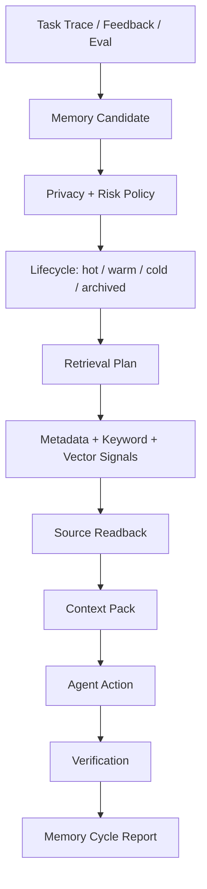
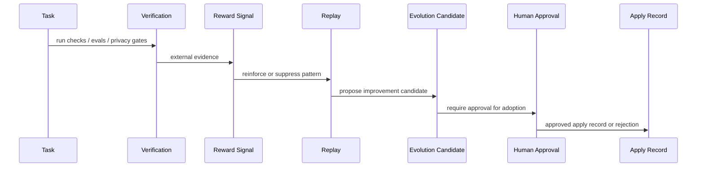
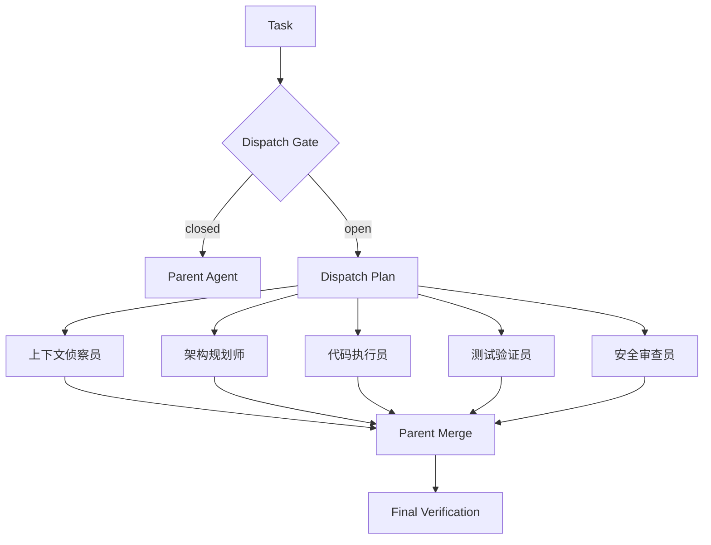

# Agentic Coding OS Brain (ACOB)

> A local-first cognitive operating layer for Codex: memory, self-evolution, multi-agent dispatch, verification, tool reliability, and an observable dashboard.


Agentic Coding OS Brain (ACOB) turns Codex from a powerful chat-style coding agent into a governed agentic coding system.

It is not a prompt pack. It is a local harness that adds:

- bounded working context
- governed long-term memory
- self-evolution candidates with approval gates
- ROI-gated sub-agent dispatch
- verification-before-completion
- tool-call reliability checks
- privacy scanning
- a local dashboard for observable system state

In plain language:

> Codex is the engine. ACOB is the operating system around it: memory, routing, safety rails, feedback loops, and a dashboard.

## 60-Second Quickstart

ACOB is designed to be tried with one command and no hosted backend.

Use the GitHub package today:

```bash
npx -y github:liuanye9-lab/codex-os-brain quickstart
```

Use the npm package after publication:

```bash
npx -y agentic-coding-os-brain@latest quickstart
```

Open the dashboard:

```bash
acob dashboard
```

Verify the system:

```bash
acob status
acob agents
acob dispatch --task "refactor dashboard, update docs, run checks" --json
acob check
```

Expected:

```text
status: global_active
scope: all_codex_prompts_on_this_codex_home
```

Low-cost runtime profile:

- no hosted backend
- no database setup
- no paid model call during install
- no private memory uploaded
- local files only under `~/.acob`
- dashboard runs on localhost

## Why This Matters

Most coding agents fail in predictable ways:

| Failure | What Usually Happens | ACOB Response |
|---|---|---|
| Long context drift | the agent keeps reading more and forgets what matters | Working Memory + Context Pack |
| Fake memory | everything is dumped into a vector store | governed memory lifecycle and source readback |
| Unverified completion | the agent says done because it looks done | verification-before-completion gate |
| Tool hallucination | API/tool calls succeed but results are not parsed or checked | tool-call ledger and local eval suite |
| Agent sprawl | more agents are spawned without ROI | dispatch gate, token budget, permission lock |
| Unsafe self-improvement | feedback directly changes rules or persona | candidate-only self-evolution with rollback |
| Dashboard illusion | pretty charts imply capability | observable-state dashboard only |

ACOB is built around a simple thesis:

> Agentic coding becomes valuable when memory, tools, agents, evaluation, and feedback are governed as one system.

## System Overview

```mermaid
flowchart LR
  User["User Task"] --> Gate["ACOB Entry Gate"]
  Gate --> WM["Working Memory"]
  WM --> Pack["Context Pack"]
  Pack --> Dispatch{"ROI Dispatch Gate"}
  Dispatch -->|"simple or risky"| Parent["Parent Agent"]
  Dispatch -->|"complex + verifiable + low risk"| Agents["Specialist Agents"]
  Parent --> Tools["Tool Calls"]
  Agents --> Tools
  Tools --> Verify["Verification Gate"]
  Verify --> Reward["Reward Signal"]
  Reward --> Replay["Replay"]
  Replay --> Memory["Memory Cycle"]
  Memory --> Evolution["Self-Evolution Candidate"]
  Evolution --> Approval["Human Approval Gate"]
  Approval --> Dashboard["Observable Dashboard"]
```



## Core Product Layers

| Layer | Purpose | Public Runtime |
|---|---|---|
| Entry Gate | every Codex task enters a preflight contract | `runtime/scripts/inject-context.cjs` |
| Working Context | keeps current goal, constraints, risks, and verification focus bounded | global hook context |
| Memory System | models memory as selected reconstruction, not raw storage | `examples/memory-policy.example.json` |
| Self-Evolution | turns feedback into candidates, not automatic rule changes | `runtime/scripts/evolution-apply.cjs` |
| Multi-Agent Dispatch | routes complex work to specialist templates only when ROI is positive | `runtime/scripts/agentic-dispatch.cjs` |
| Tool Reliability | validates params, parses output, verifies result | `runtime/scripts/tool-eval-suite.cjs` |
| Dashboard | displays observable state and safe controls | `runtime/dashboard/` |
| Privacy Gate | prevents private memory, home paths, secrets, and raw prompts from shipping | `runtime/scripts/privacy-scan.cjs` |

## Memory System

ACOB treats memory as a governed lifecycle, not a vector database.



### Memory Principles

| Principle | Engineering Meaning |
|---|---|
| Memory is not storage | useful information must be selected, scoped, and reconstructed |
| Long context is not intelligence | the system decides what to include and what to drop |
| Vector recall is not truth | recalled memory must be read back from source before it becomes evidence |
| Forgetting is a feature | stale, low-value, conflicting, or risky memory should decay or be blocked |
| Private memory is local | public packages never include private user memory or identity files |

### Public Memory Boundary

The public repository includes memory policy examples and schemas. It does not include:

- private long-term memory
- user profile files
- identity/persona files
- raw session logs
- private local paths
- API keys, tokens, cookies, credentials, or vector indexes

## Self-Evolution System

ACOB supports self-evolution as a controlled feedback loop.

It does not let an agent rewrite its own core rules just because a model reflection sounded plausible.



### Self-Evolution Contract

| Rule | Why It Exists |
|---|---|
| feedback creates candidates | prevents unstable automatic rewrites |
| regression evidence required | avoids improving one case while breaking others |
| rollback plan required | every adoption must be reversible |
| high-risk changes need approval | memory, persona, credentials, publishing, and self-evolution remain gated |
| dashboard is evidence, not proof | observable metrics do not become capability claims by themselves |

## Multi-Agent Coding

ACOB includes a public specialist-agent library. The system does not spawn agents for show.

Dispatch opens only when the task has:

- 3+ clear sub-steps
- verifiable output
- low privacy risk or read-only agents
- separable responsibilities
- enough token budget



| Agent | Stable ID | Role |
|---|---|---|
| 上下文侦察员 | `context-scout` | map repo structure, files, and unknowns |
| 架构规划师 | `architecture-planner` | decompose complex changes and define boundaries |
| 代码执行员 | `implementation-worker` | implement a bounded assigned slice |
| 测试验证员 | `test-verifier` | run focused checks and produce evidence |
| 安全审查员 | `security-reviewer` | review privacy, secrets, and risky operations |
| 文档说明员 | `docs-writer` | update public explanation and user docs |
| 发布检查员 | `release-operator` | inspect package, release, and cross-platform risk |
| 工具调用审计员 | `tool-reliability-auditor` | verify tool parameters, parsing, and post-call results |
| 依赖审计员 | `dependency-auditor` | review dependency, license, supply-chain, and platform risk |
| 合并仲裁员 | `merge-arbiter` | merge agent outputs and define final verification |

## Dashboard

The dashboard is the system's global workspace: it shows observable state, not hidden reasoning.

```text
http://127.0.0.1:8791/
```

It is designed for operational trust:

- Is the global hook active?
- Did the dispatch gate open or close?
- Which specialist agents were selected?
- Did verification run?
- Did the privacy scan pass?
- Is a risky operation waiting for approval?
- Are control-plane commands available?

The dashboard does not show:

- private memory
- raw prompts
- hidden chain-of-thought
- credentials
- private home paths

## Repository Structure

The public repository mirrors the full private project shape while keeping the content public-safe.

```text
.
├── bin/                         # CLI entry
├── dashboard/                   # public dashboard mirror
├── docs/                        # architecture, install, security, release docs
├── evals/                       # public smoke/regression eval descriptions
├── examples/                    # sanitized examples
├── os-agent/                    # public OS-agent bridge boundary
├── plugins/                     # public plugin surface notes
├── research-reviews/            # public research summaries
├── runtime/                     # installable runtime
├── schemas/                     # public artifact schemas
├── scripts/                     # public helper entry notes
├── skills/                      # public skill templates
├── templates/                   # safe installation templates
├── tools/                       # tool reliability contracts
├── v2/ ... v7/                  # versioned architecture layers
└── test/                        # smoke tests
```

## Install And Run

Fastest GitHub path:

```bash
npx -y github:liuanye9-lab/codex-os-brain quickstart
```

Fastest npm path after publication:

```bash
npx -y agentic-coding-os-brain@latest quickstart
```

Manual npm install:

```bash
npm install -g agentic-coding-os-brain
acob quickstart
```

Verify:

```bash
acob status
acob agents
acob dispatch --task "refactor dashboard, update docs, run checks" --json
```

Start dashboard:

```bash
acob dashboard
```

## CLI Surface

```bash
acob quickstart
acob install --global-agentic
acob status
acob agents
acob dispatch --task "..."
acob dispatch --task "..." --json --write
acob agent-execution --example
acob agent-lock --example
acob budget --example
acob tool-eval
acob control --list
acob evolution-apply --example
acob dashboard
acob check
acob uninstall
```

## Safety And Governance

ACOB uses a public-safe release boundary.

| Boundary | Policy |
|---|---|
| Private memory | excluded from repository and npm package |
| Raw prompts | not stored in public artifacts |
| Secrets | blocked by privacy scan |
| Self-evolution | candidate and approval gated |
| Sub-agents | ROI and privacy gated |
| Tool calls | parameter, parse, and verification checks |
| Dashboard | observable state only |

Run before publishing:

```bash
npm run check
npm run privacy:scan
npm run pack:dry
```

## Why This Is Built For Agentic Coding Infrastructure

ACOB is positioned as infrastructure for the next phase of coding agents:

- agents need memory, but memory needs governance
- agents need tools, but tool calls need verification
- agents need autonomy, but autonomy needs gates
- agents need feedback, but feedback must become evidence-backed candidates
- organizations need dashboards, but dashboards must avoid data illusion

This repository is the public, privacy-safe foundation for that operating layer.

See:

- [Architecture](docs/ARCHITECTURE.md)
- [Agentic Coding](docs/AGENTIC_CODING.md)
- [Quickstart](docs/QUICKSTART.md)
- [Security](docs/SECURITY.md)
- [Install](docs/INSTALL.md)
- [Public Release Checklist](docs/PUBLIC_RELEASE_CHECKLIST.md)
