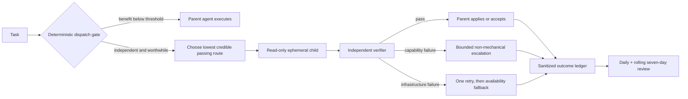

# Brain Lite Model Router

A small, dependency-free reference harness for routing Codex sub-tasks across GPT-5.6 Sol, Terra, Luna, and GPT-5.3-Codex-Spark without restoring an always-on hook stack.

The core rule is simple: keep ordinary work in the parent agent, and delegate only when a task is independent and has a clear verification, model-specialization, quota, batching, or parallelism advantage.

## Why this exists

Modern coding models need less orchestration than older harnesses assumed. Always-on prompt hooks, mandatory multi-agent fan-out, long policy injections, and automatic self-review can consume tokens while reducing model freedom. Brain Lite keeps only the pieces that still pay for themselves:

- a deterministic dispatch gate that makes no model call;
- task-family model and effort boundaries;
- read-only, ephemeral delegated workers;
- independent verification before acceptance;
- a sanitized, idempotent routing ledger;
- daily and rolling seven-day outcome reviews;
- bounded policy adaptation from distinct verified samples.

It intentionally ships no global hooks, neural router, gateway, graph engine, or raw memory layer.

## Routing policy

| Start route | Intended boundary |
|---|---|
| Spark high | Bounded, local, text-only coding with a mechanical check and an independent quota advantage |
| Luna low | Trivial extraction, classification, or formatting with immediate verification |
| Luna medium | Clear, repeated, low-risk work in one module |
| Luna max | Rules-clear, constraint-dense, batch work with deterministic verification |
| Terra medium | Everyday multi-condition development or research; use as a bounded probe |
| Terra max | Cross-file, cross-table, or cross-time reconciliation, including a failed Terra-medium probe |
| Sol max | Unfamiliar, open-ended, architectural, high-value, high-cost-of-failure, or hard-to-verify work |
| Ultra | Only after a verified max failure, at least three independent lanes, and a merge verifier |

Effort is an investment control, not a quality guarantee. The router does not mechanically climb through every effort level.



## Safety and cost boundaries

- Delegated workers use explicit argv, stdin task packets, read-only sandboxing, ephemeral sessions, and a structured output schema.
- The parent agent owns every workspace mutation and runs the final verifier.
- Model self-reports never count as completion evidence.
- Three different representative samples must pass 3/3 before a route becomes stable; 2/3 remains trial-only.
- Infrastructure failures are excluded from capability statistics. Repeated recent failures open an expiring route circuit.
- A task is capped at three attempts, one infrastructure retry, two capability escalations, and a total wall-time budget.
- Low-risk, independently verifiable task families may adopt a stable route automatically. High-risk, private, external-write, strategic, and unverifiable tasks never auto-downgrade.

## Quick start

Requires Node.js 20 or newer and a Codex executable for live delegation.

```bash
npm test
node scripts/brain-lite-router.js --features-file examples/features.json
```

Example feature packet:

```json
{
  "taskFamily": "bounded-coding",
  "clarity": "clear",
  "risk": "low",
  "verifiable": true,
  "independent": true,
  "coding": true,
  "textOnly": true,
  "boundedChange": true,
  "sparkQuotaAvailable": true,
  "estimatedToolCalls": 5
}
```

Delegate only after the gate returns `dispatch: true`:

```bash
node scripts/brain-lite-delegate.js \
  --route-file route.json \
  --task-file task.json \
  --cwd /path/to/project \
  --ledger data/router-ledger.jsonl
```

Derive bounded policy state and generate a review:

```bash
node scripts/brain-lite-routing-ledger.js derive \
  --ledger data/router-ledger.jsonl \
  --output data/router-policy-state.json
node scripts/brain-lite-daily-review.js \
  --ledger data/router-ledger.jsonl \
  --policy-state data/router-policy-state.json \
  --output reports/daily-review.md
```

## Calibration note

The included constraint-satisfaction profile is an example derived from a small three-case calibration in which max was the observed passing effort and lower efforts were non-monotonic. It is a task-family starting point, not a universal ranking. Replace or disable it when local representative samples disagree.

The research and adoption audit is in [docs/research/2026-07-12-model-routing-audit.md](docs/research/2026-07-12-model-routing-audit.md).

## Repository boundary

This public package contains generic source, synthetic tests, schemas, and documentation only. Do not commit raw prompts, model outputs, personal profiles, memories, rollout archives, credentials, local account paths, generated ledgers, or daily reports.

MIT licensed.
