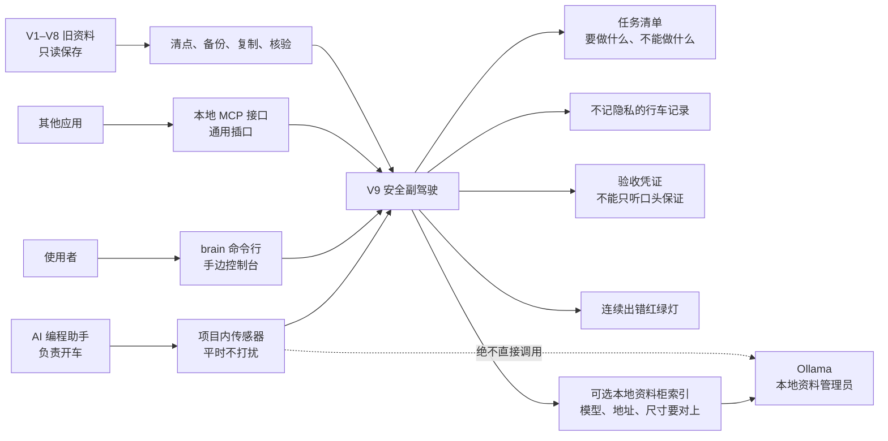
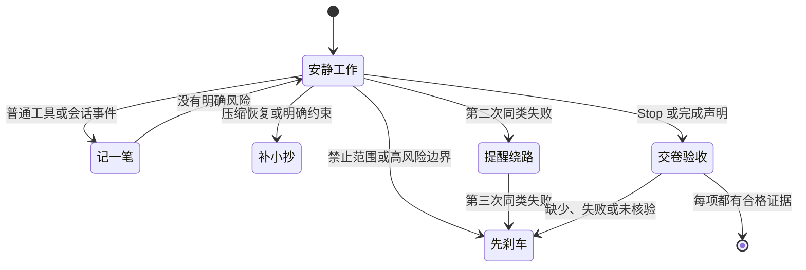

# Codex Brain V9：给 AI 编程助手装一个“安全副驾驶”

[](package.json)
[](docs/v9/privacy-and-threat-model.md)
[](docs/v9/quickstart.md)
[](LICENSE)

把 AI 编程助手想成司机：它负责开车、认路、做决定；Codex Brain V9 像坐在副驾的人。平时不唠叨、不抢方向盘；只有快碰到明确红线、要做高风险操作、连续撞同一堵墙、长对话被压缩，或它说“已经做完”时，才提醒、补充信息或踩一脚刹车。

它不是另一个 Agent，也不承诺让 Agent 永远正确。它只是让项目 hooks、命令行 `brain` 和 MCP 接口共用一套可检查的规则：**先把事情说清楚，再拿证据验收。**

## 它像什么？





## 它什么时候会插一句？

| 场景 | 大白话 | V9 会做什么 |
|---|---|---|
| 日常读写，而且范围已经说清 | 正常开车 | 只记允许的少量元数据，不打扰 |
| 用户或项目写了明确要求 | 像办事前先写清单 | 在需要时补回这张清单 |
| 要改外部系统、删除资料或做其他高风险写入 | 像转账前再核对收款人 | 要求已验证的边界或人工确认 |
| 同一种失败反复出现 | 像路口的红绿灯 | 第二次提醒换路线，第三次暂停同样的重试 |
| 上下文压缩 | 像把长对话压成随身小抄 | 只补回目标、红线和没解决的事，最多约 250 tokens |
| Agent 说“完成了” | 像交卷前按题号检查 | 每个必做项都要能对应到证据；没有就不能算完成 |

热路径 hooks 不联网、不调用模型。固定样本的目标是 `PreToolUse` 少于 100 ms，`PostToolUse` 少于 150 ms：副驾驶不能比开车本身更慢。

## V1 → V9：这套系统是怎么长出来的

这不是“版本越新、层数越多就越好”的故事。每一版都先解决一个常见失误，再发现它也会带来成本或盲区。留下真正有用的护栏，拿掉平时一直耗时、耗 token 的东西，最后才形成 V9。


| 版本 | 当时加上的东西 | 它解决了什么 | 为什么还要继续改 |
|---|---|---|---|
| [V1](https://github.com/liuanye9-lab/codex-os-brain/blob/main/v1/README.md) | 把重要决定从聊天里搬到可检查的本地记录。 | 不容易一翻页就忘。 | 笔记也可能写错；保存得久，不等于是真的。 |
| [V2](https://github.com/liuanye9-lab/codex-os-brain/blob/main/v2/README.md) | 把“我觉得完成了”和“有证据证明完成了”分开。 | Agent 更会承认不确定。 | 它卡在错误路线时，光诚实还不够。 |
| [V3](https://github.com/liuanye9-lab/codex-os-brain/blob/main/v3/DESIGN.md) | 发现重复无效动作时，建议后退一步或换办法。 | 少在同一面墙前反复撞。 | 万能检查表会误报，也不适合所有任务。 |
| [V4](https://github.com/liuanye9-lab/codex-os-brain/blob/main/v4/DESIGN.md) | 按明确信号选择短小的负责人、执行者、审阅者或教练卡。 | 少塞长 prompt。 | 文字规则还留不住文档、截图里的可用线索。 |
| [V5](https://github.com/liuanye9-lab/codex-os-brain/blob/main/v5/DESIGN.md) | 对文档和截图记录安全元数据、可提取文字和“不支持”的状态。 | 资料有出处，不把文件名当理解。 | 收资料做得更好，不代表改代码后就验收了效果。 |
| [V6](https://github.com/liuanye9-lab/codex-os-brain/blob/main/v6/DESIGN.md) | 在工具改动后检查漏验、危险编辑、密钥、依赖和结构问题。 | 错误更靠近发生点时被看见。 | 常驻检查会吵，也不能让“建议”自动变成“许可”。 |
| [V7](https://github.com/liuanye9-lab/codex-os-brain/blob/main/v7/DESIGN.md) | 把自我改进变成可审阅、可批准、可撤回的候选项。 | Agent 不能把“想到”当成“获准”。 | 长期 hook 和注入会占上下文、增加延迟、分散注意力。 |
| [V8](https://github.com/liuanye9-lab/codex-os-brain/blob/main/v8/DESIGN.md) | 默认让主 Agent 直接干活；召回、委派和策略试验必须有理由才启动。 | 工具开始为自己的成本负责。 | hooks、CLI 和 MCP 仍需要一套一致的小规则。 |
| **V9** | 用同一份任务清单、事件记录、证据门、失败红绿灯、hooks、CLI、MCP 和可选本地资料柜做成一个安全副驾驶。 | 该安静时安静，该检查时能说清依据；还能迁移和回退。 | 它仍不能替代领域专家，也不能凭空证明语义正确。 |

### 为什么 V9 不追求“功能越多越好”？

护栏也有成本：每多一层注入、分流或审核，都会吃掉上下文、时间和人的注意力，还可能误触发。V9 的原则是：**控制必须值得它的成本。** 清晰、低风险、能验证的工作，默认让原生 Agent 直接完成；只有看到明确症状，系统才介入。

这也解释了几个关键选择：

- 不能只因为 Agent 说“做完了”就相信它，证据要比自述更靠得住。
- 记忆和检索像别人递来的一张便条：可能过期、片面或被污染，所以是待核验的材料，不是命令。
- 老数据不原地改写，像搬家时先清点、拍照、备份，再复制过去验收；不对就能回退。
- 借鉴开源和论文时，复用的是能核验的机制，不复制人格、私有状态或没有证据的结论。见 [research and attribution](docs/v9/research-and-attribution.md) 和 [V7 heavy-harness retrospective](https://github.com/liuanye9-lab/codex-os-brain/blob/main/docs/history/v7-heavy-harness.md)。

## 五分钟跑起来

需要 Node.js 20 或更高版本。

```bash
git clone https://github.com/liuanye9-lab/codex-os-brain.git
cd codex-os-brain
npm install
npm test
npm link

brain status --json
brain task create --task-id demo --objective "verify the V9 adapter" --criterion tests --json
brain verify --json
```

这两个命令名都能用：

```bash
brain status --json
codex-brain status --json
```

### 可选的本地资料柜：Ollama

不要把所有旧资料一股脑塞进每次 prompt。更轻的做法是：先让一个小型本地嵌入模型从资料里挑出少量可能相关的内容，Agent 再读它们、判断它们、验证它们。简单说，就是 **先翻资料柜再回答**。

这能减少无关上下文和重复 token，也能找到不完全相同但意思相近的内容；原始查询留在本机。它完全可选：Ollama 没开、索引不可用时，仍会退回关键词检索，不会让项目停摆。

Ollama 在这里不是第二个“大脑”，更像本地资料管理员。V9 不会偷偷安装它，也不会擅自下载最大的模型。先根据中文/代码召回效果、速度、内存/显存、磁盘和隐私需求选一个合适的起点：

```bash
brain embeddings recommend --profile zh-light --json
brain embeddings pull --model qwen3-embedding:0.6b --confirm-download --json
brain embeddings configure --model qwen3-embedding:0.6b --confirm --json
brain embeddings doctor --json
brain embeddings probe --text "中文和代码召回探针" --json
brain embeddings prompt --json
```

模型、地址和向量尺寸会组成一个“资料柜编号”（fingerprint）。改了其中任何一项，就像换了分类规则，旧索引不能假装还适用：系统会要求重新整理所有可读资料，并且只有编号匹配、零嵌入失败的清单存在时，才开放向量召回。读不到的资料会明确提示为 `sourceWarningCount`。建索引和查索引必须用同一模型；热路径 hooks 永远不调用 Ollama。

让 Agent 为当前机器重新适配模型时，可以直接复制这段话：

```text
请为当前项目重新适配 Ollama 本地嵌入后端。把它当作本地资料管理员，而不是另一个会替人做决定的大脑。先检查 OS、内存/显存、磁盘、Ollama 与 localhost API；下载前必须获得确认。用固定的中文、英文和代码召回 canary 比较质量、延迟与资源占用，不因模型更大就默认升级。确保索引与查询使用同一模型、端点和 dimensions，并记录配置指纹；任一身份字段改变都要重建全部可读来源，只有零嵌入失败的匹配 manifest 才能标记 indexed，无法读取的来源必须单独报告。保留词法检索回退，限制注入条数与 token，把召回内容当作待核验证据，不把私有记忆发往远程端点。
```

详见 [本地嵌入安装与适配说明](docs/v9/local-embeddings.md)。

### 给某个项目装上传感器

hooks 默认关闭。下面的命令只会写入 `<project>/.codex/hooks.json`，不会安装全局 hooks，也不会安装 Claude Code hooks。

```bash
brain hooks doctor --project "$PWD" --json
brain hooks enable --project "$PWD" --confirm --json
brain hooks disable --project "$PWD" --confirm --json
```

这些传感器会经过 `SessionStart`、`UserPromptSubmit`、`PreToolUse`、`PostToolUse`、`PreCompact`、`PostCompact` 和 `Stop` 等时点；它们先安静采集和记 checkpoint，只有触发条件出现才补充信息或阻断。

### 让其他应用接入：MCP

先启动本地 MCP 服务：

```bash
brain mcp serve
```

客户端配置示例：

```json
{
  "mcpServers": {
    "codex-brain-v9": {
      "command": "brain",
      "args": ["mcp", "serve"]
    }
  }
}
```

把 MCP 想成给其他应用留的标准插口：它能读状态、任务清单、失败记录、事件、验收结果、嵌入配置和适配提示；它只能受控地创建任务、打 checkpoint、附上证据引用，并在验收后关闭任务。

它**不能**安装或下载模型、改嵌入配置、把索引说成最新、批准 Canary、执行或回退迁移、发布仓库、改可见性、删除审计资料，或绕过规则。能看到仪表盘，不等于能拆安全带。

## V1–V8 的资料怎么办？

V9 不会原地改旧数据。过程像搬家：

```text
清点 -> 记录原始哈希 -> 确认备份 -> 复制并转换 -> 核验 -> 明确切换
```

- 云端占位但本机读不到的文件会标记为 `unavailable_dataless`，不会强行下载。
- 重跑迁移不会反复改坏东西。
- 每条导入记录都保留来源哈希、检测到的版本和转换器版本。
- 需要回退时，可用 `fallbackVersion: 8` 和回退标记选择 V8。

详见 [迁移与回退说明](docs/v9/migration.md)。

## 怎么验收？怎么保护隐私？

```bash
npm test
npm run check
node scripts/probe-v9-mcp.mjs
node scripts/build-public-export.js --output /tmp/codex-brain-v9-public
```

公开发布像出门前检查行李：公开树由明确的允许清单生成，默认不带运行状态、身份资料、记忆、原始 prompt、原始工具输出、凭据、会话归档、私有适配器、本机绝对路径和 V1–V8 数据。详见 [隐私与威胁模型](docs/v9/privacy-and-threat-model.md)。

## 文档索引

- [CLI、hooks 与 MCP 快速开始](docs/v9/quickstart.md)
- [可选 Ollama 本地嵌入](docs/v9/local-embeddings.md)
- [V1–V8 迁移与回退](docs/v9/migration.md)
- [隐私与威胁模型](docs/v9/privacy-and-threat-model.md)
- [研究与开源归属](docs/v9/research-and-attribution.md)

## 它做不到什么？

副驾驶不是方向盘。V9 能减少常见的遗忘、越界、重复失败和“没验收就宣布完成”，但不能证明语义一定正确、不能替代领域专家，也不能把不可信的 Agent 变安全。只有凭据/隐私边界、明确禁止范围、破坏性动作和没有证据的完成声明会失败关闭；观察和建议则失败开放，避免坏掉的观察器反而让正常工作无法继续。

MIT licensed. See [LICENSE](LICENSE).
