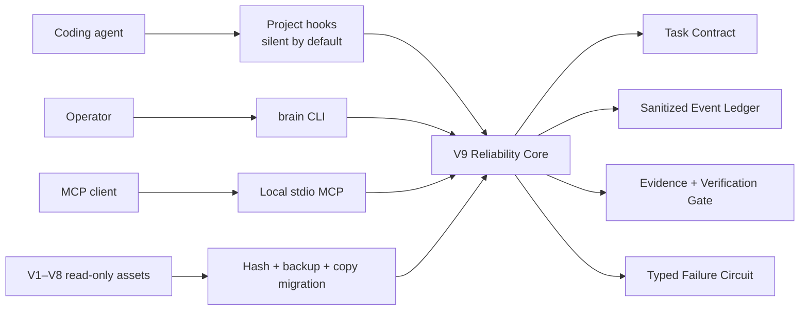
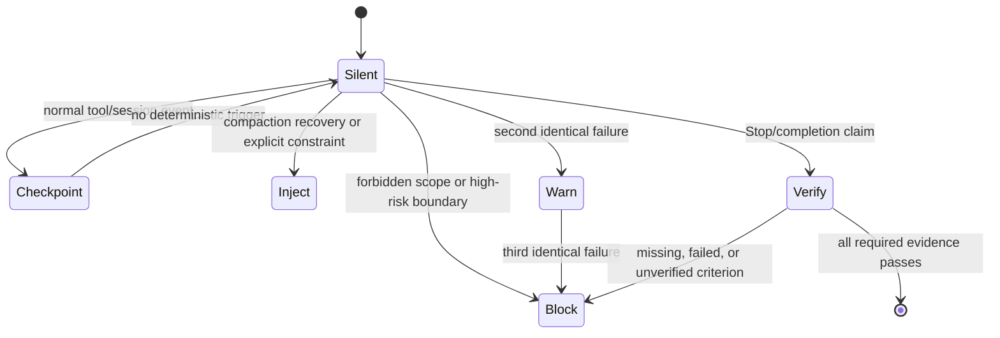

# Codex Brain — Adaptive Reliability Harness, Version 9

[](package.json)
[](docs/v9/privacy-and-threat-model.md)
[](docs/v9/quickstart.md)
[](LICENSE)

Codex Brain V9 is a local reliability control plane for coding agents. It is silent during ordinary work and intervenes only when deterministic evidence indicates an explicit constraint, a high-risk write, repeated failure, context-compaction recovery, or an unsupported completion claim.

It does not replace the agent. It gives hooks, the `brain` CLI, and a stdio MCP server one shared, evidence-gated contract.

## Architecture





## What activates it

| Trigger | V9 behavior | Default decision |
|---|---|---|
| Ordinary read/write inside verified scope | Record only allowlisted metadata | Silent |
| Explicit user/project constraint | Restore a bounded checkpoint when relevant | Inject |
| High-risk or external write | Require a verified boundary or human confirmation | Block |
| Repeated identical failure | Warn after two; open the circuit after three | Inject, then block retry |
| Context compaction | Restore objective, explicit constraints, and unresolved items | Inject, maximum about 250 tokens |
| `Stop` completion claim | Evaluate every required criterion against evidence | Block if incomplete |

Hot hooks make no network or model call. The local targets are below 100 ms for `PreToolUse` and below 150 ms for `PostToolUse` on deterministic fixtures.

## Five-minute quickstart

Requirements: Node.js 20 or newer.

```bash
git clone https://github.com/liuanye9-lab/codex-os-brain.git
cd codex-os-brain
npm install
npm test
npm link

brain status --json
brain task create --task-id demo --objective "verify the V9 adapter" --criterion tests --json
brain verify --json
```

Both binary names are available:

```bash
brain status --json
codex-brain status --json
```

### Enable project-scoped hooks

Hooks are off until a project explicitly opts in. This command writes only `<project>/.codex/hooks.json`; it does not install global or Claude Code hooks.

```bash
brain hooks doctor --project "$PWD" --json
brain hooks enable --project "$PWD" --confirm --json
brain hooks disable --project "$PWD" --confirm --json
```

The hook lifecycle includes `SessionStart`, `UserPromptSubmit`, `PreToolUse`, `PostToolUse`, `PreCompact`, `PostCompact`, and `Stop`.

### Start the MCP server

```bash
brain mcp serve
```

Example client configuration:

```json
{
  "mcpServers": {
    "codex-brain-v9": {
      "command": "brain",
      "args": ["mcp", "serve"]
    }
  }
}
```

MCP can read status, contracts, failures, events, and verification state. Its four controlled mutations create a task, checkpoint it, attach an evidence reference, and close it after verification. MCP cannot approve Canary promotion, apply or roll back migration, publish a repository, change visibility, delete audit data, or bypass policy.

## V1–V8 preservation

V9 never rewrites legacy data in place. Migration is:

```text
inventory -> source hashes -> verified backup -> copy adapters -> verification -> explicit cutover
```

- Unavailable cloud placeholders are recorded as `unavailable_dataless`; V9 does not force hydration.
- Re-running a migration is idempotent.
- Every imported record keeps source hash, detected version, and adapter version.
- V8 remains selectable through `fallbackVersion: 8` and a rollback marker.

See [the migration guide](docs/v9/migration.md).

## Verification and privacy

```bash
npm test
npm run check
node scripts/probe-v9-mcp.mjs
node scripts/build-public-export.js --output /tmp/codex-brain-v9-public
```

The public tree is generated from an explicit allowlist. It excludes runtime state, identities, memories, raw prompts, raw tool output, credentials, session archives, private adapters, local absolute paths, and V1–V8 data. See the [privacy and threat model](docs/v9/privacy-and-threat-model.md).

## Documentation

- [CLI, hooks, and MCP quickstart](docs/v9/quickstart.md)
- [V1–V8 migration and rollback](docs/v9/migration.md)
- [Privacy and threat model](docs/v9/privacy-and-threat-model.md)
- [Research and open-source attribution](docs/v9/research-and-attribution.md)

## Boundaries

V9 reduces common reliability failures; it does not prove semantic correctness, replace domain review, or make an untrusted agent safe. Deterministic gates fail closed only for credential/privacy boundaries, explicit forbidden scope, destructive actions, and unsupported completion. Advisory telemetry fails open so a broken observer does not disable ordinary work.

MIT licensed. See [LICENSE](LICENSE).
