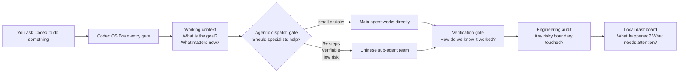
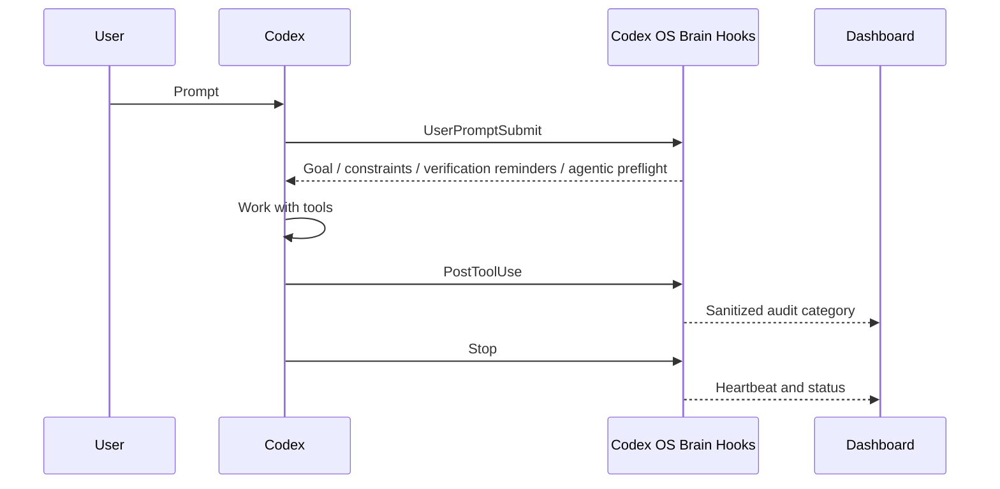
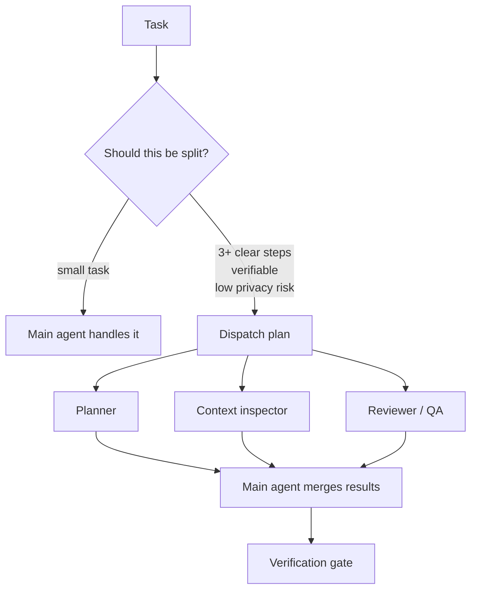

# Codex OS Brain

Give Codex a local "operating system for thinking and doing": memory discipline, verification gates, safer tool use, and a dashboard you can actually inspect.

Think of Codex as a very capable driver. Codex OS Brain is the dashboard, seat belt, route planner, rear-view mirror, and maintenance log around that driver.

It does not replace Codex. It wraps Codex with a public, privacy-first harness so every task can enter through a visible, safer, more consistent workflow.

## What Is This?

Codex OS Brain is a small local runtime that installs into your Codex environment.

After installation, every Codex prompt passes through a global entry gate before the agent starts working. That gate runs an Agentic Coding preflight and reminds the agent to:

- keep the current goal clear
- remember the active constraints
- verify before saying "done"
- slow down on risky changes
- avoid turning private memory into public data
- record sanitized status for a local dashboard
- dispatch Chinese-named specialist sub-agents only when the task is complex, verifiable, and low-risk

In plain language:

> Codex OS Brain gives Codex a workbench, checklist, dashboard, and learning notebook, without shipping your private life or secrets anywhere.

## What Can It Help You Do?

| If you use Codex for... | Codex OS Brain helps by... | What you get |
|---|---|---|
| Coding tasks | adding verification-before-completion reminders | fewer "looks done but broken" results |
| Long tasks | keeping a bounded working context | less drift and fewer forgotten constraints |
| Risky edits | raising engineering audit signals | safer changes around config, secrets, memory, and identity |
| Repeated workflows | turning useful patterns into candidate habits | a harness that can become more aligned over time |
| Multi-step work | shaping tasks into dispatchable units | clearer handoffs for sub-agents or future automation |
| Daily usage | showing observable state in a local dashboard | less guessing about what the system is doing |

## One-Screen Mental Model



The goal is simple:

> Make Codex less like a blank chat box and more like a repeatable work system.

## Why "Brain"?

This project uses brain-inspired language as a practical analogy, not as a claim of consciousness.

| Brain-like idea | Everyday analogy | Engineering mechanism |
|---|---|---|
| Attention | a desk with only the current papers on it | bounded working context |
| Working memory | a sticky note beside your keyboard | current goal, constraints, risks |
| Long-term memory | a notebook, not a garbage drawer | candidate-only learning |
| Reward | a coach checking the scoreboard | external evidence, tests, reviews |
| Metacognition | knowing when you are unsure | slow down, ask, verify, or stop |
| Social approval | asking the owner before changing the house | human approval for high-risk changes |
| Immune system | a security guard at the door | privacy scan and engineering audit |

## How It Runs

Codex OS Brain installs three global hook stages into Codex:

| Codex event | Runtime script | What it does |
|---|---|---|
| `UserPromptSubmit` | `inject-context.cjs` | adds the public cognitive harness context and Agentic Coding preflight before work starts |
| `PostToolUse` | `engineering-harness.cjs` | records sanitized risk categories after tool use |
| `Stop` | `capture-session.cjs` | updates a sanitized heartbeat/status file |



## Agent Memory, Without the Privacy Trap

Most "AI memory" systems make a dangerous mistake: they store everything and call it intelligence.

Codex OS Brain takes the opposite approach:

- memory should be selected, not dumped
- learning should require feedback, not just accumulation
- private user facts should not be packaged into a public tool
- useful patterns should start as candidates, not permanent rules
- risky memory, persona, or self-evolution changes need human approval

In this public package, no private long-term memory is included. The installed runtime only writes sanitized local status under:

```text
~/.codex-os-brain/data
```

That makes the framework reusable without leaking the original user's personal agent, memory, identity, logs, or secrets.

## Sub-Agent Dispatch Model

Codex OS Brain is designed so bigger tasks can be split like a small team:



The important rule:

> More agents do not automatically mean more intelligence.

Sub-agents should be used only when the task has clear parts, low privacy risk, and a way to verify results. Otherwise, the main agent should keep the work simple.

The public package now includes a local sub-agent library and dispatch planner:

```bash
codex-os-brain agents
codex-os-brain dispatch --task "refactor the dashboard, update docs, run checks" --json
```

Built-in Chinese agent templates:

| Agent | Stable id | Job | Default power |
|---|---|---|---|
| 上下文侦察员 | `context-scout` | map files, APIs, patterns, constraints | read-only |
| 架构规划师 | `architecture-planner` | compare designs and choose the smallest viable plan | read-only |
| 代码执行员 | `implementation-worker` | implement one bounded, assigned slice | limited write scope |
| 测试验证员 | `test-verifier` | find and run focused verification | read/execute safe checks |
| 安全审查员 | `security-reviewer` | review secrets, privacy, hooks, local servers | read-only |
| 文档说明员 | `docs-writer` | update README/docs/user-facing explanation | docs-only write scope |
| 发布检查员 | `release-operator` | run release checklist and package inspection | read/execute safe checks |

The dispatch gate opens only when:

- the task has enough clear sub-steps
- the outcome is verifiable
- privacy risk is low, or selected agents are read-only
- responsibilities are disjoint
- the parent agent remains responsible for final merge

This means Codex OS Brain supports agentic coding without pretending that "more agents" automatically means better work.

When the dispatch gate opens and the current Codex environment exposes real subagent tools, the parent agent can call those subagents directly. When the environment does not expose real subagent tools, Codex OS Brain falls back to the local dispatch plan and must not pretend the subagents executed.

## Dashboard

The local dashboard is the control panel for the harness.

```text
http://127.0.0.1:8791/
```

It shows observable state only:

- whether the global Codex entry is active
- whether prompt injection is working
- how many sanitized prompt events were recorded
- how many engineering audits happened
- whether a red flag is raised
- whether privacy boundaries are intact
- which agent templates are registered
- whether the latest dispatch was recommended or blocked

It does not show hidden reasoning chains. It does not show private memory. It does not show your raw prompt text.

Think of it like a car dashboard:

- speedometer: is the runtime active?
- warning light: did a risky boundary get touched?
- odometer: how many events have passed through?
- service light: what needs verification or approval?

## Why This Gets Better Over Time

Codex OS Brain is a harness for repeated use.

The more you use it, the more useful its local signals become:

- repeated task shapes become easier to recognize
- verification habits become consistent
- risky patterns become visible
- dashboard history gives you feedback
- future memory or skill promotion can be evidence-based instead of guessed

It is "越用越懂用户" in the practical sense:

> Not because it magically knows you, but because it keeps better local structure around your repeated goals, constraints, feedback, and verification patterns.

The public package starts with safe infrastructure. Personal memory should be added locally by the user, deliberately, and never shipped as part of the package.

## Install

After the package is published to npm:

```bash
npx codex-os-brain install --global-agentic
```

Until npm publication, install from GitHub:

```bash
npx --yes github:liuanye9-lab/codex-os-brain install --global-agentic
```

Then verify:

```bash
codex-os-brain status
```

Expected:

```text
status: global_active
scope: all_codex_prompts_on_this_codex_home
```

Start the dashboard:

```bash
codex-os-brain dashboard
```

## Commands

```bash
codex-os-brain install --global-agentic
codex-os-brain status
codex-os-brain agents
codex-os-brain dispatch --task "..."
codex-os-brain dispatch --task "..." --json --write
codex-os-brain dashboard
codex-os-brain check
codex-os-brain uninstall
```

## What Gets Installed

The installer:

1. copies the public runtime to `~/.codex-os-brain`
2. backs up `~/.codex/hooks.json`
3. adds global Codex hooks with empty matchers
4. enables gated Agentic Coding preflight globally
5. writes only sanitized local status files under `~/.codex-os-brain/data`

## What Is Explicitly Not Included

- no private long-term memory
- no user profile
- no persona or identity file
- no API key
- no token
- no private local paths
- no automatic memory promotion
- no automatic self-evolution adoption
- no hidden chain-of-thought dashboard

## Safety Model

Codex OS Brain treats learning and self-evolution as candidate-only by default:

- learning requires external evidence
- confidence should control action speed
- high-risk changes require human approval
- dashboard state is evidence, not proof of intelligence
- private data stays local and is not packaged

## Development

```bash
npm run check
npm run privacy:scan
npm run pack:dry
```

See [docs/SECURITY.md](docs/SECURITY.md) before publishing or modifying install behavior.
