# Codex Brain V9：给 AI 编程助手装一个「安全副驾驶」

[](package.json)
[](docs/v9/privacy-and-threat-model.md)
[](docs/v9/quickstart.md)
[](evals/v9-reliability/runner.cjs)
[](LICENSE)

把 AI 编程助手想成**司机**：它负责开车、认路、做决定。  
Codex Brain 像坐在副驾的人：**平时不唠叨、不抢方向盘**；只有快碰到红线、要做高风险操作、连续撞同一堵墙、长对话被压缩，或它说「已经做完」时，才提醒、补小抄，或踩一脚刹车。

> 它**不是**另一个 Agent，也**不承诺**让模型永远正确。  
> 它是一层 **reliability control plane（可靠性控制平面）**：把「目标、边界、证据、失败、交接」变成可检查的规则——**先把事情说清楚，再拿证据验收**。

### 可选的最小上下文续航

有些人会在自己的私有环境里额外接一条很短的 `UserPromptSubmit` hook：只从本地核心摘要中取身份、协作偏好和安全边界，再交给 Agent。它解决的是跨任务的连续性，不是把完整聊天、人格设定或长期记忆塞进每一轮。

这类 hook 应当只读、本地运行、固定 token 上限、失败静默放行；遇到发布、删除、密钥、长期记忆或人格文件时，工具前 hook 只提醒核对范围、证据和回滚，不伪装成强制审批。个人核心文件、用户画像、真实会话和全局 hook 配置都不属于这个公开仓库，也不在公开导出范围内。

### 30 秒对照：没装 vs 装了

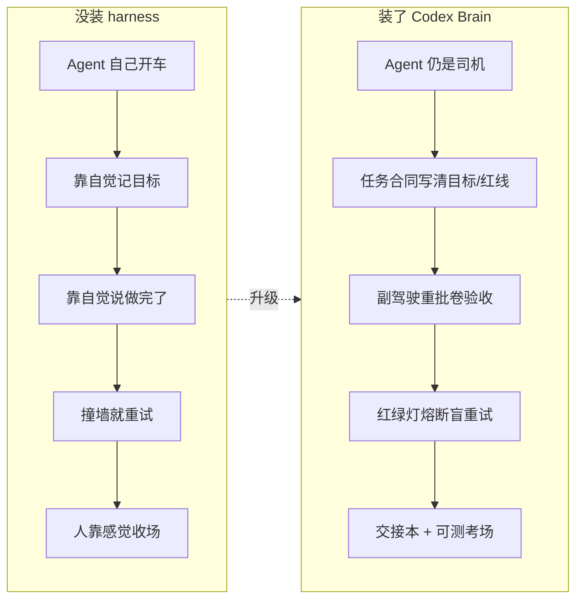
```mermaid
flowchart LR
  subgraph Before["没装 harness"]
    B1["Agent 自己开车"] --> B2["靠自觉记目标"]
    B2 --> B3["靠自觉说做完了"]
    B3 --> B4["撞墙就重试"]
    B4 --> B5["人靠感觉收场"]
  end
  subgraph After["装了 Codex Brain"]
    A1["Agent 仍是司机"] --> A2["任务合同写清目标/红线"]
    A2 --> A3["副驾驶重批卷验收"]
    A3 --> A4["红绿灯熔断盲重试"]
    A4 --> A5["交接本 + 可测考场"]
  end
  Before -. "升级" .-> After
```

---

## 目录

1. [装上之后，你到底得到什么](#装上之后你到底得到什么)
2. [Agent 会有哪些具体提升](#agent-会有哪些具体提升)
3. [什么时候会插手，什么时候闭嘴](#什么时候会插手什么时候闭嘴)
4. [一图看懂架构](#一图看懂架构)
5. [P0–P6：0.10 可靠性控制平面](#p0p6-010-可靠性控制平面)
6. [历代版本：解决了什么问题，为什么那样改](#历代版本解决了什么问题为什么那样改)
7. [事务记忆与加密同步](#事务记忆与加密同步)
8. [五分钟跑起来](#五分钟跑起来)
9. [工程术语对照](#工程术语对照)
10. [它做不到什么](#它做不到什么)
11. [文档索引](#文档索引)

---

## 装上之后，你到底得到什么

安装并启用后，你的工作流会多出一套**本地、可审计、默认可静默**的护栏，而不是再塞一个会抢话的「超级大脑」。

### 能力全景图（你买到的是整套安全带，不是更吵的导航）

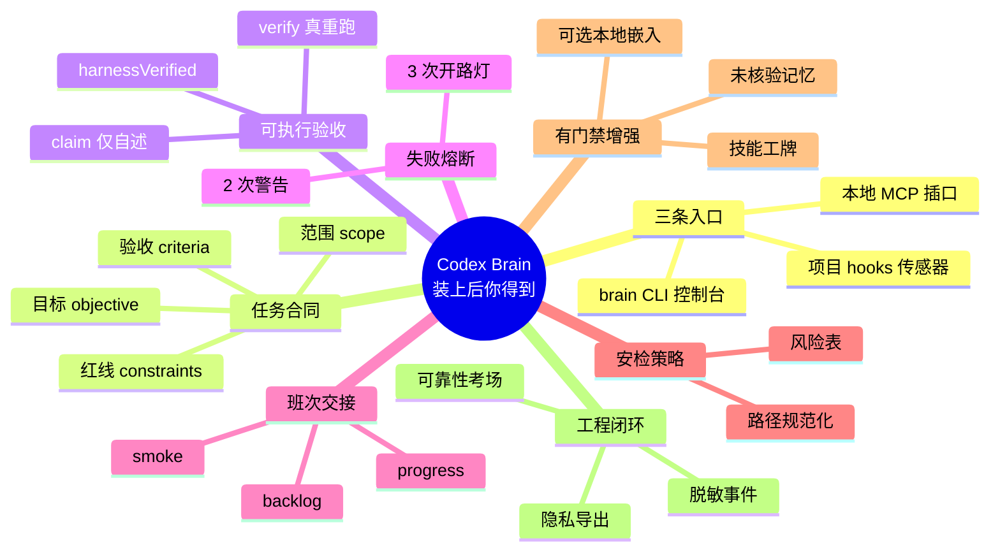
```mermaid
mindmap
  root((Codex Brain<br/>装上后你得到))
    三条入口
      项目 hooks 传感器
      brain CLI 控制台
      本地 MCP 插口
    任务合同
      目标 objective
      红线 constraints
      范围 scope
      验收 criteria
    可执行验收
      claim 仅自述
      verify 真重跑
      harnessVerified
    失败熔断
      2 次警告
      3 次开路灯
    班次交接
      backlog
      progress
      smoke
    安检策略
      路径规范化
      风险表
    有门禁增强
      技能工牌
      未核验记忆
      可选本地嵌入
    工程闭环
      脱敏事件
      可靠性考场
      隐私导出
```

### 1. 三条统一入口（同一套规则）

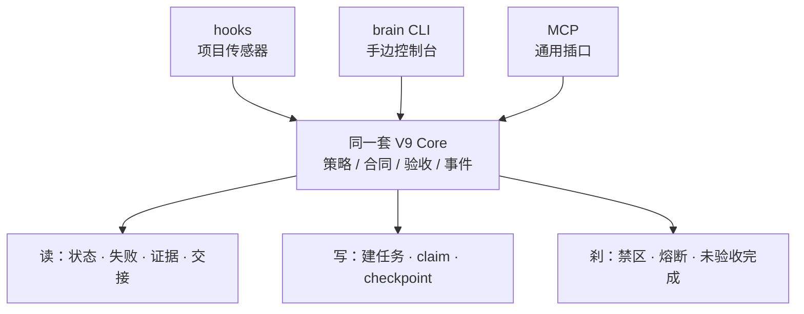
```mermaid
flowchart TB
  H["hooks<br/>项目传感器"] --> Core["同一套 V9 Core<br/>策略 / 合同 / 验收 / 事件"]
  C["brain CLI<br/>手边控制台"] --> Core
  M["MCP<br/>通用插口"] --> Core
  Core --> R1["读：状态 · 失败 · 证据 · 交接"]
  Core --> R2["写：建任务 · claim · checkpoint"]
  Core --> R3["刹：禁区 · 熔断 · 未验收完成"]
```

| 入口 | 大白话 | 你得到什么 |
|---|---|---|
| **项目 hooks** | 装在项目里的传感器 | 在 `SessionStart` / `PreToolUse` / `PostToolUse` / `PreCompact` / `PostCompact` / `Stop` 等时点自动观察；平时安静，触发红线才介入 |
| **`brain` CLI** | 手边控制台 | 建任务、验收、交接、技能、记忆、嵌入、hooks 开关，全部可脚本化、可 JSON 输出 |
| **本地 MCP** | 给其他应用的标准插口 | Cursor / 其他 MCP 客户端可读状态与证据，受控写任务与 claim；**不能**绕过策略、装模型、跑迁移 |

三端共用同一 core：**不会出现「CLI 一套规矩、hooks 另一套」**。

### 2. 一份「任务合同」（Task Contract）

装上后你可以（也应当）把每次正经活写成合同：

- **objective**：要做成什么  
- **constraints**：明确红线（用户说的 > 推断的）  
- **scope.allowed / forbidden**：能动哪里、不能动哪里  
- **criteria + verifier**：怎样才算验收通过  

这不是写给人类看的文档玩具，而是 **Stop / verify / close 的硬门槛**。

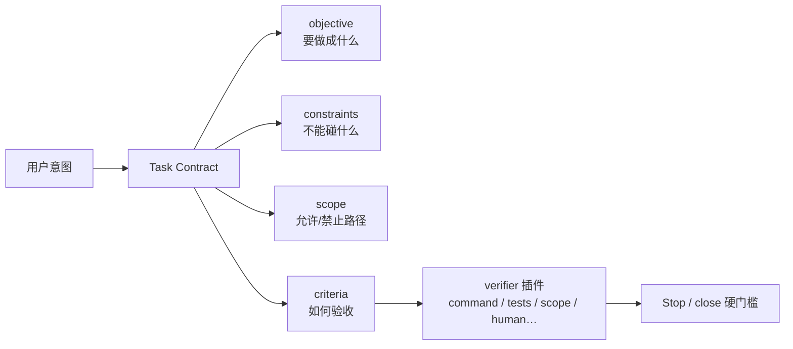
```mermaid
flowchart LR
  U["用户意图"] --> TC["Task Contract"]
  TC --> O["objective<br/>要做成什么"]
  TC --> C["constraints<br/>不能碰什么"]
  TC --> S["scope<br/>允许/禁止路径"]
  TC --> K["criteria<br/>如何验收"]
  K --> V["verifier 插件<br/>command / tests / scope / human…"]
  V --> Gate["Stop / close 硬门槛"]
```

### 3. 可执行验收，而不是「口头完成」

| 以前常见情况 | 装上之后 |
|---|---|
| Agent 说「测试过了 / 做完了」 | 只记为 **claim（自述）**，状态仍是 `unverified` |
| 你凭感觉相信 | `brain verify` **重新跑** command / test / scope 等 verifier |
| 过关靠自觉 | 只有 `harnessVerified: true` 才能把 criterion 标成 `passed` |

类比：**学生自己在卷子上打勾不算分，老师重批才算分。**

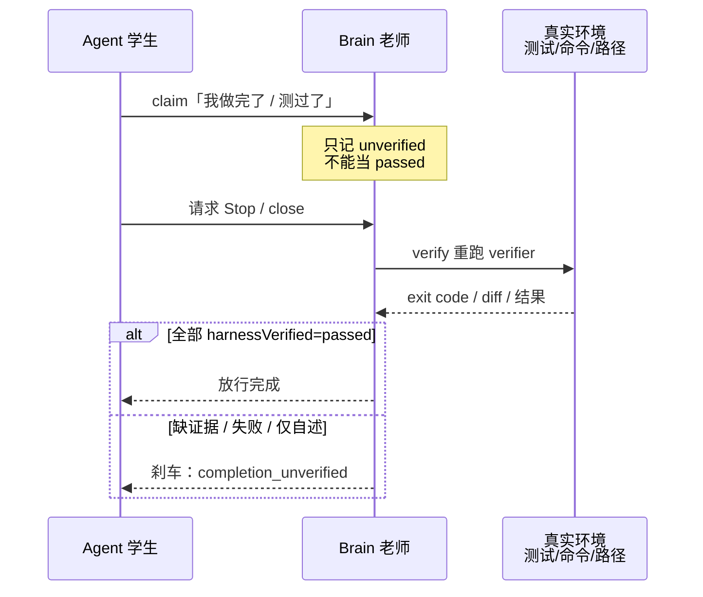
```mermaid
sequenceDiagram
  participant A as Agent 学生
  participant B as Brain 老师
  participant E as 真实环境<br/>测试/命令/路径
  A->>B: claim「我做完了 / 测过了」
  Note over B: 只记 unverified<br/>不能当 passed
  A->>B: 请求 Stop / close
  B->>E: verify 重跑 verifier
  E-->>B: exit code / diff / 结果
  alt 全部 harnessVerified=passed
    B-->>A: 放行完成
  else 缺证据 / 失败 / 仅自述
    B-->>A: 刹车：completion_unverified
  end
```

### 4. 失败熔断（Failure Circuit）

同类失败：

1. 第 1 次：记一笔  
2. 第 2 次：**警告——换路线**  
3. 第 3 次：**熔断——别再盲重试**

减少「同一面墙连撞十分钟」的 token 与时间浪费。

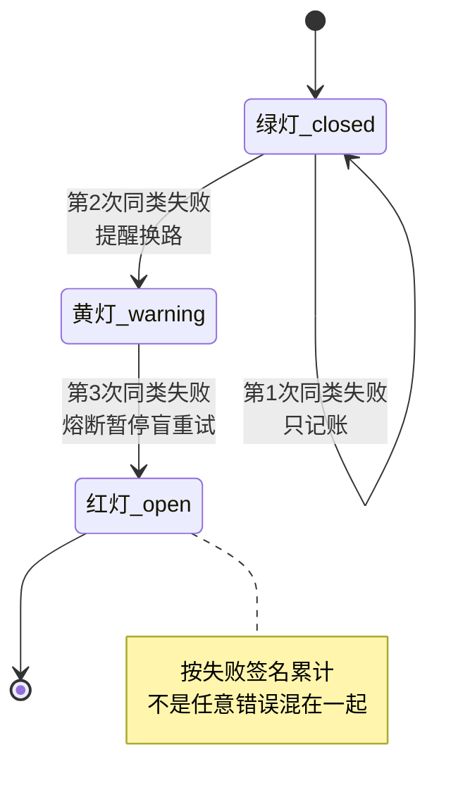
```mermaid
stateDiagram-v2
  [*] --> 绿灯_closed
  绿灯_closed --> 绿灯_closed: 第1次同类失败<br/>只记账
  绿灯_closed --> 黄灯_warning: 第2次同类失败<br/>提醒换路
  黄灯_warning --> 红灯_open: 第3次同类失败<br/>熔断暂停盲重试
  红灯_open --> [*]
  note right of 红灯_open
    按失败签名累计
    不是任意错误混在一起
  end note
```

### 5. 班次交接工件（Session Handoff）

在项目下生成 / 维护：

```text
.brain/
  feature-backlog.json   # 功能清单（passes 只能在验证后翻 true）
  progress.md            # 本班做了什么、留下什么
  smoke.sh               # 下一班先点烟：环境还活着吗
```

上下文压缩或新开会话时，副驾驶补的是**目标 + 红线 + 未决 + 交接摘要**，不是整段聊天复读。

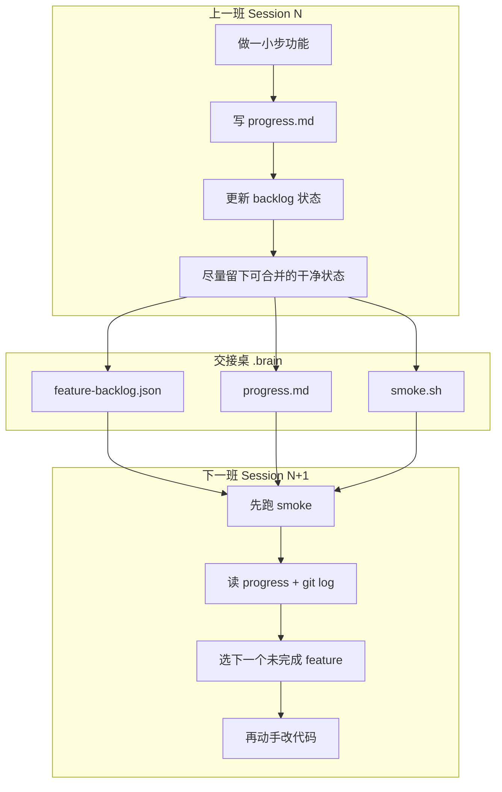
```mermaid
flowchart TB
  subgraph 上一班 Session N
    W1["做一小步功能"] --> W2["写 progress.md"]
    W2 --> W3["更新 backlog 状态"]
    W3 --> W4["尽量留下可合并的干净状态"]
  end
  subgraph 交接桌 .brain
    F1["feature-backlog.json"]
    F2["progress.md"]
    F3["smoke.sh"]
  end
  subgraph 下一班 Session N+1
    S1["先跑 smoke"] --> S2["读 progress + git log"]
    S2 --> S3["选下一个未完成 feature"]
    S3 --> S4["再动手改代码"]
  end
  W4 --> F1 & F2 & F3
  F1 & F2 & F3 --> S1
```

### 6. 能力边界策略（Capability Policy）

不再靠「命令字符串里有没有 delete 字样」这种贴纸式匹配，而是：

- 路径 **canonicalize**（规范化真实路径）  
- **allow / deny** 前缀与禁区  
- 工具与 shell 的 **risk table**（如 `git push --force`、`rm -rf`、管道远程执行）

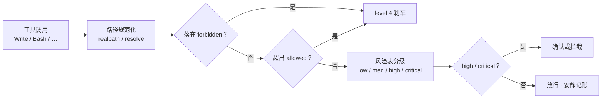
```mermaid
flowchart LR
  T["工具调用<br/>Write / Bash / …"] --> P["路径规范化<br/>realpath / resolve"]
  P --> D1{"落在 forbidden？"}
  D1 -->|是| Block["level 4 刹车"]
  D1 -->|否| D2{"超出 allowed？"}
  D2 -->|是| Block
  D2 -->|否| R["风险表分级<br/>low / med / high / critical"]
  R --> D3{"high / critical？"}
  D3 -->|是| Confirm["确认或拦截"]
  D3 -->|否| Allow["放行 · 安静记账"]
```

### 7. 技能与记忆（有门禁的增强，不是永远在线）

- **Skills**：激活必须声明 **期望验收项 + token 预算**；产出是证据候选项，不是指令  
- **Memory**：召回默认带 `[UNVERIFIED MEMORY]`；只有 harness 验证通过的结果才可晋升为 `verified_outcome`  
- **可选本地嵌入（Ollama）**：本地资料柜召回；**hooks 热路径永不调模型 / 永不调 Ollama**

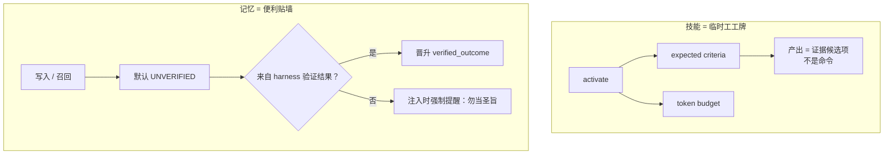
```mermaid
flowchart TB
  subgraph Skills["技能 = 临时工工牌"]
    SA["activate"] --> SB["expected criteria"]
    SA --> SC["token budget"]
    SB --> SD["产出 = 证据候选项<br/>不是命令"]
  end
  subgraph Memory["记忆 = 便利贴墙"]
    M1["写入 / 召回"] --> M2["默认 UNVERIFIED"]
    M2 --> M3{"来自 harness 验证结果？"}
    M3 -->|是| M4["晋升 verified_outcome"]
    M3 -->|否| M5["注入时强制提醒：勿当圣旨"]
  end
```

### 8. 隐私与本地优先

- 默认 **local-first**：状态在 `CODEX_BRAIN_HOME`（或 `~/.codex-brain`）  
- 事件是**脱敏元数据**，不默认存原始 prompt / 原始工具输出  
- 公开发布走 **allowlist 导出**，不是把私有目录洗一遍就上传  

### 9. 可度量的可靠性考场

```bash
npm run eval:reliability
```

四个固定考站：**虚假完成、死循环、越权、热路径税（延迟）**——用来回答「装了到底有没有用」，而不是「我觉得更稳」。

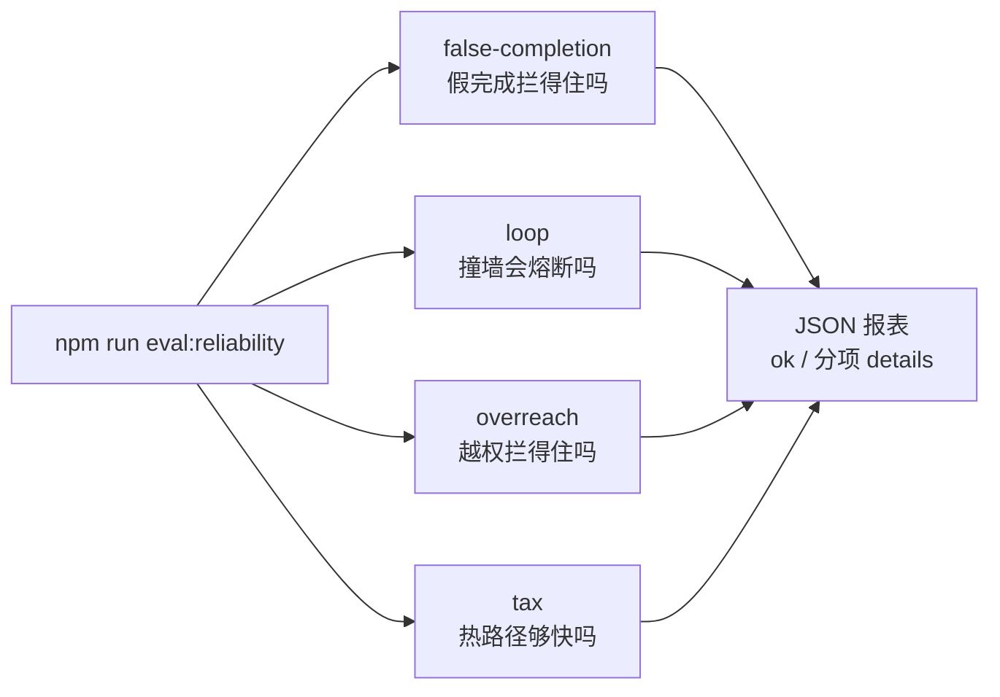
```mermaid
flowchart LR
  E["npm run eval:reliability"] --> S1["false-completion<br/>假完成拦得住吗"]
  E --> S2["loop<br/>撞墙会熔断吗"]
  E --> S3["overreach<br/>越权拦得住吗"]
  E --> S4["tax<br/>热路径够快吗"]
  S1 & S2 & S3 & S4 --> REP["JSON 报表<br/>ok / 分项 details"]
```

### 10. 你**不会**自动得到的东西（避免预期错位）

- 不会自动让模型更聪明、写出更优雅的算法  
- 不会替代 code review 与领域专家判断  
- 不会在 hooks 默认关闭时「隐形全托管」——**要显式 enable**  
- 不能把语义正确性形式化证明完（它管的是过程可靠性，不是定理证明器）

---

## Agent 会有哪些具体提升

下面按**真实 coding agent 常见失败模式**对照。提升指的是 **可靠性 / 可控性 / 成本纪律**，不是 benchmark 上的「智商分数」。

### 提升雷达（装 harness 改的是这些轴，不是「智商」）

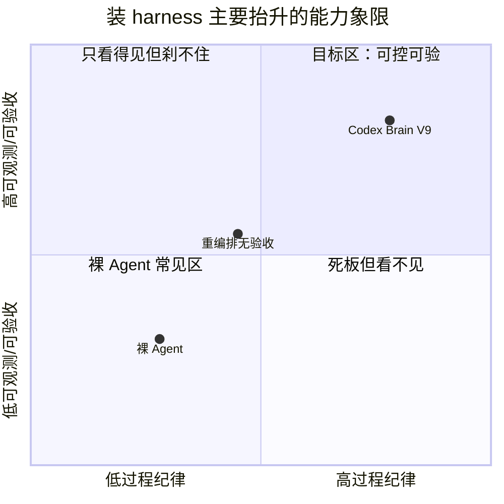
```mermaid
quadrantChart
  title 装 harness 主要抬升的能力象限
  x-axis 低过程纪律 --> 高过程纪律
  y-axis 低可观测/可验收 --> 高可观测/可验收
  quadrant-1 目标区：可控可验
  quadrant-2 只看得见但刹不住
  quadrant-3 裸 Agent 常见区
  quadrant-4 死板但看不见
  裸 Agent: [0.28, 0.30]
  重编排无验收: [0.45, 0.55]
  Codex Brain V9: [0.78, 0.82]
```

> 读图方式：向右 = 更守边界、少盲重试；向上 = 完成可验、过程可复盘。Brain 推你进右上，而不是假装模型变聪明了。

### 八种翻车 → 八种抬升（总览）

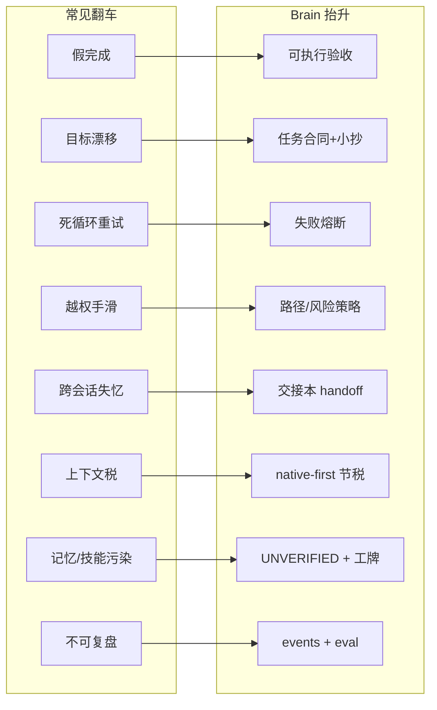
```mermaid
flowchart LR
  subgraph Pain["常见翻车"]
    P1["假完成"]
    P2["目标漂移"]
    P3["死循环重试"]
    P4["越权手滑"]
    P5["跨会话失忆"]
    P6["上下文税"]
    P7["记忆/技能污染"]
    P8["不可复盘"]
  end
  subgraph Gain["Brain 抬升"]
    G1["可执行验收"]
    G2["任务合同+小抄"]
    G3["失败熔断"]
    G4["路径/风险策略"]
    G5["交接本 handoff"]
    G6["native-first 节税"]
    G7["UNVERIFIED + 工牌"]
    G8["events + eval"]
  end
  P1 --> G1
  P2 --> G2
  P3 --> G3
  P4 --> G4
  P5 --> G5
  P6 --> G6
  P7 --> G7
  P8 --> G8
```

### A. 完成声明更诚实（False Completion ↓）

| 现象 | 无 harness | 有 Codex Brain |
|---|---|---|
| 「功能做好了」但测试没跑 / 跑挂 | 你常被带节奏 | Stop / close 可被 **harness re-run** 挡住 |
| 把「改了文件」当成「验收通过」 | 极易发生 | criterion 必须挂 **可执行证据** |

**专业表述**：completion 从 *self-report* 升级为 *externally verifiable acceptance*（外部可验证验收）。

### B. 目标与红线更抗遗忘（Goal Drift ↓）

| 现象 | 无 harness | 有 Codex Brain |
|---|---|---|
| 长对话后偏离原始目标 | 很常见 | Task Contract + compact 后小抄强制带回 objective / constraints |
| 「用户说了不能动 X」被冲淡 | 靠模型自觉 | explicit constraints 有冲突检测；scope 可拦路径 |

### C. 重复无效动作更少（Looping ↓）

| 现象 | 无 harness | 有 Codex Brain |
|---|---|---|
| 同一错误重试 N 次 | 烧 token | 失败签名 + 2 警告 / 3 熔断 |
| 换个说法再撞一次 | 难以察觉 | 同类 signature 累计 |

### D. 高风险动作更难「手滑」（Overreach ↓）

| 现象 | 无 harness | 有 Codex Brain |
|---|---|---|
| 写到 secrets、误删、强推远程 | 依赖模型谨慎 | PreToolUse 策略：禁区路径、critical shell 模式要求确认或拒绝 |
| 只靠 prompt「请小心」 | 软约束 | **fail-closed** 红线（策略边界）+ **fail-open** 观察（坏观察器不卡死干活） |

### E. 跨会话 / 压缩后更能接上（Long-horizon Continuity ↑）

| 现象 | 无 harness | 有 Codex Brain |
|---|---|---|
| 新 session 不知道上一班做到哪 | 靠人复述 | progress + backlog + smoke 交接协议 |
| 压缩后只剩模糊摘要 | 易丢红线 | 有界 checkpoint（目标/约束/未决）+ handoff 上下文 |

对齐业界 long-running harness 思路：**增量推进 + 干净交接 + 可检查 backlog**，但保持 native-first，不默认 multi-agent 编排。

### F. 上下文更「省座位」（Context Tax ↓）

| 现象 | 无 harness / 重 harness | 有 Codex Brain V9 |
|---|---|---|
| 每轮塞长 system / 人设 / 全历史 | 贵且挤掉任务本身 | **默认真干**；有症状才注入；召回有条数与 token 上限 |
| 多 Agent 默认开会 | 协调成本高 | 子代理 / 技能 **按证据按需**；清晰任务上路由可能 **0 质量增益、token 大涨** |

**专业表述**：从 *always-on orchestration* 转为 *measured augmentation*（计量后的增强）。

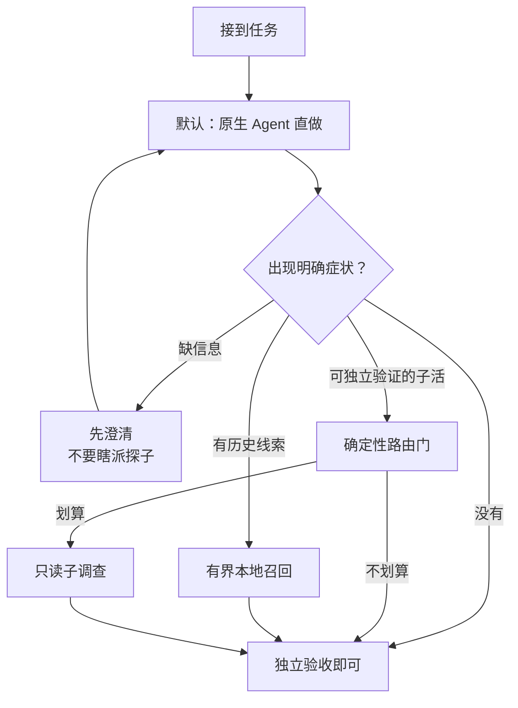
```mermaid
flowchart TB
  Task["接到任务"] --> Native["默认：原生 Agent 直做"]
  Native --> Q{"出现明确症状？"}
  Q -->|没有| V["独立验收即可"]
  Q -->|缺信息| Clarify["先澄清<br/>不要瞎派探子"]
  Q -->|有历史线索| Recall["有界本地召回"]
  Q -->|可独立验证的子活| Gate["确定性路由门"]
  Gate -->|不划算| V
  Gate -->|划算| Child["只读子调查"]
  Recall --> V
  Child --> V
  Clarify --> Native
```

模型调度现在只相信“验收收据”，不相信模型自报成功。子模型执行后先留下预记录；母 Agent 应用结果，再用无 shell 字符串的 argv verifier 重跑测试。收据只保存状态、耗时、命令与输出哈希、证据 ID 和产物哈希，不保存对话或测试输出正文。失败只有明确归因为模型能力才进入路由学习，旧布尔日志、未知归因和 verifier 基础设施故障全部排除。三个不同任务指纹独立通过后，route 才可能进入 stable。


```mermaid
flowchart LR
  Route["确定性路由"] --> Run["直做或只读委派"]
  Run --> Draft["预记录 / 收据草稿"]
  Draft --> Verify["母 Agent 独立 verifier"]
  Verify --> Receipt["脱敏哈希收据"]
  Receipt --> Ledger["追加式路由账本"]
  Ledger --> Candidate["证据门控策略候选"]
```

设计与命令见 [verifier-backed model routing evidence](docs/v9/model-routing-evidence.md)。

### G. 记忆与技能更安全（Poisoning / Skill Sprawl ↓）

| 现象 | 无 harness | 有 Codex Brain |
|---|---|---|
| 过期笔记当圣旨 | 记忆污染 | 注入强制 UNVERIFIED；冲突与 supersedes 可记录 |
| 技能随意注入 | 成本与副作用不清 | 激活要 **expected criteria + budget**；产出仅是 evidence candidate |

### H. 可观测、可复盘（Observability ↑）

你得到：

- 脱敏 **events.jsonl**（工具结果状态、失败签名、验收事件）  
- **circuit** 状态（是否已熔断）  
- **verify results**（谁、用什么 fingerprint、何时 harness 验证）  
- **eval 报表**（四考站是否绿）

这让「Agent 今天又犯什么病」从感觉变成可统计信号（触发频率、重复失败、验证缺口）——**不是通用 BI**，但是调策略的原材料。

### 提升一览（给决策者看的表）

| 维度 | 提升方向 | 机制关键词 |
|---|---|---|
| 完成可信度 | 虚假完成更难混过 | executable verifiers, harnessVerified |
| 约束遵守 | 越界更易被拦 | task contract, path policy |
| 失败处理 | 盲重试更短 | failure circuit |
| 长程任务 | 交接更干净 | handoff backlog / progress / smoke |
| 成本纪律 | 默认编排税更低 | native-first, silent-by-default |
| 记忆安全 | 待证召回 | unverified memory banner |
| 技能治理 | 有预算有验收 | skill activation contract |
| 工程闭环 | 可测可回归 | reliability eval suites |

---

## 什么时候会插手，什么时候闭嘴

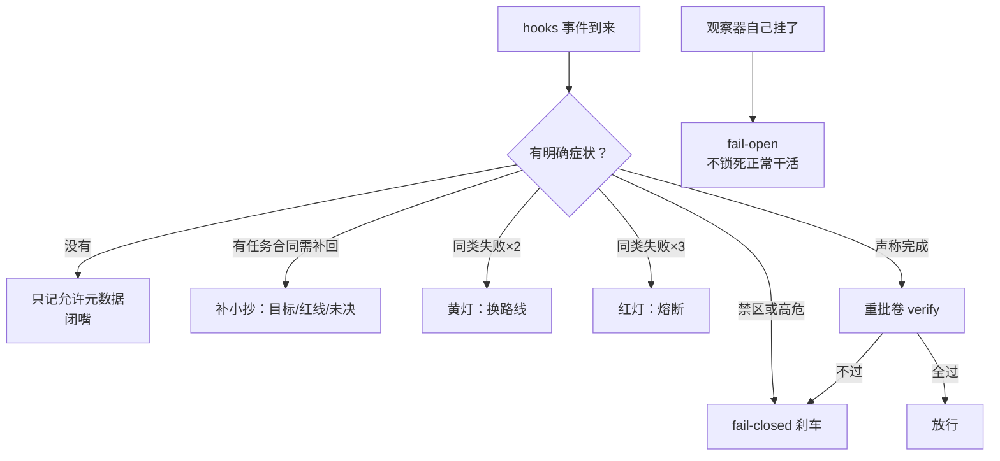
```mermaid
flowchart TB
  Ev["hooks 事件到来"] --> Quiet{"有明确症状？"}
  Quiet -->|没有| Log["只记允许元数据<br/>闭嘴"]
  Quiet -->|有任务合同需补回| Note["补小抄：目标/红线/未决"]
  Quiet -->|禁区或高危| Brake["fail-closed 刹车"]
  Quiet -->|同类失败×2| Warn["黄灯：换路线"]
  Quiet -->|同类失败×3| Open["红灯：熔断"]
  Quiet -->|声称完成| Exam["重批卷 verify"]
  Exam -->|全过| Pass["放行"]
  Exam -->|不过| Brake
  ObsFail["观察器自己挂了"] --> OpenFail["fail-open<br/>不锁死正常干活"]
```

| 场景 | 大白话 | V9 行为 |
|---|---|---|
| 日常读写，范围已说清 | 正常开车 | 只记允许的元数据，**不打扰** |
| 有明确目标/红线 | 办事前写清单 | 需要时补回 Task Contract 与交接摘要 |
| 禁区路径 / 高危写 / 强推 / 破坏性删除 | 转账前再核收款人 | 策略拦截或要求确认（fail-closed） |
| 同类失败反复出现 | 路口红绿灯 | 2 警告，3 熔断 |
| 上下文压缩 / 新会话 | 换班留言 | 有界小抄 + handoff，不复读全文 |
| Agent 声称完成 | 交卷按题号查 | **重跑 verifier**；自述不算数 |
| 观察器自己挂了 | 仪表盘坏了别锁死油门 | 观察类失败 **fail-open**，不阻断正常工作 |

热路径 hooks：**不联网、不调用模型**。预算目标：`PreToolUse` &lt; 100 ms，`PostToolUse` &lt; 150 ms——副驾驶不能比开车还慢。

---

## 一图看懂架构

### 总装图：司机 + 三种插口 + 副驾驶仪表台

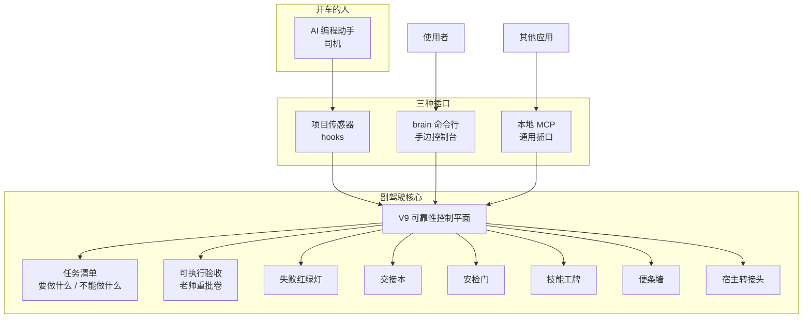
```mermaid
flowchart TB
  subgraph 开车的人
    Agent["AI 编程助手\n司机"]
  end
  subgraph 三种插口
    Hooks["项目传感器\nhooks"]
    CLI["brain 命令行\n手边控制台"]
    MCP["本地 MCP\n通用插口"]
  end
  subgraph 副驾驶核心
    Core["V9 可靠性控制平面"]
    Contract["任务清单\n要做什么 / 不能做什么"]
    Verify["可执行验收\n老师重批卷"]
    Circuit["失败红绿灯"]
    Handoff["交接本"]
    Policy["安检门"]
    Skills["技能工牌"]
    Memory["便条墙"]
    Hosts["宿主转接头"]
  end
  Agent --> Hooks
  Human["使用者"] --> CLI
  Client["其他应用"] --> MCP
  Hooks --> Core
  CLI --> Core
  MCP --> Core
  Core --> Contract
  Core --> Verify
  Core --> Circuit
  Core --> Handoff
  Core --> Policy
  Core --> Skills
  Core --> Memory
  Core --> Hosts
```

### 运行时状态机：大部分时间安静，关键点才出声

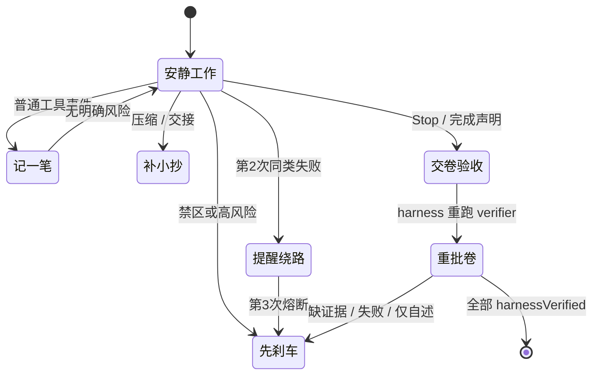
```mermaid
stateDiagram-v2
  [*] --> 安静工作
  安静工作 --> 记一笔: 普通工具事件
  记一笔 --> 安静工作: 无明确风险
  安静工作 --> 补小抄: 压缩 / 交接
  安静工作 --> 先刹车: 禁区或高风险
  安静工作 --> 提醒绕路: 第2次同类失败
  提醒绕路 --> 先刹车: 第3次熔断
  安静工作 --> 交卷验收: Stop / 完成声明
  交卷验收 --> 重批卷: harness 重跑 verifier
  重批卷 --> [*]: 全部 harnessVerified
  重批卷 --> 先刹车: 缺证据 / 失败 / 仅自述
```

### 一次工具调用在副驾驶眼里长什么样

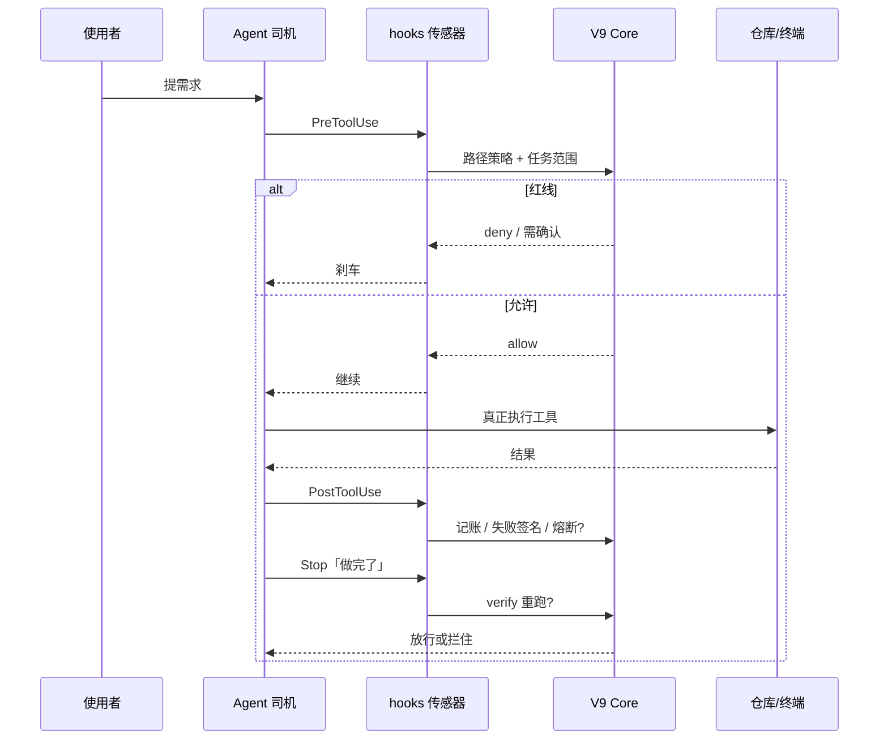
```mermaid
sequenceDiagram
  participant User as 使用者
  participant Agent as Agent 司机
  participant Hook as hooks 传感器
  participant Core as V9 Core
  participant World as 仓库/终端
  User->>Agent: 提需求
  Agent->>Hook: PreToolUse
  Hook->>Core: 路径策略 + 任务范围
  alt 红线
    Core-->>Hook: deny / 需确认
    Hook-->>Agent: 刹车
  else 允许
    Core-->>Hook: allow
    Hook-->>Agent: 继续
    Agent->>World: 真正执行工具
    World-->>Agent: 结果
    Agent->>Hook: PostToolUse
    Hook->>Core: 记账 / 失败签名 / 熔断?
    Agent->>Hook: Stop「做完了」
    Hook->>Core: verify 重跑?
    Core-->>Agent: 放行或拦住
  end
```

---

## P0–P6：0.10 可靠性控制平面

在 V9「安全副驾驶」之上，0.10 把「证据」从状态字段升级为**可重放协议**，并补齐交接、评测、策略、技能、宿主与记忆。

### 分层示意图：从「能刹住」到「可证明」

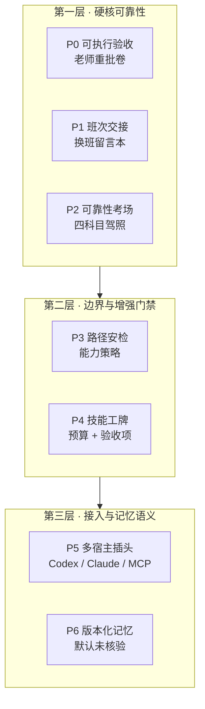
```mermaid
flowchart TB
  subgraph L1["第一层 · 硬核可靠性"]
    direction LR
    P0["P0 可执行验收<br/>老师重批卷"]
    P1["P1 班次交接<br/>换班留言本"]
    P2["P2 可靠性考场<br/>四科目驾照"]
  end
  subgraph L2["第二层 · 边界与增强门禁"]
    direction LR
    P3["P3 路径安检<br/>能力策略"]
    P4["P4 技能工牌<br/>预算 + 验收项"]
  end
  subgraph L3["第三层 · 接入与记忆语义"]
    direction LR
    P5["P5 多宿主插头<br/>Codex / Claude / MCP"]
    P6["P6 版本化记忆<br/>默认未核验"]
  end
  L1 --> L2 --> L3
```

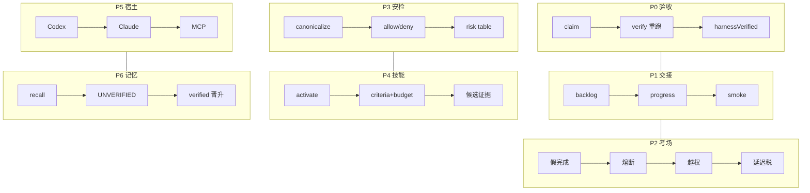
```mermaid
flowchart TB
  subgraph P0["P0 验收"]
    direction LR
    A0["claim"] --> A1["verify 重跑"] --> A2["harnessVerified"]
  end
  subgraph P1["P1 交接"]
    direction LR
    B0["backlog"] --> B1["progress"] --> B2["smoke"]
  end
  subgraph P2["P2 考场"]
    direction LR
    C0["假完成"] --> C1["熔断"] --> C2["越权"] --> C3["延迟税"]
  end
  subgraph P3["P3 安检"]
    D0["canonicalize"] --> D1["allow/deny"] --> D2["risk table"]
  end
  subgraph P4["P4 技能"]
    E0["activate"] --> E1["criteria+budget"] --> E2["候选证据"]
  end
  subgraph P5["P5 宿主"]
    F0["Codex"] --> F1["Claude"] --> F2["MCP"]
  end
  subgraph P6["P6 记忆"]
    G0["recall"] --> G1["UNVERIFIED"] --> G2["verified 晋升"]
  end
  P0 --- P1
  P1 --- P2
  P3 --- P4
  P5 --- P6
```

| 优先级 | 能力 | 大白话 | 解决的问题 | 你怎么用 |
|---|---|---|---|---|
| **P0** | 可执行验收 | 老师重批卷 | 自述完成、假 passed | `brain verify` / `brain evidence claim` |
| **P1** | 班次交接 | 换班留言本 | 压缩/跨会话失忆与烂尾 | `brain handoff init\|status\|progress` |
| **P2** | 可靠性考场 | 驾照四科目 | 「我觉得更稳」无法证明 | `npm run eval:reliability` |
| **P3** | 路径能力策略 | 机场安检 | 关键词误伤/漏拦 | hooks PreToolUse + `policy.js` |
| **P4** | 技能焊死证据 | 临时工工牌 | 技能乱注入无验收 | `brain skill activate --criterion …` |
| **P5** | 多宿主适配 | 旅行转接头 | 绑死单一 IDE | `BRAIN_HOST=codex\|claude\|mcp` |
| **P6** | 版本化记忆 | 未核验便利贴 | 记忆污染当圣旨 | `brain memory recall` |

详见 [docs/v9/p0-p6-reliability-plane.md](docs/v9/p0-p6-reliability-plane.md)。

---

## 事务记忆与加密同步

V9 的记忆源已经从 `grep + Markdown` 升级为本地 SQLite：WAL 事务、版本化 CRUD、FTS5/BM25、持久向量、结构化聚合、时态图遍历和候选审批都由数据库承担。Markdown 仍适合人审，grep 仍适合定位，但两者不再冒充记忆存储层。

```mermaid
flowchart LR
  Source["来源证据"] --> SQL["SQLite WAL<br/>事务 + CRUD"]
  SQL --> Hybrid["FTS5/BM25 + 向量<br/>混合召回"]
  SQL --> Graph["时态关系图<br/>递归遍历"]
  Hybrid --> Feedback["显式反馈 + 固定评测"]
  Graph --> Feedback
  Feedback --> Candidate["优化候选<br/>人工审批后试验"]
  SQL --> Snapshot["SQLite 在线快照<br/>完整性检查"]
  Snapshot --> AES["AES-256-GCM<br/>Keychain 持钥"]
  AES --> Remote["私有同步目标<br/>只收 .cbmem 密文"]
  AES --> Split["2-of-2 离线密钥份额<br/>分设备 + 分口令保管"]
  Remote --> Restore["认证血缘 + 恢复租约<br/>原子换库 + 自动回滚"]
```

同步不采用 last-write-wins。每个不可变 `.cbmem` 包都带经过认证的 `databaseId → parentBackupId → backupId` 血缘；`same` 只验证不换库，远端祖先链包含本地 head 才允许确认后的自动 fast-forward 恢复，分叉、外来数据库和未知血缘全部阻断。恢复过程会持有协作租约、检查数据库占用、先做回滚快照，再通过同文件系统原子换库和崩溃日志保证失败可回退。

```mermaid
stateDiagram-v2
  [*] --> Verify
  Verify --> Same: 同一 head
  Verify --> FastForward: 远端祖先含本地 head
  Verify --> LocalAhead: 远端是已知旧祖先
  Verify --> Diverged: 从旧祖先分叉
  Verify --> Foreign: databaseId 不同
  Verify --> Unknown: 无法证明血缘
  Same --> NoOp
  FastForward --> ConfirmedRestore
  LocalAhead --> KeepLocal
  Diverged --> Block
  Foreign --> Block
  Unknown --> Block
```

```bash
brain memory backup-key-init --confirm
brain memory backup-encrypted --confirm
brain memory backup-verify --input /path/to/backup.cbmem
brain memory backup-compare --input /path/to/incoming.cbmem
brain memory restore-encrypted --input /path/to/incoming.cbmem --confirm-restore
brain memory recovery-export --output-a /offline-a/key.cbkey --output-b /offline-b/key.cbkey --passphrase-a-file /private/pass-a --passphrase-b-file /private/pass-b --confirm
brain memory recovery-drill --share-a /offline-a/key.cbkey --share-b /offline-b/key.cbkey --passphrase-a-file /private/pass-a --passphrase-b-file /private/pass-b --input /path/to/backup.cbmem
brain harness cycle
```

详见 [事务记忆基础设施](docs/v9/memory-infrastructure.md)、[加密备份及冲突安全同步](docs/v9/encrypted-backup-and-sync.md) 与 [离线恢复密钥仪式](docs/v9/recovery-key-ceremony.md)。

---

## 历代版本：解决了什么问题，为什么那样改

这不是「版本号越大功能越多越好」的堆料史。每一版都先钉住一个**高频翻车点**，再发现护栏本身的成本与盲区，最后收敛成 V9 的原则：

> **控制必须赚回自己的成本（control must earn its cost）。**  
> 清晰、低风险、可验证的工作 → 让原生 Agent 直接干；  
> 只有出现明确症状 → 系统才介入。

### 演进时间线

```mermaid
timeline
  title Codex Brain 从笔记本到安全副驾驶
  section 记与诚实
    V1 笔记本 : 把目标从聊天里搬到本地可检查记录
               : 发现：记得住 ≠ 是真的
    V2 诚实    : 自述不能当证据
               : 发现：诚实仍可能死磕错路
  section 换路与姿势
    V3 换路    : 卡住时逼你换策略
               : 发现：万能检查表会误报
    V4 姿势卡  : 短工作卡代替长人设
               : 发现：管不住截图/文档证据
  section 证据与工程
    V5 出处    : 多模态只记可表示证据
               : 发现：收证据 ≠ 已验收
    V6 改完即查 : 靠近编辑点做工程体检
               : 发现：建议不能自动变许可
  section 重与轻
    V7 重 harness : 可观测闭环 + 进化门
                  : 发现：默认全开变成上下文税
    V8 默认直做   : native-first + 计量增强
                  : 发现：三端仍需统一小规则
  section 副驾驶
    V9 安全副驾驶 : 统一 core · 证据门 · 熔断 · 隐私
    0.10 P0–P6    : 可重放验收 · 交接 · 考场 · 安检 · 技能/宿主/记忆
```

### 版本主线（一图串起来）

```mermaid
flowchart LR
  V1["V1<br/>笔记本"] --> V2["V2<br/>诚实"]
  V2 --> V3["V3<br/>换路"]
  V3 --> V4["V4<br/>姿势卡"]
  V4 --> V5["V5<br/>资料出处"]
  V5 --> V6["V6<br/>改完即查"]
  V6 --> V7["V7<br/>重 harness"]
  V7 --> V8["V8<br/>默认直做"]
  V8 --> V9["V9<br/>安全副驾驶"]
  V9 --> V91["0.10<br/>P0–P6"]
```

### V7 重编排 vs V9 副驾驶（为何变轻）

```mermaid
flowchart TB
  subgraph V7style["V7 倾向：默认厚甲"]
    H1["长驻 prompt / 记忆注入"]
    H2["常开 hooks 与分流"]
    H3["多 Agent 协调"]
    H4["自我进化流水线"]
    H1 --> H2 --> H3 --> H4
  end
  subgraph V9style["V9 倾向：默认赤膊干活 + 按需护具"]
    L1["原生 Agent 直做"]
    L2["有症状才注入/拦截"]
    L3["验收与红线常备"]
    L4["增强要算账 eval/tax"]
    L1 --> L2 --> L3 --> L4
  end
  V7style -->|"模型变强后<br/>编排税 > 收益"| V9style
```

### 总表（问题 → 手段 → 为何还要演进）

| 版本 | 当时主要问题（大白话） | 专业出发点 | 加了什么 | 留下的教训 / 为何继续改 |
|---|---|---|---|---|
| **V1** | 聊着聊着忘掉目标、重复踩坑 | 持久化与可追溯：把关键状态移出瞬时对话 | 本地笔记 / 轻量索引 / 会话开始条件注入 / Stop 捕获教训 | **记得住 ≠ 是真的**；错误信念也会被忠实保存 → V2 |
| **V2** | 模型说得很满，证据不够 | 置信度校准：self-report ≠ evidence | 在线：信号融合与对质；离线：回顾记忆再晋升/存疑 | 更诚实仍可能死磕错误路线 → V3 |
| **V3** | 卡在一条路上反复小修 | 失败环检测与策略切换（anti-loop） | 卡住检测、突破清单（回退/分解/换工具/质疑目标） | 万能检查表会误报；不同任务需要不同姿势 → V4 |
| **V4** | 大道理都会，一忙就局部最优 | 轻量模式路由，避免每轮长 persona | owner / operator / reviewer / coach 短工作卡 | 纯文本姿态管不住截图/文档类证据 → V5 |
| **V5** | 截图 PDF 当过又丢，或假装看懂了 | 多模态摄入的可表示证据边界 | sidecar：元数据、可提取文本、unsupported 状态 | 收证据更好 ≠ 改完代码已验收 → V6 |
| **V6** | 局部改对、整体埋雷（漏测、密钥、膨胀文件） | 贴近因果点的工程 harness | PostTool 检测：漏验、危险编辑、密钥、依赖与结构债 | 常驻检查易吵；「建议」不能自动变「许可」→ V7 |
| **V7** | 想自我进化却可能直接改策略/记忆 | 治理门：proposal → candidate → 审批/验证 | Evolution Gate、trace/eval、隐私门、人审 | **护栏全集默认开启**在强模型时代变成上下文税与干扰 → V8 |
| **V8** | 编排太重，清晰任务被拖慢 | Native-first control plane；增强要可计量 | Task Contract、context economy、trace、harness tax、skill lifecycle、policy lab | hooks/CLI/MCP 仍需统一小规则 → V9 |
| **V9** | 三端策略不一致；要安静也要能刹得住 | 统一可靠性副驾驶 + 证据门 + 熔断 + 可选本地召回 | 同一 core、hooks/CLI/MCP、迁移回退、隐私导出 | 证据仍偏状态字段；长程交接与硬评测不足 → **0.10 P0–P6** |
| **0.10** | 假完成、弱交接、弱评测、弱策略、弱技能/记忆/多宿主 | 可重放验收 + handoff + eval + capability policy | 本文 P0–P6 | 仍不替代语义专家；继续用 eval 说话 |

### 分版细说（优化出发点写清楚）

#### V1 — 从「聊天记忆」到「可检查笔记本」

- **问题**：长会话丢失目标；同一纠正反复出现；决策只活在对话气泡里。  
- **出发点**：先解决 **persistence（持久化）** 与 **traceability（可追溯）**，而不是一上来追求准确率分数。  
- **手段**：小而可读的本地状态/教训文件 + 条件注入，而不是巨型黑盒记忆库。  
- **边界**：保存系统会连错误一起保存。

#### V2 — 诚实优先：自述不能当证据

- **问题**：Agent 语气很确定，但没有外部依据。  
- **出发点**：**epistemic humility（认知谦逊）**——把「我觉得」和「我有证据」拆开。  
- **手段**：多信号置信、对质、不敢则追问或降调；离线再整合记忆。  
- **边界**：诚实 ≠ 会换搜索路径。

#### V3 — 卡住时逼你换路

- **问题**：单轨死磕（single-track persistence）。  
- **出发点**：在 **unproductive loop 变得可见** 的时刻介入，而不是每句都说教。  
- **手段**：重复卡住信号 → 下一轮突破清单。  
- **边界**：检查表会误伤；姿势应随任务变。

#### V4 — 短工作卡，而不是长人设

- **问题**：原则会背，压力下只顾眼前 diff。  
- **出发点**：**context thrift（上下文节俭）**——用显式信号选窄姿态，而不是常驻万金油 prompt。  
- **手段**：owner / operator / reviewer / coach。  
- **边界**：管不住非文本证据生命周期。

#### V5 — 资料要有出处，不假装看懂

- **问题**：截图/PDF 影响过任务，随后从记忆蒸发；或把文件名当理解。  
- **出发点**：**evidence representation（可表示证据）**——只记录能安全表示的东西，明确 unsupported。  
- **边界**：摄入完善 ≠ 变更已验证。

#### V6 — 改完马上做工程体检

- **问题**：AI 改动局部正确，却引入漏测、密钥、臃肿结构、错误层修改。  
- **出发点**：**shift-left observability**——在因果编辑点附近暴露失败模式。  
- **手段**：纯检测器 + 红灯记录 + 节流，避免永远吵闹。  
- **边界**：顾问型，不该静默改写；自我改系统需要治理 → V7。

#### V7 — 重 harness：可观测闭环 + 进化门

- **问题**：长程不可靠：丢上下文、漂目标、工具过程不可见、完成不可验、错误不可复用。  
- **出发点**：把 coding session 当成 **engineered execution loop**（需求→计划→执行→trace→验证→人审→学习），而不是写更好的 prompt。  
- **手段**：工作记忆、trace/eval、prompt pack、隐私门、人审、reward/replay、看板……以及 **Evolution Gate**（提案必须候选化，敏感变更要批/要证）。  
- **历史地位**：定下至今仍正确的硬核原则——**验证、隐私、人审、可观测、评估**。  
- **为何收缩**：模型变强后，**每层默认全开**会：吞上下文、抢判断、多 Agent 空转、自动进化推噪声。  
- 复盘：[docs/history/v7-heavy-harness.md](docs/history/v7-heavy-harness.md)

#### V8 — Native-first：默认让主 Agent 干活

- **问题**：V7 式编排在「任务已经清晰」时变成纯税。  
- **出发点**：**measured augmentation**——增强模块可开关；用 harness tax 对比原生基线；策略进 lab，技能走 lifecycle。  
- **实证取向**：清晰任务上，路由子代理可能 **质量不涨、token/延迟大涨**；含糊任务缺信号时，多派几个探子也猜不到没说出口的业务规则 → **先澄清，再编排**。  
- **边界**：控制面模块仍需与 hooks/CLI/MCP 收成一套产品规则。

#### V9 — 安全副驾驶（当前主线）

- **问题**：要保留 V7/V8 的硬护栏，但默认安静、三端一致、可迁移可回退、隐私可导出。  
- **出发点**：  
  - **native-first**：司机开车，副驾驶按症状介入；  
  - **evidence-gated completion**：完成门控；  
  - **fail-closed red lines / fail-open observers**；  
  - **local-first privacy**。  
- **手段**：Task Contract、事件、证据门、失败电路、hooks/CLI/MCP 统一 core、可选 Ollama 嵌入、V1–V8 复制式迁移。  
- **0.10 增量**：把「证据」做成可执行 verifier；补 handoff、eval、path policy、skills、hosts、memory 版本语义（P0–P6）。

### 从历代演进里沉淀的产品原则

```mermaid
flowchart TB
  P1["1 持久化服务验证<br/>不是替代验证"] --> P2["2 自述 < 证据<br/>证据最好可重放"]
  P2 --> P3["3 卡住换路<br/>> 加长 prompt"]
  P3 --> P4["4 上下文要短、按需<br/>常驻即有税"]
  P4 --> P5["5 多模态/记忆<br/>标明知道到哪一步"]
  P5 --> P6["6 问题靠近编辑点暴露<br/>建议 ≠ 放行"]
  P6 --> P7["7 自我改进必须过治理门"]
  P7 --> P8["8 编排默认关<br/>打开要有收益证明"]
  P8 --> P9["9 三端一套策略<br/>红线硬 · 观察软"]
  P9 --> P10["10 用 eval 约束叙事"]
```

1. **持久化要服务验证，而不是替代验证。**  
2. **自述永远小于证据；证据最好可重放。**  
3. **卡住时换路，比加长 prompt 更有效。**  
4. **姿态与上下文要短、要按需，常驻即有税。**  
5. **多模态与记忆都要标明「知道到什么程度」。**  
6. **工程问题靠近编辑点暴露，但建议 ≠ 放行。**  
7. **自我改进必须过治理门。**  
8. **编排默认关闭；打开要有独立收益证明。**  
9. **三端一套策略；红线硬，观察软。**  
10. **用 eval 约束叙事，避免「架构故事」膨胀。**

---

## 五分钟跑起来

需要 **Node.js 22.5+**（事务记忆使用内置 `node:sqlite`）。

### 安装路径图

```mermaid
flowchart LR
  A["git clone"] --> B["npm install"]
  B --> C["npm test"]
  C --> D["npm run eval:reliability"]
  D --> E["npm link"]
  E --> F["brain status"]
  F --> G["task create"]
  G --> H["evidence claim"]
  H --> I["brain verify"]
  I --> J["handoff init"]
  J --> K["hooks enable<br/>可选"]
```

```bash
git clone https://github.com/liuanye9-lab/codex-os-brain.git
cd codex-os-brain
npm install
npm test
npm run eval:reliability
npm link

brain status --json
brain task create --task-id demo --objective "verify the V9 adapter" --criterion tests --json
brain evidence claim --criterion tests --id claim1 --json   # 仅自述，未验收
brain verify --json                                        # harness 重跑
brain handoff init --objective "verify the V9 adapter" --json
```

别名：`brain` 与 `codex-brain` 均可。

### 任务与验收（P0）

```bash
brain task create --task-id release --objective "ship safely" --criterion tests,scope --json
brain evidence claim --criterion tests --id ev1 --kind claim --ref agent --json
brain verify --json                 # 重跑 verifiers
brain verify --status-only --json   # 只看存档评分
brain task checkpoint --summary "midway" --json
```

### 交接本（P1）

```bash
brain handoff init --json
brain handoff status --json
brain handoff progress --summary "固定了 Stop 验收" --json
```

### 技能 / 记忆 / 宿主（P4–P6）

```bash
brain skill list --json
brain skill activate --id brain-lite-model-router --criterion tests --budget 2000 --json
brain memory create --kind preference --content "优先本地嵌入" --json
brain memory query --query "嵌入" --json
brain hosts list --json
```

### 给项目装传感器

```bash
brain hooks doctor --project "$PWD" --json
brain hooks enable --project "$PWD" --confirm --json
brain hooks disable --project "$PWD" --confirm --json
```

默认**不**装全局 hooks，**不**擅自装 Claude Code hooks；只写项目内配置。

### MCP

```bash
brain mcp serve
```

```json
{
  "mcpServers": {
    "codex-brain-v9": {
      "command": "brain",
      "args": ["mcp", "serve"]
    }
  }
}
```

MCP 可读状态/任务/失败/事件/验收/交接/技能/记忆；可受控建任务、checkpoint、**claim** 证据、激活技能、验证后关闭任务。  
**不能**自证 passed、下载模型、改嵌入配置、批准迁移、绕过策略。

### 可选：本地资料柜（Ollama）

像资料管理员，不是第二大脑。hooks 热路径**永不**调用。

```bash
brain embeddings recommend --profile zh-light --json
brain embeddings doctor --json
```

见 [docs/v9/local-embeddings.md](docs/v9/local-embeddings.md)。

### 验收与发布卫生

```bash
npm test
npm run check
npm run eval:reliability
node scripts/build-public-export.js --output /tmp/codex-brain-v9-public
```

---

## 工程术语对照

| 术语 | 大白话 | 在本项目中的落点 |
|---|---|---|
| **Harness** | 套在模型外面的缰绳与跑道 | 整个 Codex Brain：约束感知、动作、验收与交接 |
| **Reliability control plane** | 可靠性调度台 | V9 core：合同、策略、验证、事件、熔断 |
| **Task Contract** | 任务合同 | objective / constraints / scope / criteria |
| **Executable verifier** | 可执行验收器 | command / test_runner / git_diff_bounded / human_attestation… |
| **harnessVerified** | 老师签过字 | 仅 harness 重跑可置 true |
| **Native-first** | 默认让主模型直做 | 无症状不注入、不强制 multi-agent |
| **Measured augmentation** | 增强要算账 | harness tax、skill budget、eval |
| **Fail-closed / fail-open** | 红线死锁 / 观察器坏了不挡路 | PreToolUse&Stop vs 纯观察 |
| **Context engineering** | 座位怎么分 | 有界 checkpoint、召回上限、交接摘要 |
| **Loop engineering** | 交通规则 | 失败电路 + 证据交卷 |
| **Capability policy** | 能力与路径门禁 | path canonicalize + risk table |
| **Evidence-gated memory** | 有证据才晋升的记忆 | UNVERIFIED 默认；verified_outcome 晋升 |
| **Host adapter** | 宿主转接头 | Codex / Claude / generic MCP |
| **RAG（可选）** | 先翻资料柜再答 | 本地嵌入；结果是候选证据不是指令 |

---

## 它做不到什么

```mermaid
flowchart TB
  Yes["Brain 能帮你"] --> Y1["少假完成"]
  Yes --> Y2["少越界与盲重试"]
  Yes --> Y3["压缩/换班后更能接上"]
  Yes --> Y4["过程可复盘、可回归"]
  No["Brain 不能替你"] --> N1["语义一定正确"]
  No --> N2["产品/业务一定对"]
  No --> N3["不建合同不 verify 也自动变稳"]
  No --> N4["猜出你没说的隐藏验收标准"]
```

- **不能**保证语义正确、产品正确、安全到可形式化证明  
- **不能**替代资深工程师的设计评审与业务判断  
- **不能**在你不建 Task Contract、不跑 verify、不 enable hooks 时「自动变稳」  
- **不能**单靠多 Agent 猜出用户没说的隐藏验收标准（此时应 **澄清**，不是加戏）  

副驾驶不是方向盘。它减少的是：**遗忘、越界、死循环、假完成、无交接、无计量的编排税**。

---

## 文档索引

| 文档 | 内容 |
|---|---|
| [CLI / hooks / MCP 快速开始](docs/v9/quickstart.md) | 命令与接入 |
| [P0–P6 可靠性控制平面](docs/v9/p0-p6-reliability-plane.md) | 0.10 机制说明 |
| [可选 Ollama 本地嵌入](docs/v9/local-embeddings.md) | 资料柜 |
| [事务记忆基础设施](docs/v9/memory-infrastructure.md) | SQLite、检索、图与持续评测 |
| [加密备份及冲突同步](docs/v9/encrypted-backup-and-sync.md) | `.cbmem`、Keychain 与血缘判定 |
| [离线恢复密钥仪式](docs/v9/recovery-key-ceremony.md) | 2-of-2 分离保管、演练、导入与轮换 |
| [V1–V8 迁移与回退](docs/v9/migration.md) | 搬家协议 |
| [隐私与威胁模型](docs/v9/privacy-and-threat-model.md) | 本地优先与导出 |
| [研究与开源归属](docs/v9/research-and-attribution.md) | 论文与上游概念 |
| [V7 重 harness 复盘](docs/history/v7-heavy-harness.md) | 为何从重到轻 |
| [V1–V8 历史设计](v1/README.md) | 分版设计原文入口 |

---

MIT licensed. See [LICENSE](LICENSE).
