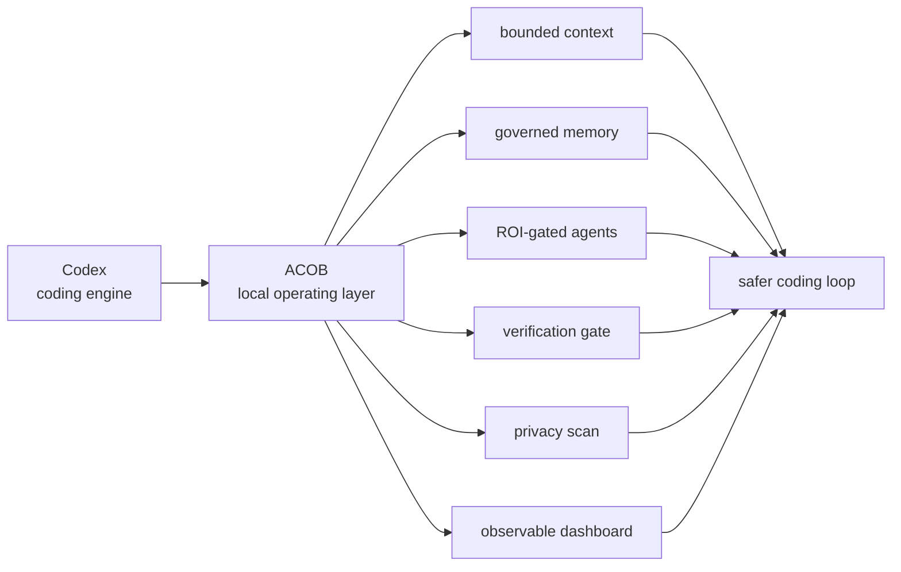
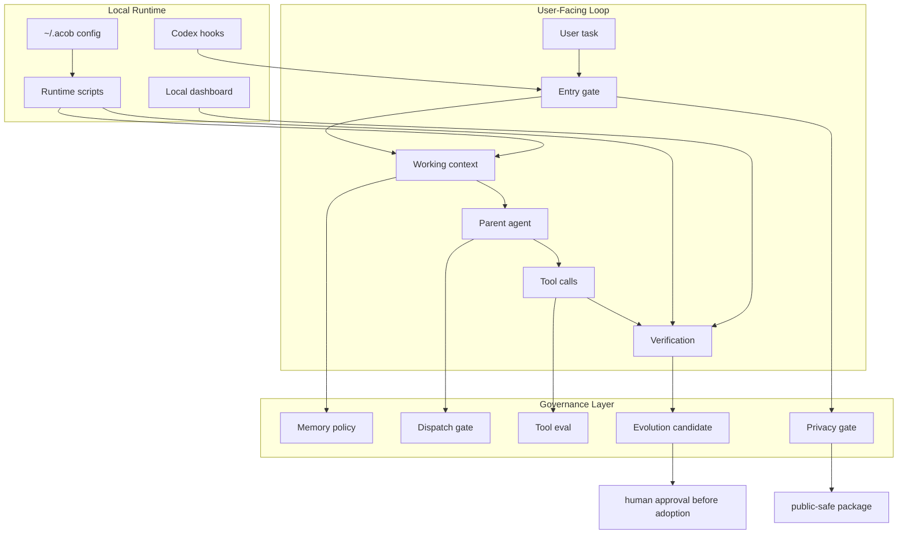

# Agentic Coding OS Brain (ACOB)

> A local-first cognitive operating layer for Codex: memory, self-evolution, multi-agent dispatch, verification, tool reliability, and an observable dashboard.


Agentic Coding OS Brain (ACOB) turns Codex from a powerful chat-style coding agent into a governed agentic coding system.

It is not a prompt pack. It is a local harness that adds:

- bounded working context
- governed long-term memory
- self-evolution candidates with approval gates
- ROI-gated sub-agent dispatch
- verification-before-completion
- tool-call reliability checks
- privacy scanning
- a local dashboard for observable system state

In plain language:

> Codex is the engine. ACOB is the operating system around it: memory, routing, safety rails, feedback loops, and a dashboard.

## Visual Overview

ACOB is designed as a small public harness, not a private data dump. The public package explains the operating pattern, ships reusable runtime pieces, and keeps personal memory outside the repository.



### Leaf Agent Mascot Layer

The Leaf Agent is the public mascot layer used to make the system easier to understand in demos, docs, and visual explanations.

| IP signal | Public meaning |
|---|---|
| Black long hair | calm, steady, readable agent presence |
| Leaf motif | memory, growth, pruning, and renewal |
| Gentle operator temperament | helpful by default, but grounded in verification |
| Not a data source | mascot identity never grants access to private memory |

The mascot is a communication layer. The actual product value comes from the local runtime, privacy boundaries, verification checks, and public-safe memory workflow.

### Architecture Infographic



### Product Map

| Layer | Kano role | What users get |
|---|---|---|
| Privacy scan + local storage | Basic | confidence that private files and secrets do not ship |
| Verification-before-completion | Basic | fewer unsupported "done" claims |
| Working context + memory retrieval | Performance | less drift and lower context waste |
| ROI-gated specialist agents | Performance | useful delegation without agent sprawl |
| Dashboard | Excitement | visible state for debugging and trust |
| Leaf Agent visual layer | Excitement | a friendly explanation surface for a technical system |
| Raw logs, private memories, generated caches | Reverse | intentionally excluded from public release |

## 60-Second Quickstart

ACOB is designed to be tried with one command and no hosted backend.

By default, quickstart also prepares the local embedding path used for memory recall and token reduction:

- provider: Ollama
- model: `qwen3-embedding:0.6b`
- purpose: local vector retrieval, not final reasoning
- behavior: auto-detect Ollama, pull the model when available, verify `/api/embed`, then record status under `~/.acob/config.json`

Use the GitHub package today:

```bash
npx -y github:liuanye9-lab/codex-os-brain quickstart
```

Lowest-friction alias:

```bash
npx -y github:liuanye9-lab/codex-os-brain init
```

Use the npm package after publication:

```bash
npx -y agentic-coding-os-brain@latest quickstart
```

Open the dashboard:

```bash
acob dashboard
```

Check local memory retrieval:

```bash
acob embedding --status
acob embedding --setup
```

Skip embedding setup when you only want the lightweight harness:

```bash
npx -y github:liuanye9-lab/codex-os-brain quickstart --skip-embedding
```

Verify the system:

```bash
acob prove
acob demo --task "fix dashboard, update docs, run checks"
acob memory-loop --example --json
acob metrics --json
acob effect
acob status
acob agents
acob embedding --status
acob benchmark --example
acob memory-retrieval --example
acob dispatch --task "refactor dashboard, update docs, run checks" --json
acob doctor
```

`acob prove` is the lowest-friction proof command. It does not install, write reports, or read private memory. It shows install status, memory/context value, dispatch behavior, effect score, privacy boundary, and the next useful command in one screen.

Expected:

```text
status: global_active
scope: all_codex_prompts_on_this_codex_home
```

Existing installs that combine ACOB with a compatible private engineering harness may show `status: hybrid_active`. That is also healthy: the public runtime is active, and an external local hook is providing one of the guardrail steps without packaging private memory.

Low-cost runtime profile:

- no hosted backend
- no database setup
- no paid model call during install
- optional local embedding download through Ollama
- no private memory uploaded
- local files only under `~/.acob`
- dashboard runs on localhost

## Why This Matters

Most coding agents fail in predictable ways:

| Failure | What Usually Happens | ACOB Response |
|---|---|---|
| Long context drift | the agent keeps reading more and forgets what matters | Working Memory + Context Pack |
| Fake memory | everything is dumped into a vector store | governed memory lifecycle and source readback |
| Unverified completion | the agent says done because it looks done | verification-before-completion gate |
| Tool hallucination | API/tool calls succeed but results are not parsed or checked | tool-call ledger and local eval suite |
| Agent sprawl | more agents are spawned without ROI | dispatch gate, token budget, permission lock |
| Unsafe self-improvement | feedback directly changes rules or persona | candidate-only self-evolution with rollback |
| Dashboard illusion | pretty charts imply capability | observable-state dashboard only |

ACOB is built around a simple thesis:

> Agentic coding becomes valuable when memory, tools, agents, evaluation, and feedback are governed as one system.

## Public Value Check

ACOB is useful when the problem is not "make one model remember more text", but "make a coding agent operate with memory, verification, tools, and safe feedback loops".

Current strengths:

- one-command local install for Codex
- first-minute `acob demo` that shows the memory, dispatch, verification, and self-evolution gates without private data
- daily `acob metrics` reports for context weight, memory-loop state, dispatch gates, and verification pressure
- one-screen `acob effect` scorecard for health, score, Kano snapshot, and next action
- candidate-only `acob memory-loop` so memory can close the loop without unsafe auto-promotion
- global preflight hook for every Codex prompt
- local embedding setup for low-cost memory recall
- bounded working context instead of unlimited context stuffing
- public-safe memory lifecycle rules
- ROI-gated sub-agent dispatch
- verification-before-completion checks
- dashboard that shows observable state only

Current honest gaps:

- public benchmark is a deterministic demo, not a live model leaderboard
- memory retrieval v1 is a local auditable pipeline, not a mature graph memory database
- dashboard is an observation surface, not a full remote control plane
- self-evolution remains candidate-gated and does not rewrite core rules automatically

That is intentional for a public release: the project favors local usability, privacy, and verifiability before claiming broad agent intelligence.

## Benchmark Demo

ACOB includes a public benchmark scaffold with 20 coding task scenarios.

It compares:

| Mode | Purpose |
|---|---|
| No ACOB | baseline coding agent without harness governance |
| Long Context Only | more context but no memory lifecycle or verification loop |
| ACOB Working Memory + Replay + Reward | task-scoped attention plus feedback loop |
| ACOB + Memory Lifecycle | retrieval, freshness, privacy, conflict, expiry, context pack |

Metrics:

- success rate
- rework rate
- token estimate
- verification pass rate

Run:

```bash
npm run benchmark:demo -- --example
acob benchmark --example
```

Boundary: this demo is deterministic and transparent. It is a scaffold for public feasibility and future live traces, not a claim that ACOB already beats all other systems on a real benchmark.

## Memory Retrieval Pipeline

ACOB now includes an auditable retrieval pipeline for token-aware memory use:

```text
Task Query
  -> Query Rewrite
  -> Vector Recall Slot
  -> Rerank
  -> Freshness Score
  -> Privacy Label
  -> Conflict Detection
  -> Expiry / Forget
  -> Context Pack Injection
```

It implements:

- memory write policy
- retrieval query rewrite
- vector recall slot through local Ollama embedding
- rerank
- freshness score
- privacy label
- conflict detection
- expiry / forget
- context pack injection

Run:

```bash
npm run memory:retrieve -- --example
acob memory-retrieval --example
```

Default embedding path:

```text
Ollama + qwen3-embedding:0.6b
```

## ACOB vs Mainstream Memory Systems

ACOB does not try to replace Mem0, Zep, Letta, or LangGraph.

It positions itself differently:

| System | Primary Strength |
|---|---|
| Mem0 | memory extraction / retrieval |
| Zep / Graphiti | temporal graph memory |
| Letta | context repo / memory OS |
| LangGraph | state machine / orchestration |
| ACOB | Codex-facing agentic coding harness |

Open the visual page:

[ACOB vs Mainstream](docs/ACOB_VS_MAINSTREAM.html)

## System Overview

```text
User Task
  -> ACOB Entry Gate
  -> Working Memory
  -> Context Pack
  -> ROI Dispatch Gate
       | simple or risky
       v
       Parent Agent

       | complex + verifiable + low risk
       v
       Specialist Agents
  -> Tool Calls
  -> Verification Gate
  -> Reward Signal
  -> Replay
  -> Memory Cycle
  -> Self-Evolution Candidate
  -> Human Approval Gate
  -> Observable Dashboard
```

## Core Product Layers

| Layer | Purpose | Public Runtime |
|---|---|---|
| Entry Gate | every Codex task enters a preflight contract | `runtime/scripts/inject-context.cjs` |
| Working Context | keeps current goal, constraints, risks, and verification focus bounded | global hook context |
| Memory System | models memory as selected reconstruction, not raw storage | `examples/memory-policy.example.json` |
| Self-Evolution | turns feedback into candidates, not automatic rule changes | `runtime/scripts/evolution-apply.cjs` |
| Multi-Agent Dispatch | routes complex work to specialist templates only when ROI is positive | `runtime/scripts/agentic-dispatch.cjs` |
| Tool Reliability | validates params, parses output, verifies result | `runtime/scripts/tool-eval-suite.cjs` |
| Dashboard | displays observable state and safe controls | `runtime/dashboard/` |
| Privacy Gate | prevents private memory, home paths, secrets, and raw prompts from shipping | `runtime/scripts/privacy-scan.cjs` |

## Memory System

ACOB treats memory as a governed lifecycle, not a vector database.

```text
Task Trace / Feedback / Eval
  -> Memory Candidate
  -> Privacy + Risk Policy
  -> Lifecycle: hot / warm / cold / archived
  -> Retrieval Plan
  -> Metadata + Keyword + Vector Signals
  -> Source Readback
  -> Context Pack
  -> Agent Action
  -> Verification
  -> Memory Cycle Report
```

### Memory Principles

| Principle | Engineering Meaning |
|---|---|
| Memory is not storage | useful information must be selected, scoped, and reconstructed |
| Long context is not intelligence | the system decides what to include and what to drop |
| Vector recall is not truth | recalled memory must be read back from source before it becomes evidence |
| Forgetting is a feature | stale, low-value, conflicting, or risky memory should decay or be blocked |
| Private memory is local | public packages never include private user memory or identity files |

### Public Memory Boundary

The public repository includes memory policy examples and schemas. It does not include:

- private long-term memory
- user profile files
- identity/persona files
- raw session logs
- private local paths
- API keys, tokens, cookies, credentials, or vector indexes

## Self-Evolution System

ACOB supports self-evolution as a controlled feedback loop.

It does not let an agent rewrite its own core rules just because a model reflection sounded plausible.

```text
Task
  -> Verification: run checks / evals / privacy gates
  -> Reward Signal: external evidence
  -> Replay: reinforce or suppress pattern
  -> Evolution Candidate: propose improvement candidate
  -> Human Approval: require approval for adoption
  -> Apply Record: approved apply record or rejection
```

### Self-Evolution Contract

| Rule | Why It Exists |
|---|---|
| feedback creates candidates | prevents unstable automatic rewrites |
| regression evidence required | avoids improving one case while breaking others |
| rollback plan required | every adoption must be reversible |
| high-risk changes need approval | memory, persona, credentials, publishing, and self-evolution remain gated |
| dashboard is evidence, not proof | observable metrics do not become capability claims by themselves |

## Multi-Agent Coding

ACOB includes a public specialist-agent library. The system does not spawn agents for show.

Dispatch opens only when the task has:

- 3+ clear sub-steps
- verifiable output
- low privacy risk or read-only agents
- separable responsibilities
- enough token budget

```text
Task
  -> Dispatch Gate
       | closed
       v
       Parent Agent

       | open
       v
       Dispatch Plan
         -> 上下文侦察员
         -> 架构规划师
         -> 代码执行员
         -> 测试验证员
         -> 安全审查员
         -> Parent Merge
         -> Final Verification
```

| Agent | Stable ID | Role |
|---|---|---|
| 上下文侦察员 | `context-scout` | map repo structure, files, and unknowns |
| 架构规划师 | `architecture-planner` | decompose complex changes and define boundaries |
| 代码执行员 | `implementation-worker` | implement a bounded assigned slice |
| 测试验证员 | `test-verifier` | run focused checks and produce evidence |
| 安全审查员 | `security-reviewer` | review privacy, secrets, and risky operations |
| 文档说明员 | `docs-writer` | update public explanation and user docs |
| 发布检查员 | `release-operator` | inspect package, release, and cross-platform risk |
| 工具调用审计员 | `tool-reliability-auditor` | verify tool parameters, parsing, and post-call results |
| 依赖审计员 | `dependency-auditor` | review dependency, license, supply-chain, and platform risk |
| 合并仲裁员 | `merge-arbiter` | merge agent outputs and define final verification |

## Dashboard

The dashboard is the system's global workspace: it shows observable state, not hidden reasoning.

```text
http://127.0.0.1:8791/
```

It is designed for operational trust:

- Is the global hook active?
- Did the dispatch gate open or close?
- Which specialist agents were selected?
- Did verification run?
- Did the privacy scan pass?
- Is a risky operation waiting for approval?
- Are control-plane commands available?

The dashboard does not show:

- private memory
- raw prompts
- hidden chain-of-thought
- credentials
- private home paths

## Repository Structure

The public repository mirrors the full private project shape while keeping the content public-safe.

```text
.
├── bin/                         # CLI entry
├── dashboard/                   # public dashboard mirror
├── docs/                        # architecture, install, security, release docs
├── evals/                       # public smoke/regression eval descriptions
├── examples/                    # sanitized examples
├── os-agent/                    # public OS-agent bridge boundary
├── plugins/                     # public plugin surface notes
├── research-reviews/            # public research summaries
├── runtime/                     # installable runtime
├── schemas/                     # public artifact schemas
├── scripts/                     # public helper entry notes
├── skills/                      # public skill templates
├── templates/                   # safe installation templates
├── tools/                       # tool reliability contracts
├── v2/ ... v7/                  # versioned architecture layers
└── test/                        # smoke tests
```

## Install And Run

Fastest GitHub path:

```bash
npx -y github:liuanye9-lab/codex-os-brain quickstart
```

Fastest npm path after publication:

```bash
npx -y agentic-coding-os-brain@latest quickstart
```

Manual npm install:

```bash
npm install -g agentic-coding-os-brain
acob quickstart
```

Verify:

```bash
acob status
acob agents
acob dispatch --task "refactor dashboard, update docs, run checks" --json
```

Start dashboard:

```bash
acob dashboard
```

## CLI Surface

```bash
acob quickstart
acob install --global-agentic
acob status
acob agents
acob dispatch --task "..."
acob dispatch --task "..." --json --write
acob agent-execution --example
acob agent-lock --example
acob budget --example
acob tool-eval
acob benchmark --example
acob memory-retrieval --example
acob control --list
acob evolution-apply --example
acob dashboard
acob check
acob uninstall
```

## Safety And Governance

ACOB uses a public-safe release boundary.

| Boundary | Policy |
|---|---|
| Private memory | excluded from repository and npm package |
| Raw prompts | not stored in public artifacts |
| Secrets | blocked by privacy scan |
| Self-evolution | candidate and approval gated |
| Sub-agents | ROI and privacy gated |
| Tool calls | parameter, parse, and verification checks |
| Dashboard | observable state only |

Run before publishing:

```bash
npm run check
npm run privacy:scan
npm run pack:dry
```

## Why This Is Built For Agentic Coding Infrastructure

ACOB is positioned as infrastructure for the next phase of coding agents:

- agents need memory, but memory needs governance
- agents need tools, but tool calls need verification
- agents need autonomy, but autonomy needs gates
- agents need feedback, but feedback must become evidence-backed candidates
- organizations need dashboards, but dashboards must avoid data illusion

This repository is the public, privacy-safe foundation for that operating layer.

See:

- [Architecture](docs/ARCHITECTURE.md)
- [Agentic Coding](docs/AGENTIC_CODING.md)
- [Quickstart](docs/QUICKSTART.md)
- [Public Benchmark Demo](docs/BENCHMARK_DEMO.md)
- [Memory Retrieval Pipeline](docs/MEMORY_RETRIEVAL_PIPELINE.md)
- [ACOB vs Mainstream](docs/ACOB_VS_MAINSTREAM.html)
- [Security](docs/SECURITY.md)
- [Install](docs/INSTALL.md)
- [Public Release Checklist](docs/PUBLIC_RELEASE_CHECKLIST.md)
