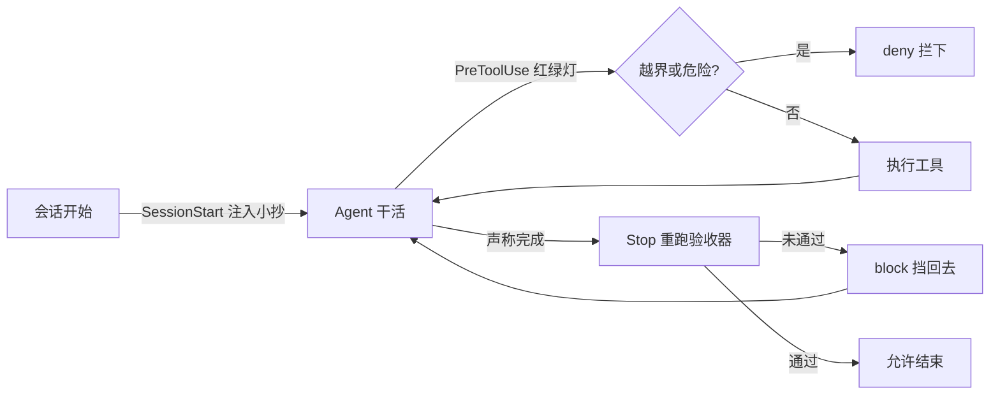
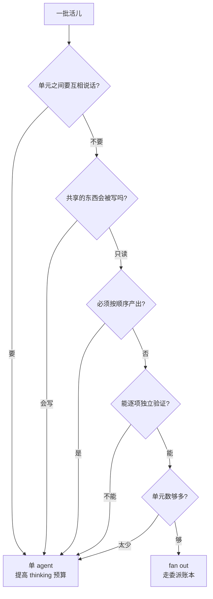

# Codex Brain V11：Coding Agent 可靠性 Harness（个人版）

给 Codex 装一套安全带：**agent 说"做完了"的时候，由机器去验证，而不是相信它。**

不是让模型更聪明，是让它**不能声称未经验证的完成**、**不能悄悄改掉验收标准**、**不能把没人检查过的产出当成结果交付**。它更像一个**安全副驾驶**：不替你开车，但在你要冲出路面时踩住刹车。

```bash
git clone <this-repo> && cd codex-os-brain
npm install
node bin/brain.js hooks enable --project "$(pwd)" --confirm
node bin/brain.js doctor          # 全绿即生效
node bin/brain.js status --json   # 看当前任务与未通过的验收项
```

---

## 一分钟看懂它怎么工作


```mermaid
flowchart LR
  A[会话开始] -->|SessionStart 注入小抄| B[Agent 干活]
  B -->|PreToolUse 红绿灯| C{越界或危险?}
  C -->|是| D[deny 拦下]
  C -->|否| E[执行工具]
  E --> B
  B -->|声称完成| F[Stop 重跑验收器]
  F -->|未通过| G[block 挡回去]
  F -->|通过| H[允许结束]
  G --> B
```

三个词概括：进门发**小抄**（当前任务合同），路上看**红绿灯**（能力边界），出门查**验收**（可执行证据）。

---

## 它到底拦住了什么（10 轮 A/B 实测）

对照组是**真实的上一版代码路径**，不是稻草人。每个套件都包含**本该放行的负例**——只会拦截的门禁毫无价值，所以误拦率排在最前面。

| 指标 | 装之前 | 装之后 |
|---|---|---|
| **误拦诚实的完成** | 0 / 2 | **0 / 2** |
| **误拦可发布的内容** | — | **0 / 2** |
| 虚假完成声明 | 5 / 5 | 5 / 5 *（无提升，见下）* |
| 会话被门禁卡死 | 2 / 3 | **0 / 3** |
| 未裁决内容流入生产 | 0 / 7 拦下 | **7 / 7 拦下** |
| 规避手段（改测试/换靶/自证） | 0 / 7 拦下 | **7 / 7 拦下** |
| fan-out 重复派活 | 无机制 | **0 / 60** |

**代价**：Stop 决策 p95 从 0.130ms → 0.326ms（+0.196ms）。治理校验线性，2 万条 10.4ms。

10 轮两臂各只产生 **1 种结果签名** = 完全确定性，可复现：

```bash
npm run eval:gates                       # 完整数据
node evals/v12-ab/runner.cjs --assert    # 回归门禁，破坏即 exit 1
```

原始数据：[`evals/v12-ab/baseline-results.json`](evals/v12-ab/baseline-results.json)

### 三个必须挑明的诚实结论

1. **虚假完成拦截是零结果。** 上一版本来就 5/5 全拦，这轮的门禁工作买到的是"不死锁"，**不是"拦得更准"**。
2. **有两项拒绝编造数字。** "真实 agent 不用账本会重复多少"取决于模型是否听话，用随机模型模拟就是造假，故记为 *unmeasurable*。
3. **自证测试集不算能力。** 按判据写的用例是循环论证。真正有意义的是**事后专门写来打脸的对抗集**——它一上来就打中 2/4，修正后才归零。

---

## 三个 hook，各拦一件事

| Hook | 时机 | 做什么 | 对应工程学科 |
|---|---|---|---|
| `SessionStart` | 会话开始 | 注入当前任务合同：目标、约束、未完成的验收项 | Context engineering |
| `PreToolUse` | 每次工具调用前 | 越界写入、危险删除直接 deny | Capability policy |
| `Stop` | 声称完成时 | **重跑验收器**。没过就不许结束 | Loop engineering |

从 12 个 hook 收敛到 3 个：**能在事前拦住的，不需要事后记录。**

V11 同时做了减法，删掉了记忆层与认知资产层（净删 5588 行）。被删能力与迁移路径见
[V10 → V11 变更](docs/v9/v10-to-v11.md)；V1–V8 的历史演进见 [v1/README.md](v1/README.md)。
召回改为委托宿主原生 memories，harness 不再自建一套；RAG（可选）与 Evidence-gated memory
不再内置，需要时由宿主或外部工具提供。

---

## 核心机制

### 1. 任务合同：先签字，再干活

```bash
node bin/brain.js task create --task-id demo \
  --objective "修复登录超时" --criterion tests --json
```

验收标准在动手前写死并签名。`Stop` 时由 harness **重新执行**验收器——agent 自己说通过不算数。

### 2. 输入封印：不许改靶

验收器的输入（`package.json`、测试目录等）会被封印。把 `"test": "real-suite"` 改成 `"test": "exit 0"` 这种操作，会以 `verifier_inputs_changed` 被拒。

工作流需要写自己的产物时，在合同里**显式声明**豁免——豁免会削弱封印，所以绝不推断：

```json
{ "verifierSpec": {
    "baselinePaths": ["package.json", "tests", "workspace"],
    "baselineExcludePaths": ["workspace/knowledge-manifest.json"] } }
```

### 3. 门禁有上限，但释放 ≠ 通过

判据可能根本无法满足（缺二进制、验收器必崩、冲突没人裁决）。所以门禁是**有界**的：

- **拦截上限**：同一任务最多拦 3 次
- **停滞检测**：未通过项不再减少 = 在原地打转，门禁让路

释放会写入 `released WITHOUT verification` + 原因，判据仍未通过、合同仍开着。

一个例外：**账本本身读不出来时继续拦截**。Stop 是 fail-closed 事件，不能让"把状态目录搞坏"成为关掉门禁的手段。

### 4. 治理门禁：把"不该发布"变成机械阻塞

内容治理工作流用 `production_ready` 标记每条产物。写在 skill 里那只是自然语言，靠模型自觉；绑到合同上就是机械的：

```bash
node bin/brain.js task create --task-id kb-q3 \
  --objective "发布 Q3 制度页" --criterion governance \
  --manifest workspace/knowledge-manifest.json --json
```

未标记 ready 的条目、悬空的 `parent_id`/`source_ids` 引用，一律阻塞完成。**fail-closed**：清单缺失/损坏/为空都算失败，缺字段不视为同意。

---

## 多 agent：只做账本，不做编排器

这是本项目**最反直觉的设计决定**，基于调研而非架构偏好：

- 等 thinking token 预算下，单 agent 在多跳推理上**追平或胜出**——每次 handoff 只会损失信息
- 共享 context 的多 agent（71%）反而**差于**单 agent（78%）；隔离 context 才是 84%
- 步骤重复是多 agent 最大单一失效模式（1600+ 标注 trace 中占 17.14%）

所以**不造 orchestrator**，只造两样东西：


```mermaid
flowchart TD
  A[一批活儿] --> B{单元之间要互相说话?}
  B -->|要| Z[单 agent<br/>提高 thinking 预算]
  B -->|不要| C{共享的东西会被写吗?}
  C -->|会写| Z
  C -->|只读| D{必须按顺序产出?}
  D -->|是| Z
  D -->|否| E{能逐项独立验证?}
  E -->|不能| Z
  E -->|能| F{单元数够多?}
  F -->|太少| Z
  F -->|够| G[fan out<br/>走委派账本]
```

### 拆分判据——先问该不该拆

```bash
node bin/brain.js fanout assess --units 500 \
  --independent-units --isolated-context --per-unit-verifiable --json
```

耦合 / 共享可变状态 / 顺序依赖 / 无法逐项验证 / 单元太少 → **一律不拆**。

"共享 context"是两种不同情况：风格指南人人只读，复制进每个 dispatch 不花钱；索引人人写，那是真耦合。

```bash
--shared-readonly     # 共享只读 → 不算耦合
--order-dependent     # 必须按序产出 → 拆不了
```

用同一个知识库工作流检验，**不同阶段结论相反**：盘点、逐页评分 → 拆；跨页一致性发布 → 不拆。

### 委派账本——防重复 + 防自证

```bash
node bin/brain.js fanout register --plan kb --units "f1,f2,f3" --json
node bin/brain.js fanout claim    --plan kb --worker A --limit 2 --json
node bin/brain.js fanout complete --plan kb --unit f1 --worker A \
  --verified --verifier-ref "ev#<harness-run>" --json
node bin/brain.js fanout status   --plan kb --json
```

- **防重复**：已完成清单由 lead 持有，每次 claim 只读注入。worker 看不见别人做过什么，靠 prompt 提醒是无效的
- **防自证**：`--verified` 必须带 harness 的 verifier-ref，worker 不能为自己背书
- **零验证率**：`zeroVerificationRate` 统计"完全没检查就被采纳"的比例。接近 1.0 说明这次 fan-out 只是在批量生产未经审视的产出

**认领是租约**：worker 崩溃不会把活儿带走。`status` 报 `stalled`，`fanout reclaim` 显式回收，活着的认领永远不会被抢。

---

## 命令速查

装成 plugin 后可直接用 `brain` 前缀；仓库内开发时用 `node bin/brain.js` 等价。

```bash
# 健康检查与当前状态
brain doctor --json
brain status --json          # 当前任务、未通过的验收项

# 任务与验收
brain task create --task-id X --objective "..." --criterion tests --json
brain verify --json
brain task close --task-id X --json

# 委派
brain fanout assess|register|claim|complete|reclaim|status

# 交接
brain handoff init|status|progress

# MCP：把上述能力暴露给支持 MCP 的客户端（只读工具标记为 readOnly）
brain mcp serve

# hook 开关（回滚用）
brain hooks disable --project "$(pwd)" --confirm
```

## 验证与门禁

```bash
npm test                  # 182 项
npm run check             # 测试 + 发布校验 + A/B 回归门禁
npm run eval:gates        # 完整 A/B 数据
npm run eval:reliability  # 可靠性考场
```

---

## 它**不做**什么

- 不让模型更聪明。装了之后 agent 不会写出更好的代码，只是**不能假装写好了**
- 不检查产物内容是否正确。治理门禁检查的是"声称就绪的条目是否自洽、引用是否可解析、冲突是否已裁决"
- 不 spawn、不调度 agent。账本记录认领与结果，跑 worker 是宿主的事
- 不让委派变安全。无法逐项验证的活儿，拆给再多 worker 也还是无法验证

## 已知边界

- **参数是拍的**：门禁上限 3 次、租约 15 分钟，需要真实使用几天才能校准
- **缺真实会话实证**：hook 在 Codex 真实对话中自动触发，目前只有二进制静态证据 + 直喂 hook 进程的验证
- **能力提升无 LLM 长会话数据**：以上全部是机械验证，不代表产出质量提升

## 文档

- [快速上手](docs/v9/quickstart.md)
- [治理与委派](docs/v9/governance-and-delegation.md)
- [hook 覆盖范围](docs/v9/hook-coverage.md)
- [V10 → V11 变更](docs/v9/v10-to-v11.md)

## 隐私

本地优先。事件只记录白名单字段，不落 prompt 原文与工具输出原文；日志中的 token 特征会被替换为 `[redacted-token]`。

## License

MIT
