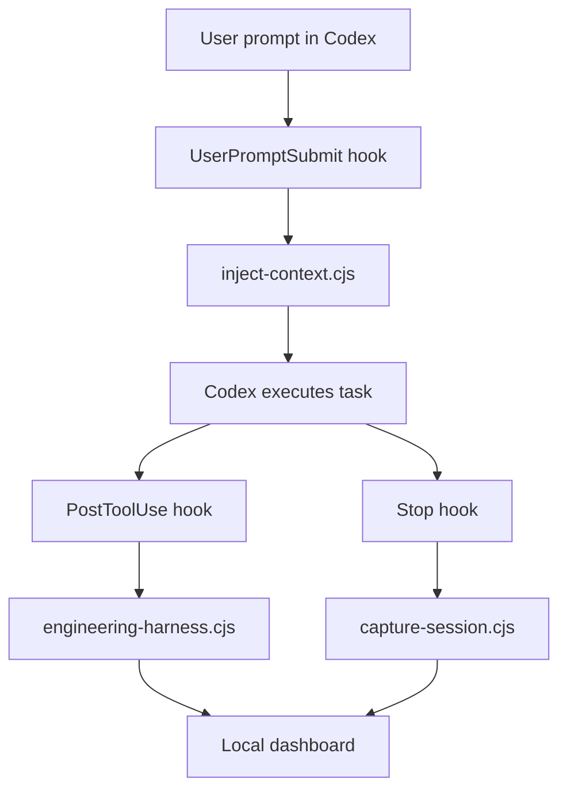

# Architecture

Codex OS Brain is a local Codex hook runtime. It is intentionally small and observable.

## Runtime Flow

## Installed Files

| Path | Purpose |
|---|---|
| `~/.codex-os-brain/runtime` | Public runtime copied from this package |
| `~/.codex-os-brain/data` | Sanitized local status and audit counts |
| `~/.codex/hooks.json` | User's Codex hook file, backed up before modification |

## Cognitive Layers

| Layer | Engineering Mechanism |
|---|---|
| Perception | `UserPromptSubmit` hook receives prompt metadata |
| Attention | injected bounded context rules |
| Working Context | current goal, constraints, focus, questions, risk reminders |
| Verification | completion must cite command/test/manual evidence |
| Reward | external evidence only; no model self-rating |
| Replay | future extension, candidate-only by default |
| Metacognition | high-risk prompts slow down and request approval |
| Social Approval | risky memory/persona/self-evolution changes require humans |
| Immune System | privacy scan and engineering audit |

## Data Boundary

The runtime does not package or require private memory. Local data files are created only after install and remain on the user's machine.

The dashboard displays observable state only:

- hook coverage
- sanitized event counts
- risk categories
- red-flag state

It does not display hidden reasoning chains or private prompt bodies.
