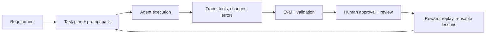
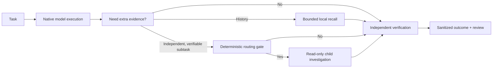

# V7 Heavy Harness: What It Solved and Why It Changed

## The original problem

Early AI coding workflows were strong at local generation but unreliable across long, multi-step work. Common failure modes included lost project context, drift from the original goal, invisible tool activity, unverified completion claims and repeated mistakes that never became reusable evidence.

V7 treated this as an engineering-systems problem rather than a prompt-writing problem. Its goal was to turn an AI coding session into an observable execution loop:

## Why V7 used a larger harness

| Mechanism | Original purpose |
|---|---|
| Working Memory and Context Injection | Keep goals, constraints, project state and historical feedback available during long tasks. |
| Trace and Eval | Make inputs, tool calls, file changes, failures and verification outcomes inspectable. |
| Prompt Pack | Turn vague product intent into goals, change boundaries, acceptance criteria and output constraints. |
| Privacy Gate and Human Approval | Prevent unreviewed external action, false learning claims and unsafe merges. |
| Reward and Sleep Replay | Convert repeated failures and successful patterns into evidence for later improvement. |
| Dashboard and weekly review | Make reliability, cost and recurring bad cases visible over time. |

These mechanisms were useful when the model needed more structure to preserve task state and when the workflow lacked native observability and verification discipline.

## What changed with stronger coding models

Modern coding models can plan, inspect repositories, call tools and maintain local task state more effectively. Reapplying every V7 layer on every turn began to create new costs:

- long permanent instructions consumed context before task work began;
- always-on hooks and context injection could compete with model judgment;
- mandatory multi-agent fan-out added coordination cost without new evidence;
- automatic self-improvement pipelines risked promoting noise rather than verified reusable work.

The lesson was not that V7 was wrong. It established the durable controls that still matter: verification, privacy boundaries, human approval, observable outcomes and evaluation. The change is that orchestration must now earn its cost per task.

## The Native-first transition

Brain Lite keeps the durable controls while removing default overhead:

The system moved from **persistent orchestration by default** to **measured augmentation on demand**. This preserves the research intent of V7 while matching the capability boundary of newer models.
