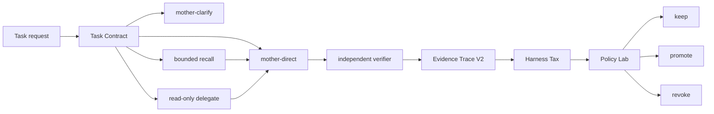

# V8 Native Harness Control Plane Design

**Status:** Implemented; 2026-07-14 lean controls integrated

**Date:** 2026-07-12
**Design decision:** Replace the previous V8 code path. Do not create a compatibility layer or migrate its runtime state.

## 1. Summary

V8 keeps Codex native execution as the default and turns the custom harness into a small, evidence-driven control plane. It intervenes only when a task needs clarification, bounded historical recall, a verifiable delegated lane, deterministic retry control, or policy evaluation.

The system must measure its own cost. Every non-native layer records the tokens, latency, tool calls, verification delta, and correction delta it introduces. A mechanism that cannot demonstrate net benefit becomes a disable or revoke candidate.

V8 is a harness around Codex, not a replacement agent framework, graph runtime, or mandatory orchestrator.

## 2. Problem statement

Brain Lite already removed always-on hooks, bounded memory recall, made child agents read-only, added a clarification gate, and separated capability failures from infrastructure failures. The remaining gaps are:

1. Context retrieval records relevance scores but not whether injected evidence was actually used.
2. Routing policy learns pass/fail state but does not compare the cost of the harness against a mother-only baseline.
3. Trace events are flat rather than parent-child operations, which weakens replay and root-cause analysis.
4. Repeated workflows can become Skill candidates, but promotion does not require measured uplift over the native baseline.
5. Deterministic retry and stop rules exist in the router but are not reusable by compiled Skills.
6. Daily review reports outcomes but cannot identify a harness layer that is producing cost without quality gain.
7. Current configuration contains machine-specific paths and is not portable between macOS and Windows.

## 3. Research basis

### 3.1 2026 papers

| Source | Evidence used | V8 decision |
|---|---|---|
| [ContextBench](https://arxiv.org/abs/2602.05892) | 1,136 tasks; sophisticated scaffolding gave only marginal context-retrieval gains; agents favored recall over precision; explored and utilized context diverged. | Measure injected-context precision and utilization. Do not increase retrieval breadth by default. |
| [LLM-as-Code Agentic Programming](https://arxiv.org/abs/2606.15874) | Program-owned loops, branches, and sequencing avoid sampled control; call-tree context grows with depth instead of total steps. | Code owns retry, escalation, timeout, and stop control for compiled workflows. Open-ended coding remains native. |
| [Active Context Compression](https://arxiv.org/abs/2601.07190) | In a five-task study, aggressive compression reduced tokens 22.7% with the same 3/5 accuracy. | Apply deterministic compression only to recall and handoff packets. Treat the result as exploratory, not a universal target. |
| [Memory for Autonomous LLM Agents](https://arxiv.org/abs/2603.07670) | Memory is a write-manage-read loop requiring write filtering, contradiction handling, latency budgets, and privacy governance. | Preserve filtered local recall and add explicit evidence-use accounting. No automatic long-term writes. |
| [TraceLab](https://arxiv.org/abs/2606.30560) | About 4,300 coding-agent sessions showed long contexts, short outputs, heavy-tailed tool calls, and imperfect cache reuse. | Track tool latency, repeated reads, output size, and harness-only token cost separately. |
| [Code as Agent Harness](https://arxiv.org/abs/2605.18747) | Identifies evaluation beyond final success, incomplete-feedback verification, regression-free improvement, shared-state consistency, and human oversight as open harness problems. | Add paired policy experiments, regression gates, typed shared events, and human gates for consequential changes. |
| [What Makes a Harness a Harness](https://arxiv.org/abs/2606.10106) | Separates a harness from an SDK, framework, IDE, evaluator, and orchestrator. | Keep V8 a thin control layer around native Codex instead of growing a new agent platform. |

SWE-EVO remains the long-horizon baseline already adopted by the project. V8 keeps Fix Rate and partial-progress reporting but does not treat final pass/fail as the only metric.

### 3.2 Open-source projects

Star counts were inspected through the GitHub API on 2026-07-12 and are used only as a maintenance/popularity signal, not as proof of technical correctness.

| Project | Snapshot | Mechanism adopted | Mechanism rejected |
|---|---:|---|---|
| [OpenHands](https://github.com/OpenHands/OpenHands) | 80,502 stars | Stateless step execution, typed events, interruption, risk confirmation, context condensation boundaries. | Full sandbox/runtime platform and default autonomous loop. |
| [LangGraph](https://github.com/langchain-ai/langgraph) | 37,072 stars | Idempotent event semantics, resumable state, explicit human interruption. | Graph runtime and persistent workflow engine. |
| [Aider](https://github.com/Aider-AI/aider) | 47,307 stars | Compact repository map idea and lint/test-after-edit discipline. | Automatic commit behavior and permanent repository-wide context injection. |
| [OpenAI Agents SDK](https://github.com/openai/openai-agents-python) | 27,824 stars | Trace/span hierarchy, structured handoff metadata, guardrail events, per-run tracing control. | Always-on remote tracing and unrestricted handoff history. |
| [SWE-agent](https://github.com/SWE-agent/SWE-agent) | 19,777 stars | Replayable trajectories, exact run configuration, evaluation separated from generation. | Raw thought/query storage in the Brain ledger. |
| [TensorZero](https://github.com/tensorzero/tensorzero) | 11,690 stars | Versioned experiments, feedback-linked evaluation, replay, paired policy comparison. | Gateway, database, UI, and online adaptive routing. |

Microsoft AutoGen and CrewAI were reviewed as popular multi-agent references, but V8 does not adopt conversation-first multi-agent orchestration because the project's own paired evaluation showed no quality gain and substantial token and latency cost on the tested tasks.

## 4. Goals

1. Keep ordinary coding work on the native mother agent with zero extra model calls.
2. Require one concrete signal before delegating an ambiguous request.
3. Make context selection measurable by precision, utilization, and token cost.
4. Make retries, escalation, timeouts, and stopping deterministic where the workflow is compiled.
5. Compare every routing or Skill policy with a native or previous-policy baseline.
6. Promote only changes that preserve quality and demonstrate measurable benefit.
7. Produce privacy-safe, replayable event traces without raw prompts or chain-of-thought.
8. Support macOS and Windows through resolved configuration paths.
9. Preserve current 800-token persistent-instruction and 900-token recall ceilings.
10. Keep every V8 subsystem independently disableable.

## 5. Non-goals

V8 will not:

- restore an always-on hook stack;
- run a routing model for every task;
- delegate ordinary tasks by default;
- build a new graph, gateway, database, or dashboard runtime;
- compress or rewrite the native Codex conversation history;
- store raw prompts, raw model output, chain-of-thought, credentials, or full private paths;
- automatically edit identity, soul, long-term memory, or global instructions;
- treat model self-reports as completion evidence;
- adopt a policy solely because it has more tokens, more agents, or a higher effort label;
- migrate or preserve the previous V8 semantic-bridge runtime.

## 6. Architecture



V8 has ten bounded components.

### 6.1 Task Contract

The Task Contract is a deterministic intake document, not a generated prompt pack. It contains:

- task ID and family;
- clarity: clear or vague;
- observable signal present;
- failing verification present;
- file scope present;
- relevant context present;
- risk and reversibility;
- external-write flag;
- verifier type and command hash;
- independence and parallel-lane count;
- context budget;
- attempt and time budget.

Decision order:

1. Disabled V8 returns native execution.
2. Vague plus no usable signal returns mother-clarify.
3. History-relevant work may request bounded recall.
4. A non-independent or unverifiable task returns mother-direct.
5. An independent, verifiable task with a measured advantage may request delegation.
6. Ultra remains unavailable unless max has a verified capability failure, at least three independent lanes exist, and a merge verifier is defined.

No model call is used to construct or evaluate the contract.

### 6.2 Context Economy

Context Economy applies only when V8 recall or delegation is used. It does not instrument or rewrite the native conversation.

Each context item has:

- evidence ID;
- source class;
- content hash;
- estimated tokens;
- retrieval score;
- injected flag;
- used flag;
- use type: decision, edit, verifier, or citation;
- contradiction flag;
- redaction status.

Metrics:

- retrieval precision = used retrieved items / injected items;
- retrieval utilization = used injected tokens / injected tokens;
- retrieval efficiency = used items / all retrieved candidates;
- duplicate-token ratio;
- context overhead tokens;
- fallback reason when embeddings are unavailable.

Compression is deterministic and extractive:

1. redact;
2. deduplicate by hash and semantic-near-duplicate key;
3. enforce per-source cap;
4. rank by semantic, lexical, recency, and source priority;
5. keep the smallest evidence set within 900 tokens;
6. never call a model solely to summarize the packet.

### 6.3 Evidence Trace V2

Trace V2 is an append-only JSONL event stream. Every event contains:

- schemaVersion;
- eventId;
- traceId;
- parentEventId;
- taskId and task fingerprint;
- event kind;
- policy version;
- timestamp;
- privacy class;
- route, model, and effort when applicable;
- allowlisted metrics;
- artifact and verifier hashes;
- outcome and failure class.

Event kinds are:

- contract;
- clarification;
- recall;
- dispatch;
- tool;
- verification;
- delivery;
- policy_experiment;
- skill_lifecycle;
- approval.

The ledger stores no chain-of-thought, raw prompt, raw model response, credential, full home path, or private file body. Event IDs remain idempotent for the same trace phase, attempt, and outcome.

### 6.4 Deterministic Workflow Control

Open-ended coding stays under native Codex control.

Only replayable Skills may use the deterministic workflow runner:

```text
prepare -> execute bounded step -> verify -> accept
                                  -> capability retry/escalate
                                  -> infrastructure retry/fallback
                                  -> stop
```

The runner owns:

- maximum attempts;
- infrastructure retry count;
- capability escalation count;
- total wall time;
- route cooldown;
- verifier execution;
- final stop status.

The LLM may choose content or strategy inside a step. It may not change the attempt budget, bypass a verifier, or declare an unverified success.

### 6.5 Harness Tax

Harness Tax is calculated only for tasks where a custom mechanism runs.

Recorded values:

- mother-only baseline identifier;
- harness input, cached-input, and output tokens;
- harness duration;
- harness tool-call count;
- final verified result;
- first-pass result;
- user correction;
- critical failure;
- context precision and utilization;
- route or Skill policy version.

Derived values:

- overhead token ratio;
- overhead latency ratio;
- quality delta;
- correction delta;
- verified completion per 1,000 tokens;
- net benefit classification: beneficial, neutral, harmful, or insufficient_evidence.

A mechanism becomes a disable candidate when its latest five distinct verified samples show no quality gain and its token or latency overhead exceeds 10%. Core safety and privacy gates are exempt from automatic disablement.

### 6.6 Policy Lab

Policy Lab evaluates changes offline or in shadow mode. It never invokes a new policy automatically on high-risk work.

Experiment states:

- proposed;
- shadow;
- trial;
- stable;
- rejected;
- revoked.

A policy is eligible for stable use only when:

1. at least three distinct representative samples have independent verifier results;
2. all samples meet the existing quality floor;
3. there is no critical failure;
4. compared with the paired baseline, it either:
   - reduces total tokens by at least 15%;
   - reduces latency by at least 15%; or
   - completes at least one additional representative sample;
5. the policy is low-risk, reversible, and has no external write;
6. the source policy version and verifier hashes are fixed.

The system reports insufficient_evidence rather than extrapolating from fewer samples. Infrastructure failures remain excluded from capability conclusions.

### 6.7 Skill Lifecycle V2

Skill lifecycle:

```text
candidate -> shadow -> replay -> canary -> promoted
                                      -> rejected
promoted -> monitored -> revoked
```

Rules:

- candidate discovery still requires at least three successful occurrences;
- shadow mode performs no external write and changes no active skill;
- replay uses fixed task packets and independent verifiers;
- canary is limited to low-risk, reversible work;
- promotion requires the Policy Lab quality and benefit gates;
- one critical failure or verified permission violation revokes the Skill immediately;
- five recent distinct samples with no benefit and more than 10% overhead create a revoke candidate;
- publishing, deployment, deletion, permission, payment, identity, memory, and self-maintenance Skills always require human approval.

### 6.8 Orthogonality Gate

Before benefit evaluation, every proposed mechanism must declare one unique failure mode, no overlap with active mechanisms, token and latency budgets, an independent verifier, a disable condition, and an independent off switch. Missing or overlapping declarations are rejected before paired samples are evaluated.

### 6.9 Evidence and Skill Outcome Attribution

Trace V2 links used Evidence IDs and hashed Skill IDs to verifier, delivery, false-green and user-correction signals. Attribution is observational rather than causal: fewer than five distinct tasks or insufficient verifier coverage produces an insufficient-evidence result. Adverse evidence produces a review candidate only; it never changes a lifecycle automatically.

### 6.10 Read-only Index Health

Daily review deterministically checks index age, build warnings, dataless sources, newly discovered unindexed sources, missing indexed sources and atomic-write debris. It emits counts and hashed source references, exposes no full paths, calls no model, and performs no repair.

## 7. Cross-platform configuration

V8 configuration uses logical roots rather than hard-coded user paths:

- CODEX_HOME;
- CODEX_BRAIN_HOME;
- workspace root;
- data root;
- reports root.

Resolution order:

1. explicit CLI path;
2. environment variable;
3. platform home-directory default;
4. repository-relative test fixture.

Configuration may store normalized relative paths. Runtime-resolved absolute paths never enter public traces or public documentation.

Local embeddings remain optional. When the local embedding endpoint is unavailable, recall falls back to lexical retrieval and records the fallback without treating it as a capability failure.

## 8. File boundaries

Implementation will create or modify the following focused units:

```text
v8/DESIGN.md
config/brain-lite-v8.json
schemas/brain-lite-task-contract.schema.json
schemas/brain-lite-trace-v2.schema.json
schemas/brain-lite-policy-experiment.schema.json
scripts/brain-lite-task-contract.js
scripts/brain-lite-context-economy.js
scripts/brain-lite-trace-v2.js
scripts/brain-lite-harness-tax.js
scripts/brain-lite-policy-lab.js
scripts/brain-lite-outcome-attribution.js
scripts/brain-lite-index-health.js
scripts/brain-lite-skill-lifecycle-v2.js
scripts/brain-lite-v8-review.js
scripts/brain-lite-router.js
scripts/brain-lite-recall.js
scripts/brain-lite-delegate.js
scripts/brain-lite-verify.js
tests/brain-lite-v8-*.test.js
```

Existing scripts remain responsible for their current behavior. V8 modules extend them through small exported interfaces rather than moving all logic into a new orchestrator.

The previous v8 scripts and status files are removed from the active version path. External diary records are not loaded, migrated, or deleted by V8.

## 9. Data flow

### 9.1 Ordinary clear task

1. Contract returns mother-direct.
2. No recall, routing model, or child is called.
3. Native Codex performs the task.
4. Existing verification runs in proportion to risk.
5. A compact direct-task outcome may be counted in review.

### 9.2 Ambiguous task without evidence

1. Contract returns mother-clarify.
2. The system asks for one symptom, failing verification, reproduction, file scope, or relevant context.
3. No child is launched.
4. Normal intake resumes when a signal exists.

### 9.3 Recall-assisted task

1. Contract marks historical relevance.
2. Context Economy builds a redacted packet under 900 tokens.
3. Evidence IDs are attached to the trace.
4. Used evidence IDs are recorded when they support a decision, edit, verifier, or citation.
5. Unused retrieval contributes to Harness Tax.

### 9.4 Delegated task

1. Contract proves independence, verifiability, and advantage.
2. Router chooses the lowest credible route.
3. Child receives a bounded, read-only packet with filtered history.
4. Parent applies any change and runs the final verifier.
5. Trace records child cost separately from parent cost.
6. Policy Lab compares the routed condition against its paired baseline.

### 9.5 Repeated workflow

1. Skill miner creates a candidate from three successful occurrences.
2. Lifecycle V2 enters shadow and replay.
3. Deterministic runner enforces attempts and verifier.
4. Policy Lab measures quality and benefit.
5. Eligible low-risk Skills enter canary, then promoted or rejected.
6. Later evidence may revoke the Skill.

## 10. Error handling and safety

- Invalid event lines fail closed for policy derivation but do not break native Codex.
- Corrupt or missing V8 configuration disables V8 and reports the reason.
- Embedding failure falls back to lexical recall.
- Infrastructure failures receive one bounded retry, then availability fallback or mother-direct.
- Capability failures use configured escalation and never mechanically visit every effort.
- Missing verifier blocks promotion but not native task execution.
- Ledger writes use atomic files where possible and idempotent event IDs.
- Any sensitive-content detection removes the field before persistence.
- External write, high-risk, irreversible, or privacy-sensitive work cannot be auto-downgraded or auto-promoted.
- Every V8 component has an enabled flag and native-safe disabled behavior.

## 11. Testing strategy

Implementation follows red-green-refactor. Tests are grouped by component.

Required test families:

1. Task Contract decision table, including vague-prompt and Ultra boundaries.
2. Context redaction, deduplication, token cap, fallback, precision, and utilization.
3. Trace schema, parent-child linkage, idempotency, and privacy rejection.
4. Deterministic attempt, retry, escalation, cooldown, timeout, and stop behavior.
5. Harness Tax beneficial, neutral, harmful, and insufficient-evidence classifications.
6. Policy Lab paired-baseline, distinct-sample, benefit-threshold, risk, and revocation gates.
7. Skill lifecycle state transitions and immediate critical-failure revocation.
8. macOS and Windows path resolution.
9. Disabled-mode proof that native Codex remains usable without V8.
10. Full existing Brain Lite regression suite.
11. Orthogonality declarations, overlap rejection and disableability.
12. Evidence/Skill attribution thresholds, verifier coverage and no-auto-lifecycle proof.
13. Read-only index-health checks and daily-review CLI integration.

No new production function is added before its failing test is observed.

## 12. Acceptance criteria

V8 is complete only when all of the following are verified:

- ordinary clear tasks incur zero extra model calls and no mandatory V8 process;
- no always-on hook is enabled;
- persistent guidance remains at or below 800 estimated tokens;
- recall and child context packets remain at or below 900 tokens unless an explicit task contract sets a lower limit;
- vague tasks without evidence never dispatch a child;
- all custom retries, escalation, and stops are bounded by code;
- trace events are replayable and pass the privacy scanner;
- policy updates require distinct verified samples and paired baseline evidence;
- low-risk automatic promotion requires preserved quality plus measurable benefit;
- consequential changes remain human-gated;
- every component can be disabled without breaking native operation;
- Windows and macOS path-resolution tests pass;
- the full existing suite and all V8 tests pass;
- a controlled V8 evaluation reports quality, token, latency, context utilization, and Harness Tax against Brain Lite;
- no claimed V8 improvement is published unless the controlled evaluation crosses its stated acceptance line.

## 13. Migration

Implementation replaces the previous V8 active code path.

Migration steps will:

1. stop referencing previous V8 semantic-bridge and diary-sidecar scripts;
2. replace the active v8 directory with the new design record;
3. leave external diary archives untouched but disconnected;
4. introduce V8 configuration disabled-by-component and native-safe by default;
5. keep existing Brain Lite config readable during transition;
6. update verification to prove that no legacy V8 process or hook remains active.

There is no legacy adapter, dual-write period, or automatic import of previous V8 state.

## 14. Design self-review

- Placeholder scan: no placeholder marker or unresolved implementation choice remains.
- Consistency: the architecture, thresholds, file map, and acceptance criteria use the same Native-first and privacy boundaries.
- Scope: V8 changes one control plane; it does not introduce a UI, gateway, graph engine, database, or new model provider.
- Ambiguity: automatic promotion, revocation, compression, and disabled behavior have explicit thresholds and owners.
