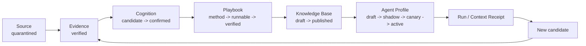

# 认知产品框架：Playbook -> Knowledge Base -> Agent

> 调研与元数据核验日期：2026-07-31。本文描述 Cognitive Labs 的实验产品层；它默认关闭，不构成主线 Harness 安装成功或能力已验证的证明。

## 结论

Codex OS Brain 已经可以从“执行约束”向“认知沉淀”发展，但沉淀对象不应是无限增长的聊天记录，而应是一条受治理的产品链：

```text
Source/Evidence -> Cognition Unit -> Playbook -> Knowledge Base -> Agent Profile
       ^                                                            |
       +----------- signed run/context receipts and new candidates -+
```

各层只承担一种职责：

| 层 | 产品对象 | 回答的问题 | 发布条件 |
| --- | --- | --- | --- |
| Evidence | 来源与证据断言 | 这条结论依据什么 | 来源可信、锚点/归因/蕴含可验证 |
| Cognition | 可证伪认知单元 | 哪个机制在什么边界内成立 | 人工确认、非敏感、有反例和 falsifier |
| Playbook | 可执行方法清单 | 遇到此类任务怎样做 | 结构门通过、依赖当前、审批晋升 |
| Knowledge Base | 领域知识产品 | 哪些认知与方法可被检索组合 | 依赖 digest 固定、受保护发布 |
| Agent | 目的绑定的能力配置 | 谁在什么权限和预算内使用它们 | 工具合同固定、shadow/canary/active 分阶段部署 |

这不是自动自我修改循环。运行结果只能生成新候选和外部签名回执，不能自行改写已发布 Knowledge Base、自动晋升 Playbook 或部署 Agent。

## 产品生命周期



发布与部署是两条独立状态机。`runnable_playbook` 只代表 manifest 可运行，不代表效果已验证；`published` Knowledge Base 只代表依赖和审批有效，不代表某个 Agent 可以获得工具权限；`active` Agent 仍不能绕过宿主 Harness、项目策略或 protected approval。

依赖发生变化时，系统重新计算 digest，并把受影响的 Playbook、Knowledge Base 和 Agent 级联标记为 `stale_blocked`。修复流程是重新核验证据、重新编译并重新发布，而不是静默接受漂移。

## 当前实现

SQLite schema v4 增加了三类受版本控制的产品记录：

- `cognitive_knowledge_bases`：认知单元、Playbook、检索策略、隐私等级和依赖 digest。
- `cognitive_agent_profiles`：用途、Knowledge Base、Playbook、工具合同、外部依赖和上下文预算。
- `cognitive_product_versions`：每次 compile、publish、deploy、revoke 的不可变快照。

Agent context 是 purpose-bound 的只读准备包，而不是执行请求。它遵守 Knowledge Base 的检索上限，保留证据引用句柄，不包含原始来源内容，并对完整返回包执行保守 token 估算。预算连最小信封都容不下时显式返回 `agent_context_budget_too_small`。

部署门如下：

| 迁移 | 最低门槛 |
| --- | --- |
| `draft -> shadow` | 已发布 Knowledge Base、当前 Playbook、所有已声明 policy/tool contract 均固定且当前、受保护审批 |
| `shadow -> canary` | 每个 Playbook 至少一条成功的生产路径签名回执，且无关键安全失败 |
| `canary -> active` | 所有 Playbook 均达到 `verified_capability`，再次受保护审批 |

内置 provider 不执行 Agent，不管理 worker，也不产生“成功”回执。MCP 只开放产品地图、readiness 检查和受预算约束的 context 准备；发布、部署和撤销仍保留在受保护 provider 边界内。

## 开源项目对照

以下数据来自 GitHub repository metadata，stars 仅用于观察生态采用度，不作为质量证明。这里只复用机制，不复制代码，也没有把这些项目加入运行时依赖。

| 项目 | 2026-07-31 状态 | 许可证 | 借鉴机制 |
| --- | ---: | --- | --- |
| [mem0](https://github.com/mem0ai/mem0) | 62,125 stars，活跃 | Apache-2.0 | 分层记忆、选择性写入与检索 |
| [Letta](https://github.com/letta-ai/letta) | 24,028 stars，活跃 | Apache-2.0 | 有状态 Agent 与持久记忆边界 |
| [Graphiti](https://github.com/getzep/graphiti) | 29,381 stars，活跃 | Apache-2.0 | 时间感知知识图和事实演化 |
| [GraphRAG](https://github.com/microsoft/graphrag) | 35,092 stars，活跃 | MIT | 图索引、分层摘要与可追溯检索 |
| [LangGraph](https://github.com/langchain-ai/langgraph) | 38,515 stars，活跃 | MIT | durable execution、checkpoint 与人工介入 |
| [KAG](https://github.com/OpenSPG/KAG) | 8,945 stars，未归档 | Apache-2.0 | 领域知识表示和逻辑增强检索 |
| [Agent Lightning](https://github.com/microsoft/agent-lightning) | 17,430 stars，活跃 | MIT | Agent 执行与训练/反馈解耦 |
| [Deep Agents](https://github.com/langchain-ai/deepagents) | 27,060 stars，活跃 | MIT | filesystem、skills、subagent 的分层组织 |

采纳的是版本化、分层状态、checkpoint、时间/图检索、执行与学习解耦。暂不采纳自动写入长期记忆、无审批在线学习、默认跨 Agent 共享、后台常驻 fan-out 和框架级自动自我修改。

## 论文信号

2026 年条目在核验时均为 arXiv preprint，应视为进行中的研究信号，而不是已建立的工程共识：

- [MemSecBench (2607.27080)](https://arxiv.org/abs/2607.27080)：把记忆污染从持久化追踪到行为后果与修复，支持污染级联阻断与可撤销设计。
- [Filesystem-Based Memory (2607.26637)](https://arxiv.org/abs/2607.26637)：关注文件式记忆的组织、演化和可持续性，支持显式分层与生命周期管理。
- [MemTX (2607.23929)](https://arxiv.org/abs/2607.23929)：提出事务化 belief commit，支持原子发布、版本快照与失败回滚。
- [MemTools (2607.21404)](https://arxiv.org/abs/2607.21404)：强调可互操作的 Agent memory 工具接口，支持 provider contract 与结构化资产边界。
- [AttriMem (2607.21106)](https://arxiv.org/abs/2607.21106)：以归因指导过程反馈，支持证据依赖和独立 verifier 回执。
- [Budget-Constrained Skill/Memory Study (2606.15017)](https://arxiv.org/abs/2606.15017)：指出在线 skill/memory 并非总能抵消 token 成本，支持 context budget 和显式 omitted 统计。
- [AgentCL (2606.02461)](https://arxiv.org/abs/2606.02461)：要求严谨评估持续学习，支持 shadow/canary、边界案例和安全失败门槛。
- [Agent Workflow Memory (2409.07429)](https://arxiv.org/abs/2409.07429)：把成功工作流抽象为可复用经验，支持从回执到 Playbook 候选的路径。

## 下一阶段优先级

P1 已实现的是产品合同：Knowledge Base/Agent schema、版本快照、依赖 digest、审批发布、阶段部署、预算 context 和级联 stale-block。

P2 应围绕真实效益验证，而不是扩大自动化：

1. 建立离线 retrieval eval，测 citation precision、上下文命中率、token 成本和过期知识拒绝率。
2. 增加污染注入与撤销恢复 fixtures，验证从 source 到 active Agent 的级联阻断时间。
3. 为 canary 定义代表性任务集和独立 verifier，禁止同一 trust domain 自证成功。
4. 只有在本地 SQLite provider 证明稳定后，再评估图检索或可插拔私有 provider；不把图数据库设为默认依赖。
5. UI 应先做只读产品地图、依赖健康和审批队列，再考虑编辑器或市场。

衡量“认知沉淀”是否进步，应看错误知识进入 active Agent 的比例是否下降、发布后漂移能否及时阻断、相同 token 预算下任务成功率是否提高，而不是看数据库条目数。

## 安全边界

- Cognitive Labs 默认关闭，且每次启动必须显式确认。
- 未加密 live SQLite 不保存调用方声明为敏感或 personal scope 的认知。
- 不保存隐藏推理、无限终端日志或原始来源全文到 Agent context。
- 发布、部署、撤销和外部写入需要 protected approval；回执不能由执行者自签。
- Agent Profile 只是受治理的能力配置，不是新权限主体，也不能覆盖项目 `AGENTS.md`、Harness 或工具策略。
- 版本快照支持审计和逻辑撤销，不声称能清除 SQLite free pages、WAL、备份或已导出的 Git 历史。
