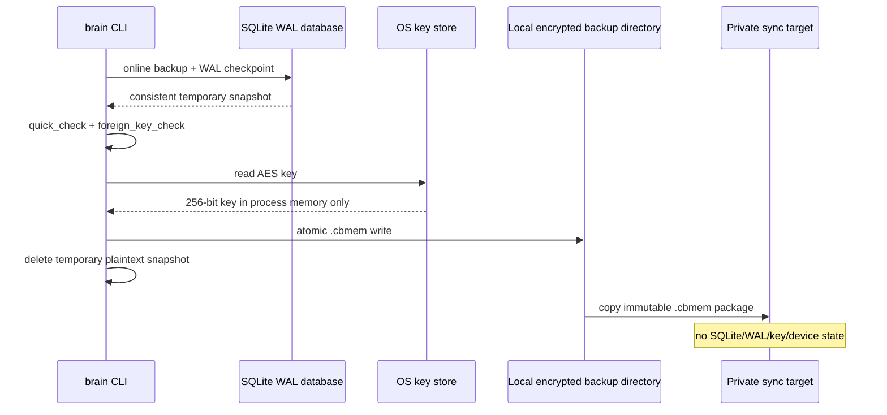
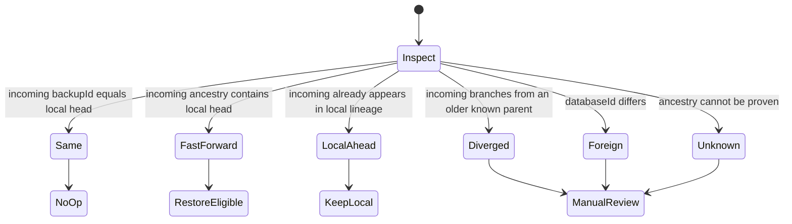

# Encrypted SQLite Backup and Conflict-Safe Synchronization

## Outcome

The live database remains a single local SQLite source of truth. Synchronization moves immutable encrypted backup packages, never the live `.sqlite3`, `-wal`, `-shm`, device-id file, backup state, or encryption key.

Each `.cbmem` package contains:

- an SQLite online backup that passed `quick_check` and `foreign_key_check` before encryption;
- AES-256-GCM ciphertext with a random 96-bit IV and authentication tag;
- database, backup, parent, generation, and pseudonymous device identifiers;
- a bounded lineage list and SHA-256 hashes for package verification;
- no hostname, source path, raw memory, credential, or encryption key.

The default macOS key store is Keychain service `com.codex-brain.memory-backup`, account `v9-aes-256-gcm`. Initializing the key is an explicit local action:

```bash
brain memory backup-key-init --confirm
```

The command returns only a fingerprint. Do not export the Keychain item into a repository. A separate offline recovery-key ceremony is required before treating remote backups as disaster recovery.

## Backup pipeline



## Conflict protocol

Every package belongs to one `databaseId` and forms a parent-linked lineage. Git timestamps, filesystem mtimes, and generation numbers alone never decide the winner.



The comparison command is read-only:

```bash
brain memory backup-inspect --input /path/to/incoming.cbmem
brain memory backup-verify --input /path/to/incoming.cbmem
brain memory backup-compare --input /path/to/incoming.cbmem
```

Interpretation:

| Status | Meaning | Automatic action |
|---|---|---|
| `same` | Incoming package is already the local head | No-op |
| `fast_forward` | The authenticated incoming ancestry contains the local head | Eligible for an explicit offline restore |
| `local_ahead` | Incoming package is an older known ancestor | Keep local |
| `diverged` | Local and incoming packages descend from different children of a known ancestor | Block |
| `foreign_database` | Package belongs to another database | Block |
| `unknown_lineage` | Ancestry cannot be proven | Block |
| `uninitialized` | This device has no local lineage | Adoption requires explicit review |

There is no last-write-wins mode and no row-level automatic merge. SQLite files from divergent branches are both retained as evidence. Resolution is a domain operation: choose an authoritative branch, export reviewed records from the other branch, re-ingest them through candidate-first CRUD, run fixed retrieval/graph evals, then create a new backup on the chosen lineage.

## Recovery runbook

1. Stop all processes that can open the live database.
2. Create and verify a fresh encrypted backup of the current local database.
3. Inspect and cryptographically verify the incoming package.
4. Run lineage comparison. Continue only for `fast_forward`, or for `uninitialized` after confirming the local database has no authoritative state.
5. Decrypt into a private temporary directory, verify SQLite integrity again, and replace the database only through an explicit offline recovery tool or reviewed operator procedure.
6. Start the runtime and run memory capability, retrieval, graph, and Harness evals.
7. Create a new encrypted backup and verify remote read-back.

The shipped CLI intentionally stops before step 5. Automatic restore is excluded until a cross-process database lease and independently tested crash-safe replacement procedure exist. This is a safety boundary, not a missing conflict policy.

## What was borrowed

The design borrows useful operational lessons from file-native retrieval systems: staging before publication, loud corruption signals, model/index identity checks, and refusing silent data shrinkage. It does not copy their multi-file index as the memory source of truth. SQLite remains authoritative, and encrypted packages are immutable replication artifacts.
