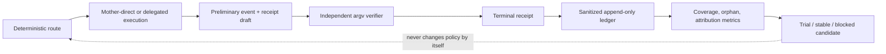

# Verifier-backed model routing evidence

Model routing needs outcome evidence, not a record that a model was called. The collection loop separates three facts:

1. A route decision and execution happened.
2. The mother agent independently verified the resulting workspace state.
3. The result is eligible, or deliberately excluded, for capability learning.



## What counts

A capability sample is eligible only when all of these are true:

- `receiptVersion` is `1`, `phase` is `verified`, and the authority is `mother-agent`.
- At least one verifier was executed without a shell string.
- The verifier result agrees with the final delivery state.
- There was no verifier timeout, missing executable, or other infrastructure failure.
- A failure is explicitly attributed to `model-capability`. `pre-existing`, `verification-infrastructure`, and `unknown` failures are excluded.

Passing mother-direct receipts form a comparison baseline. They never become a child route. Model self-reports, child preliminary events, and legacy boolean logs do not establish route stability. Repeating one task fingerprint also does not increase the distinct-sample count.

## Receipt flow

The delegate accepts structured checks and returns them in `receiptDraft`:

```json
{
  "verificationChecks": [
    {
      "id": "unit-tests",
      "kind": "test",
      "command": "node",
      "args": ["--test", "tests/example.test.js"],
      "timeoutMs": 120000
    }
  ]
}
```

After applying the proposed change, the mother agent completes the draft with `failureAttribution`, artifact paths relative to the verifier working directory, and the real `finalDelivered` state. Then it runs:

```bash
node scripts/brain-lite-routing-receipt.js verify \
  --receipt-file /private/temp/routing-receipt.json \
  --ledger /private/runtime/router-ledger.jsonl \
  --trace /private/runtime/v8-trace.jsonl \
  --policy-state /private/runtime/router-policy-state.json \
  --cwd /path/to/project
```

The receipt runner records command identity hashes, exit status, duration, evidence IDs, and a combined artifact hash. It does not store verifier stdout, stderr, prompts, patches, conversation text, or absolute artifact paths. The input receipt may contain local paths, so it belongs in a private temporary/runtime directory and must not be committed.

## Data-quality guardrails

The daily report exposes verified coverage, eligible receipts, orphan preliminary attempts, unknown failure attribution, mother-direct baselines, and delegated samples. An orphan means execution was observed but no matching terminal receipt was found. It is a collection defect, not a model failure.

The policy state remains evidence-gated: three distinct independently verified passes are required for `stable`; two of three remain `trial`; fewer than two of three are `blocked`. High-risk, private, strategic, non-verifiable, and externally mutating work never becomes an automatic cheap-model route from these samples alone.
