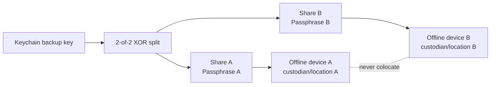

# Offline Recovery-Key Ceremony

## Purpose

The macOS Keychain key protects routine encrypted backups. Disaster recovery needs an independent path for total device loss without placing a complete recovery key, passphrase, or raw database in any repository or cloud folder.

Codex Brain uses a 2-of-2 ceremony. A random 32-byte share A is generated and share B is `backupKey XOR shareA`. Either share alone is statistically independent of the backup key. Each share is separately protected with a different passphrase using scrypt (`N=131072, r=8, p=1`) and AES-256-GCM.

## Custody layout



The CLI requires the two output parents to be different filesystem devices. It rejects repository/runtime destinations, existing output files, symbolic-link passphrase/share files, group/world-readable passphrase files, identical passphrases, and modified KDF work factors.

Create two passphrase files outside repositories, each mode `0600` and at least 20 bytes. Mount two separate offline devices, then run:

```bash
brain memory recovery-export \
  --output-a /Volumes/RECOVERY_A/codex-brain-a.cbkey \
  --output-b /Volumes/RECOVERY_B/codex-brain-b.cbkey \
  --passphrase-a-file /private/path/pass-a \
  --passphrase-b-file /private/path/pass-b \
  --confirm
```

Record only the ceremony id, key fingerprint, creation date, custodians, and storage locations. Never record either passphrase beside its share.

## Quarterly recovery drill

The drill reconstructs the key in process memory, verifies both AEAD envelopes and optionally decrypts and integrity-checks a `.cbmem` package. It does not install or print the key.

```bash
brain memory recovery-drill \
  --share-a /Volumes/RECOVERY_A/codex-brain-a.cbkey \
  --share-b /Volumes/RECOVERY_B/codex-brain-b.cbkey \
  --passphrase-a-file /private/path/pass-a \
  --passphrase-b-file /private/path/pass-b \
  --input /private/path/memory-g000001-bkp_x.cbmem
```

A successful drill receipt must include `passed=true`, matching key fingerprint, backup id, and package hash. If either custodian, passphrase, share, or selected package is unavailable, the drill fails and rotation is required after access is restored.

## Import after total device loss

On the replacement Mac, install the reconstructed key into Keychain only after a successful drill:

```bash
brain memory recovery-import \
  --share-a /Volumes/RECOVERY_A/codex-brain-a.cbkey \
  --share-b /Volumes/RECOVERY_B/codex-brain-b.cbkey \
  --passphrase-a-file /private/path/pass-a \
  --passphrase-b-file /private/path/pass-b \
  --confirm
```

Use `--replace` only when deliberately replacing an existing Keychain item whose fingerprint has already been recorded.

## Rotation

Rotation requires proof that the current two shares reconstruct the active Keychain key. It first creates a final old-key backup, then creates a new random key and 2-of-2 recovery set, replaces the Keychain item, and immediately creates a `.cbmem` package encrypted by the new key. If the new backup fails, the old Keychain key is restored and the unusable new shares are removed.

```bash
brain memory recovery-rotate \
  --current-share-a /Volumes/RECOVERY_A/old-a.cbkey \
  --current-share-b /Volumes/RECOVERY_B/old-b.cbkey \
  --current-passphrase-a-file /private/path/old-pass-a \
  --current-passphrase-b-file /private/path/old-pass-b \
  --new-output-a /Volumes/RECOVERY_A/new-a.cbkey \
  --new-output-b /Volumes/RECOVERY_B/new-b.cbkey \
  --new-passphrase-a-file /private/path/new-pass-a \
  --new-passphrase-b-file /private/path/new-pass-b \
  --confirm
```

Keep the old shares until every retained old-key backup has expired or been intentionally destroyed. Run a drill against both one retained old-key package and the new-key package before retiring the old set.

## Recommended cadence

- Export once after initial key creation.
- Drill quarterly and after any custodian, storage-device, or passphrase change.
- Rotate annually, after suspected exposure, or when custody changes.
- Keep receipts without passphrases, raw shares, local paths, or database contents.
